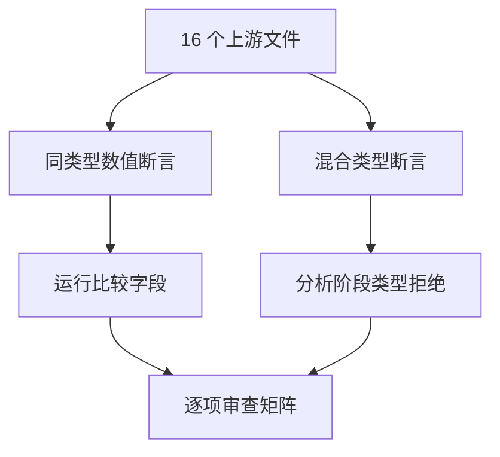
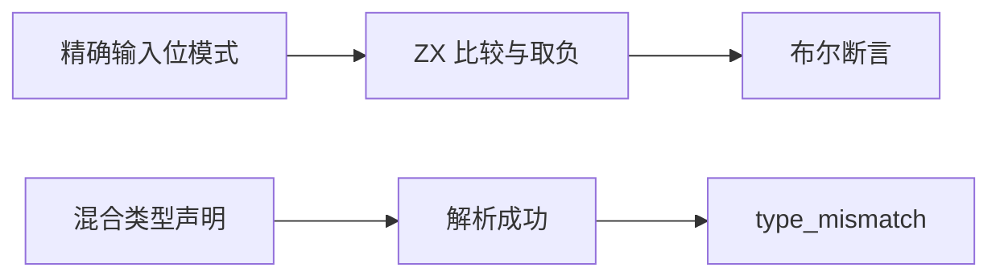

# Test262 相等语义逐项对齐

## Intent：最终目标

逐项映射相等、不等、严格相等、严格不等的 NaN、零和同数值测试，保留 ZX 同类型比较契约。

## Data：可用证据

已读取四个目录 A4.1_T1/T2、A4.2、A4.3 共 16 个文件。NaN 文件各包含六个数值断言和三个混合类型断言；不能因数值部分通过便将全文件视为等价。

## Edges：边界与限制

- ZX 使用 ==/!=，没有 JavaScript 两套相等与隐式转换机制。
- 数值部分复用已执行的比较案例；bool/string/object 混合部分关联前端 type_mismatch，不冒充运行 false/true。
- JavaScript new Object 适配为 ZX 结构对象的类型拒绝，不声称对象身份或 ToPrimitive 兼容。
- 新增上游特定的 13、-13、1.3、-1.3、0.999999999999 输入及负无穷取负的实际执行。

## Answer：交付与成功标准

逐条保存运行布尔字段或静态诊断证据，审计检查两种关联。六个新增输入场景通过真实编译执行；已有案例不重复计数。

## 执行与自我批判

新增六个运行场景，其余复用既有输入；运行组 Debug 20,355/20,355 测试、190/190 步骤通过。新增场景均用 Node 独立核对六个比较字段，结果一致。

16 个上游文件包含 108 条断言：84 条关联运行布尔字段，24 条关联静态 type_mismatch。每条保存原表达式。八个纯数值文件标记 equivalent，八个含混合类型的文件标记 adapted。审计同时检查运行字段预期和静态诊断阶段/code，避免只保存 ID 而失去语义证据。

只以实际源码断言为准，保留两套语言的模式和类型边界。把 JavaScript new Object 替换为结构对象拒绝仅证明 ZX 不接受该混合比较，不代表实现对象转换协议。没有新增生产修复。

## 最终验证

根 `zig build test -j4 --summary all`（ReleaseSafe）：283/283 步骤、33,745/33,745 Zig test 加 408 个隔离案例通过。新包累计 33,767 个案例。

临时把一个静态诊断关联的阶段从 analyze 改成 parse，审计准确拒绝；finally 恢复后审计通过。生成一致性与 diff 空白检查通过。

上游累计 107 项审查（51 equivalent、56 adapted）、221 个关联案例，53,490 项仍未审查。日志为 `/tmp/zxc-test262-batch10-runtime.log`、`/tmp/zxc-test262-batch10-root.log`；会话均已结束。
