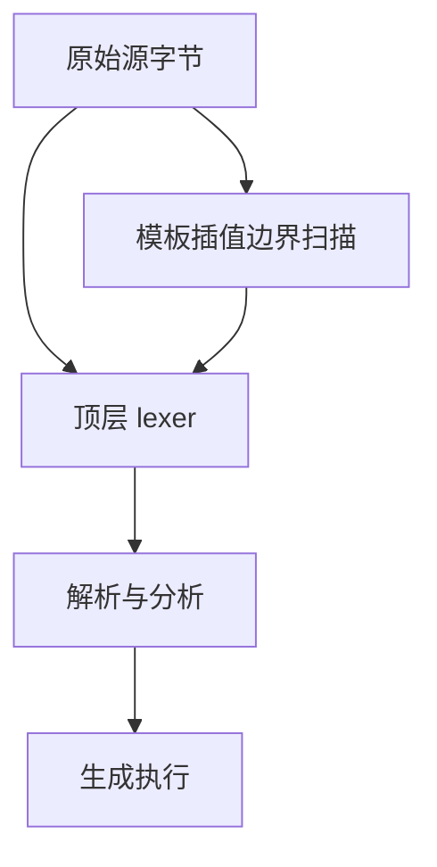
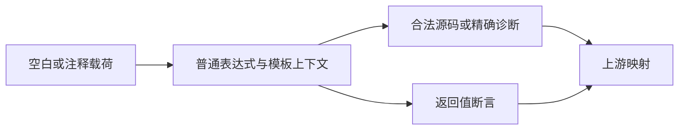

# Test262 空白与行注释边界

## Intent：最终目标

核对空白字符在词法及表达式中的行为，并验证行注释不会吞掉下一行代码。通过源字节、完整解析分析和真实编译执行建立证据。

## Data：可用证据

一元取负 A1 明确列举 TAB、VT、FF、SPACE、NBSP、LF、CR、LS、PS 和组合。ZX lexer 使用 ASCII whitespace；行注释扫描和模板插值扫描均只以 LF 结束，这可能使 CR 与 CRLF 表现不一致。已读取 comments 的基础单行/块注释文件，尚不能用读取代替审查完成。

## Edges：边界与限制

保持既有 ASCII 空白范围，不扩大为完整 JavaScript Unicode 空白集合。CR 为 ASCII 行结束字符；修复若成立，应同时覆盖顶层 lexer 与模板插值扫描。非法 Unicode 字符继续检查字节 span，不宣称支持自动分号插入。

## Answer：交付与成功标准

TypeScript 生成的字符、注释与求值案例；修复前失败证据；最小生产修复；修复后前端、真实运行及根回归；上游逐文件映射与明确差异。

## 执行记录

新增 108 个案例：30 个上游空白组合与位置场景、56 个行注释载荷/结束符/上下文场景、6 个混合注释、2 个未闭合注释、14 个真实执行案例。所有脚本使用 TypeScript。

修复前，2,875 个前端案例中有 14 个失败，全部为单独 CR 的普通源码或模板插值。LF、CRLF、LFCR 对照通过。普通源码中的 return 被吞成注释，模板则报告插值未结束；根因是两个扫描循环只寻找 LF。

修复只在 frontend/lex.zig 与 frontend/template.zig 的行注释循环增加 CR 终止条件。没有按文件名、载荷、案例 ID 或输入值特判，没有扩张 Unicode 空白集合。IR 契约补充 ASCII 空白与 CR/LF 行注释规则。

首次接入运行组时，10 个字符串案例因我选择了比较切片地址的 control 支持而失败，错误属于测试配置。改用已有 collections 深比较支持后，14 个运行案例全部通过；没有改成只比较长度、忽略错误或修改预期。普通注释与模板插值均通过实际 zxc 编译和生成模块执行。

已审查八个上游文件：unary-minus/A1 的十种间隔原样保留，按 ASCII 接受、Unicode 拒绝记录为 adapted；comments 的单行斜杠、混合块/行注释六项与未闭合块注释一项记录为 equivalent。其他已读取但未完整建立证据的文件仍保持 unreviewed。

| 检查                                      | 实际结果                                                                        |
| ----------------------------------------- | ------------------------------------------------------------------------------- |
| 修复前 Debug 前端                         | 2,861/2,875 通过，14 个 CR 回归失败                                             |
| 修复后 Debug 前端和运行组                 | 238/238 步骤、23,540/23,540 通过                                                |
| 普通根构建                                | 5/5 步骤通过                                                                    |
| TypeScript、生成一致性、Zig/Prettier 格式 | 通过                                                                            |
| 根 ReleaseSafe 回归                       | 331/331 步骤、34,372/34,372 Zig test，另 464/464 隔离案例通过；逐报告 ID 已复核 |

证据日志：/tmp/zxc-test262-comments-before.log、/tmp/zxc-test262-comments-after.log（初次运行支持选择错误）、/tmp/zxc-test262-comments-after-final.log、/tmp/zxc-test262-comments-root.log、/tmp/zxc-test262-comments-build.log。

当前登记 34,450 个案例（普通运行 20,665、前端 2,875、隔离 464、模块 10,446）；上游审查 149/53,597（60 equivalent、89 adapted），关联 328 个案例，53,448 项待审查。

## 自我批判

前端成功不等于实际执行成功，本批因此保留 14 个运行值断言；最初误选地址相等的支持模块说明测试层也必须被复核。CR 修复不等于支持全部 Unicode 行终止符或 JavaScript 自动分号插入。单独 CR 的格式化布局和面向用户行号显示尚未据此全面验证，不把词法修复扩大解释为整个工具链格式政策完成。
