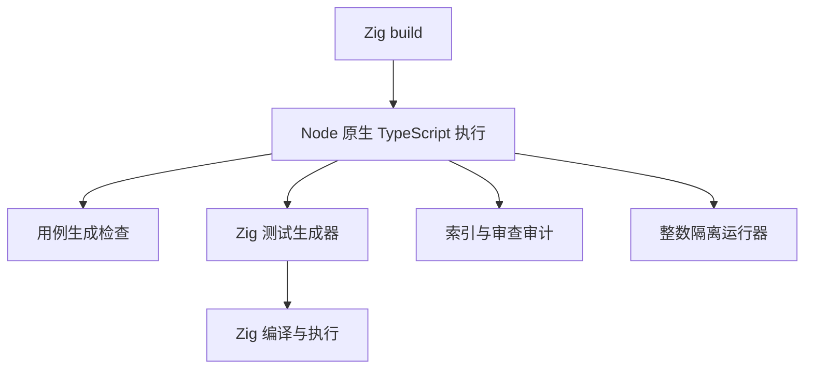
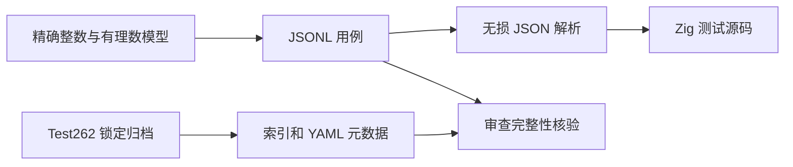

# Test262 脚本迁移 TypeScript

## IDEA

- Intent：按用户要求，将 `packages/test` 内全部 Python 脚本迁移为 TypeScript，构建、生成、运行、审计与上游资料处理均不再依赖 Python。
- Data：迁移前共 28 个 Python 文件、33,982 个有效用例、53,597 个上游索引条目、135 个已审查条目。原脚本已临时备份，用于迁移一致性验证。
- Edges：不改变 ZX/RX 语言契约和既有用例语义；不能把 i64/u64 转为不精确的 number；保留独立 IEEE 舍入模型；不修改并行中的网站工作。此次授权明确修改 test 包脚本，正式代码落在该包。
- Answer：TypeScript 脚本、Node 构建入口和运行说明；生成器检查、索引一致性检查、类型检查和完整 Zig 回归通过。测试数量不因迁移增加。

## 实施顺序

1. 保留原始生成数据作为对照，检查脚本职责与构建依赖。
2. 迁移共享 JSON/文件处理、精确整数与 IEEE 模型。
3. 迁移所有生成器、Zig 源码输出器和隔离运行器。
4. 迁移 Test262 索引、元数据和审查工具。
5. 更新构建入口、工具依赖和说明，移除 Python 源码。
6. 校验生成数据与原始数据一致，执行类型检查及回归，记录差异和自我复核。

## 架构

## 数据流

## 执行与验证

迁移已完成。28 个 Python 文件及 requirements-tools.txt 已移除；现在共有 34 个 TypeScript 文件，额外文件只承载共享 JSON、归档、索引和精确有理数职责。Zig 构建和 README 入口全部使用 Node，缓存步骤显式登记共享 TypeScript 依赖。

### 精度与输出契约

- i64/u64 输入、预期与运算使用 bigint；JSON.parse 利用原始数字 token 恢复超出安全整数范围的整数，JSON.rawJSON 保留标准 JSON 数字形式。
- IEEE 参考模型使用 bigint 分子和分母，按最近偶数舍入。没有使用被测 zxc 或宿主浮点除法生成预期。
- 所有生成器的 --check 均按字节比较，原有 33,982 个案例的 ID、输入、预期、顺序和 ZX 源码未变化。
- 索引与元数据 --check 逐字节通过，53,597 个上游文件的事实数据未变化。
- YAML 使用 1.1 模式并拒绝重复键。迁移发现新解析库不直接接受仅 CR 的行分隔，按 YAML 换行规则统一为 LF 后解析；没有按文件名特判。
- Zig 发射器中的有限小数采用可往返的十进制文本；实际 f64 字面量回归验证相同结果。整数仍使用无损十进制文本，浮点矩阵仍使用位模式。
- 隔离执行器要求精确退出码、空 stdout、执行标记和结果；10 秒超时使用 SIGKILL，避免子进程忽略 SIGTERM 后阻塞。

### 验证结果

| 检查                                  | 实际结果                                                                       |
| ------------------------------------- | ------------------------------------------------------------------------------ |
| pnpm --filter @zxc/test typecheck     | 严格类型检查通过                                                               |
| 包内 zig build test -j2 --summary all | Debug：244/244 步骤；33,574/33,574 Zig test，另 408/408 隔离案例               |
| 根 zig build test -j4 --summary all   | ReleaseSafe：289/289 步骤；33,960/33,960 Zig test，另 408/408 隔离案例         |
| 两份隔离报告复核                      | 408 个 ID 无重复，与目录完全一致，全部 passed                                  |
| 原生成数据复核                        | 全部 JSONL 和 ZX 输出逐字节一致                                                |
| 上游归档索引、元数据复核              | 53,597 条逐字节一致                                                            |
| 元数据遗漏反证                        | 审计和查询均失败，查询未泄漏部分 stdout                                        |
| 审查字段预期漂移、重复 ID 反证        | 均被对应工具拒绝                                                               |
| 真实整数程序的错误预期反证            | 精确失败；实际 stderr 仍为 ZX_EXECUTE 与 ZX_RESULT=255                         |
| 忽略 SIGTERM 的超时子进程             | 被强制终止，报告 timeout，执行器失败退出                                       |
| YAML 负例与 CR 换行探针               | 重复键、错误字段、negative:null 拒绝；CR 正常解析；无 frontmatter 标记 missing |
| Prettier、Zig 格式与 diff 空白检查    | 通过                                                                           |
| Python 源码、字节码及构建引用检索     | test 包活动源码中均为零                                                        |

根回归包含原有 386 个案例，因此新包总数是 33,574 + 408 = 33,982；不能把根汇总重复计入新包。

临时日志：/tmp/zxc-test262-ts-root-final.log、/tmp/zxc-test262-ts-package-debug.log、/tmp/zxc-test262-ts-index.log、/tmp/zxc-test262-ts-inventory.log、/tmp/zxc-test262-ts-typecheck.log、/tmp/zxc-test262-ts-guards.log。日志是本机证据，仓库中的命令可重新执行。

## 当前运行入口

Node.js 最低版本 24.2，实际本机验证为 25.8.1；TypeScript 6.0.3、@types/node 24.19.1、yaml 2.9.1 通过 test 包 package.json 固定，并写入 pnpm lock。

普通生成、发射、运行、审计和查询只使用 Node 内置模块；重建元数据时加载 yaml。两个归档工具先校验锁定 SHA-256，再使用系统 tar 解压到新建临时目录，处理后清理目录。

历史阶段文档保留原执行命令；当前可执行命令以 packages/test/README.md 为准。没有为迁移修改编译器或 RX 生产语义。

## 自我批判与后续

- 输出一致和两种模式回归证明当前数据的迁移一致性，不证明所有未来输入、所有 Node 版本或全部平台都正确。
- 33,982 是现有案例数，不是 Test262 原文件通过数；上游审查为 135/53,597（51 equivalent、84 adapted），仍有 53,462 项待审查。
- 迁移不能替代继续扩展 RX/Store、宿主、资源失败及真实生产运行证据。总目标仍未完成。
- 工具代码使用局部明确类型，没有引入 any、Python 运行兼容层或调用旧脚本的包装器。
