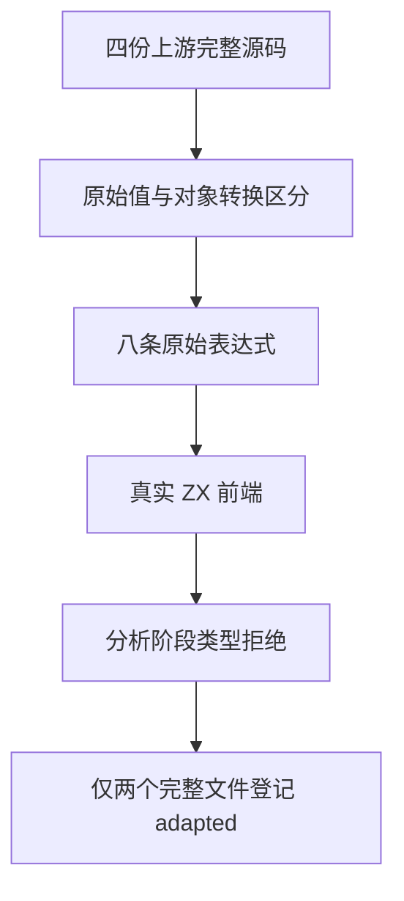

# Test262 跨类型相等诊断

## Intent：最终目标

保留 ZX 静态类型选择，针对上游的跨原始类型相等表达式验证明确的分析阶段拒绝，记录与 JavaScript 隐式转换的差异。

## Data：可用证据

固定提交 `7ab7fafa0003f73fc85c1b95d88094d33f7eb8bd`，完整读取 equals/S11.9.1_A3.2.js、A3.3.js 与 does-not-equals/S11.9.2_A3.2.js、A3.3.js。注意 A3.2 的描述写 number，但第二项实际使用字符串。分析器 `packages/compiler/src/analysis/expressions.zig` 的 binary 分支用同一 operand_type 分析左右操作数；既有 operator types 矩阵检查此静态约束。

## Edges：边界与限制

新增八个原始值字面量表达式：true 与 1、false 与 "0"、0 与 false、"1" 与 true，分别使用 == 和 !=。预期均为 analyze/type_mismatch，不将拒绝冒称 JavaScript 同语义通过。不从编译器输出自动生成预期。

两个 != 文件另含 new Boolean 与 valueOf 对象转换，本轮没有覆盖完整文件，继续未审查。只为两个 == 文件登记 adapted。源表达式保持原样，仅使用 ZX 模块和函数包裹。

## Answer：交付格式与成功标准

八条具名诊断案例注册到 frontend；完成真实前端测试与目录审计后，为两个完整文件绑定四条诊断。无生产修改计划；若诊断不符，先分析契约和失败阶段。

## 执行结果与自我批判

Debug 前端专项 5/5 步骤、2,936/2,936 测试通过，八条新增表达式均为 analyze/type_mismatch。日志 `/tmp/zxc-test262-mixed-equality.log`。目录审计通过：52,182 个登记案例、220 个上游审查（102 equivalent、108 adapted、10 excluded），53,377 未审查、606 个唯一关联案例。本轮没有改变编译器，不重复无关全量运行；最近根测试结果见执行记录阶段 46。

自我批判：跨类型拒绝只能证明 ZX 契约，不证明 JavaScript 隐式转换正确；因此状态是 adapted。不能因为同一文件前两条已测试便忽略后两条对象转换，两个 != 文件仍未登记。
