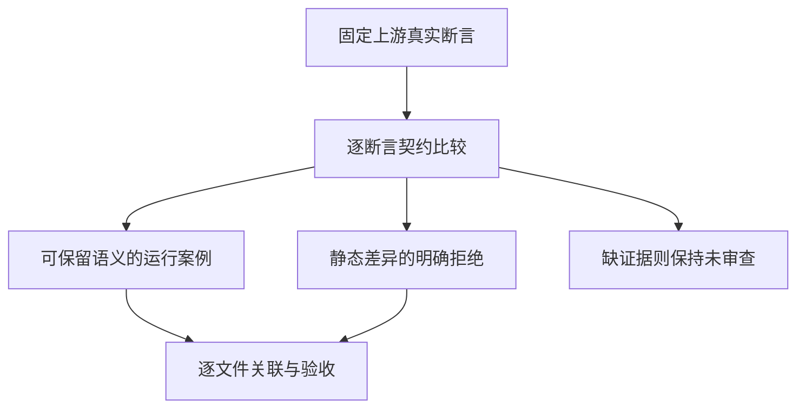
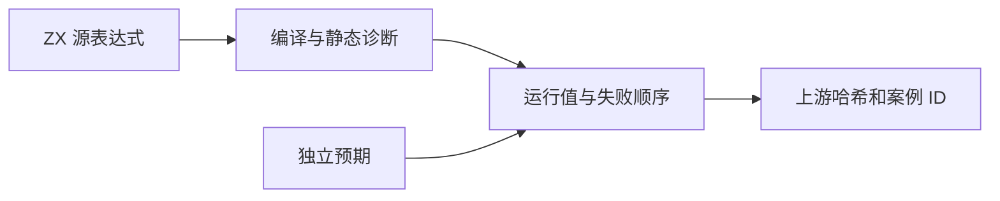

# Test262 逻辑与或逐项对齐

## Intent：最终目标

恢复推进固定 Test262 上游文件的逐项审查，核对逻辑与、逻辑或的源码求值、空白边界和类型契约。保持 ZX 静态 bool 逻辑，不把 JavaScript truthiness、包装对象身份和动态求值误记为等价。

## Data：可用证据

固定上游归档 `/tmp/zxc-test262-reference/upstream.tar.gz` 及源码索引。logical-and、logical-or 各剩 15 个未审查文件；已有 static_names 文件覆盖各三种未知名称情况。现有 operator_types 有静态类型矩阵，basic runtime 有右侧索引错误的短路覆盖，但尚不能替代全部上游源表达式、绑定、包装对象或求值顺序断言。

## Edges：边界与限制

- 每个文件读取实际断言后才作决定；有未验证的重要断言则保持未审查，不能只凭部分 bool 真值表覆盖给整个文件记 equivalent。
- eval 用于生成测试源码时，改为真实 ZX 编译；不声称支持运行时 eval。
- ASCII 空白与换行分别执行；非 ASCII 空白按 ZX 词法规则精确拒绝。
- 非 bool 操作数即使处于短路右侧也必须静态拒绝。JavaScript 包装对象、数值或字符串的返回值选择不能标为 bool 等价行为。
- 左右副作用、异常传播与尾调用必须有对应证据，不能用无副作用真值表替代。
- 分析子代理只读审查文件；主代理决定实现、关联和验收。发现生产问题按用户要求发送实现会话完善。

## Answer：交付与成功标准

新增源码级具名 runtime 与 frontend 案例，补充逐文件审查理由、哈希、案例和断言关联，运行对应专项和矩阵审计。仅将有完整证据的文件移出未审查集合；更新审查数量，不将新增参数案例冒充上游文件数。

## 执行与自我批判

本阶段新增源码与静态测试已通过，并完成下述逐文件关联。此前上游审查为 220/53,597，本轮新增 24 个后为 244/53,597；这仍远非全量对齐。

## 逐文件决定与缺口

AND 与 OR 两组使用相应 11.11.1 / 11.11.2 文件前缀，完整逐文件理由、SHA-256、诊断及结果断言保存在 `upstream/reviews/language/expressions/logical_binary.jsonl`。

| 文件族（每族两个文件） | 决定 | 实际证据与不能等价的部分 |
| --- | --- | --- |
| A1 | adapted | 六种 ASCII 空白真实执行；三种 Unicode 空白与混合串精确词法拒绝；不提供 eval |
| A2.1_T1 | adapted | bool 字面量、绑定和字段执行；左右数值字段拒绝；包装对象身份明确不适用 |
| A3_T1、A4_T1 | adapted | 对应 bool 结果、右侧选中与跳过；静态非 bool 仍拒绝；包装身份不适用 |
| A3_T2、A4_T2 | adapted | f64 两侧逻辑表达式静态拒绝；不宣称实现数值选择、±0/NaN 保真或 Number 包装身份 |
| A3_T3、A4_T3 | adapted | 空与非空字符串位于两侧均拒绝；String 包装构造与身份不适用 |
| A3_T4、A4_T4 | adapted | 明确为空的 optional 左右位置拒绝；undefined 单独不适用，不替换为 null |
| symbol-logical-*-evaluation | excluded | 核心为 Symbol truthiness 与身份，设计未提供 Symbol |
| tco-right | excluded | 核心为深递归尾调用空间行为，设计禁止递归；普通短路不能代替 |
| A2.4_T1/T2/T3 | 仍未审查 | 六个文件涉及左赋值先于右读取、左右不同异常的优先级、未知名称与隐式全局创建；现有无副作用真值表不足以登记 |

共新增 20 个 adapted、4 个 excluded，没有新增 equivalent。每个文件的实际源码哈希与固定索引核对一致；子代理完整读取 30 个候选文件，主代理复核关键源码及契约并完成登记。

## 已执行证据

新增 26 条源码运行、104 条静态和词法案例。联合 `test-logical-binary test-frontend` 为 33/33 步骤、3,350/3,350 测试通过：前端共 3,048，逻辑专项共 302（包括原有短路与嵌套案例）。日志 `/tmp/zxc-test262-logical-binary-final.log`。

TypeScript、生成一致性、目录及审查断言审计通过。目录共 52,880：runtime 38,686、frontend 3,048、safety 464、RX 10,446、Store 236；上游已审查 244、未审查 53,353，关联案例 693。首次登记误带 .jsonl 扩展导致构建查找双扩展路径，修复登记后通过；不是生产实现失败。

自我批判：adapted 中部分行为是明确拒绝 JavaScript 可接受的非 bool 操作，而非提供等价结果；包装对象等断言又有设计排除。因此逐项理由必须一直保留，不得将 244 个审查结论描述为 244 个完全等价通过。六个顺序文件保留未审查，而不因包含不支持语法整份排除。

根回归首轮 52,876/52,876 条 Zig 测试通过，但 893/896 构建步骤成功，唯一失败为 generate_zlib --check：当前格式化后的 fixtures.zig 在常量之间使用单换行，生成器仍用双换行。逐字节去空白比较确认数据未变后，只调整生成器连接符为单换行，生成检查通过。未修改压缩预期或生产实现，完整根回归正在复验。

最终根级复验于 2026-10-04（Asia/Shanghai）完成：896/896 步骤、52,876/52,876 条 Zig 测试通过，日志 `/tmp/zxc-test262-logical-binary-root-final.log`。本阶段跨日继续使用开始时的执行文件，后续新阶段文档按新日期建立。
