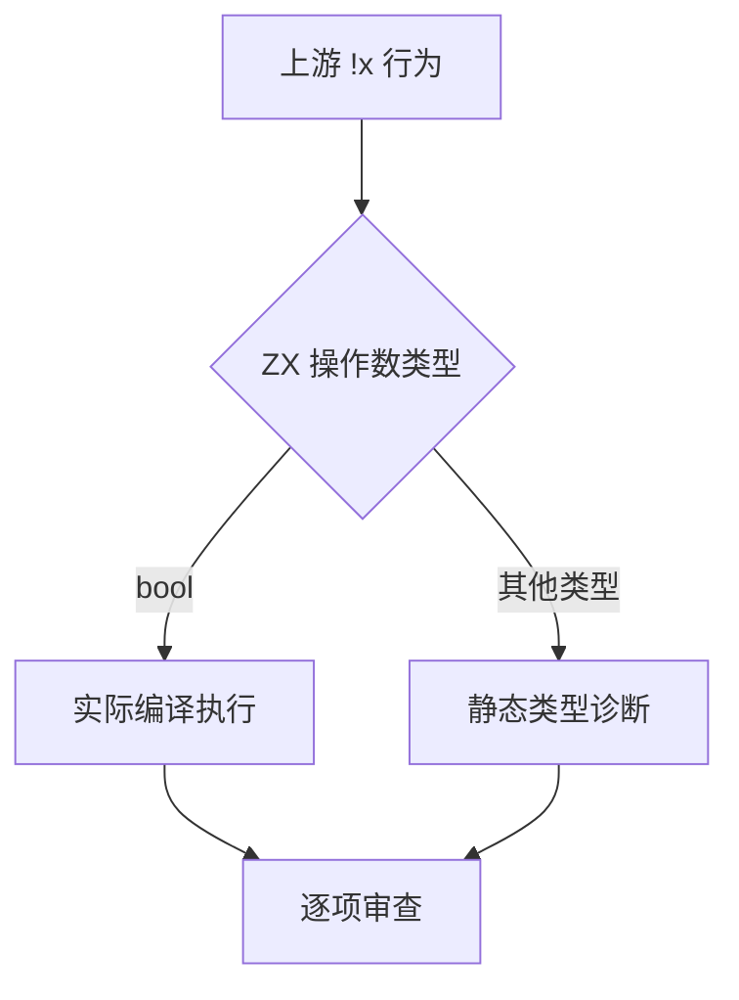

# Test262 逻辑非与布尔约束

## Intent：最终目标

验证逻辑非的布尔结果、绑定和字段读取、嵌套及与逻辑运算的优先级；以精确静态诊断区分 ZX 与 JavaScript ToBoolean。

## Data：可用证据

已读取 logical-not 目录 19 个上游文件，包括真实布尔值、未知名称、空白、数值、字符串、null、对象包装、BigInt 和 Symbol。ZX 现有逻辑运算要求 bool，不能因上游自动转换而修改语言契约。

## Edges：边界与限制

不把静态拒绝称为真值转换支持；不将未完整验证的对象、Symbol、BigInt 文件批量标为已审查。普通布尔输入与源码表达式分别执行，前端负例检查实际阶段和类别。

## Answer：交付与成功标准

TypeScript 生成器、分层案例、上游逐项关联、生成一致性和实际回归证据。仅有复现缺陷时修改生产实现。



```mermaid
flowchart LR
  I[布尔输入和源码字面量] --> N[取反 绑定 字段 嵌套]
  N --> P[与 && 或 || 的优先级]
  P --> E[独立真值预期]
```

## 执行记录

新增 71 个案例：39 个前端案例，32 个实际运行案例。前端覆盖 14 种输入类型、13 个非布尔原始字面量、2 个名称正负例、10 种间隔字符串；运行覆盖 14 个源表达式、2 组多字段布尔结果及 16 个 &&/|| 优先级组合。

已实际确认 bool 接受，其余 13 种输入类型以 type_mismatch 拒绝；不存在绕过检查的 optional bool 或 void 路径。依据 analyzer.expression/coerce 的既有类型检查补充 IR 契约说明，没有改变生产语义。

上游新增九项审查：真实布尔字面量为 equivalent；绑定与静态记录、未知名称、null、字符串、数值转换、空白规则均按具体差异记录 adapted。数值特殊值使用 f64 类型级拒绝作为适配证据，不声称执行 Number 全局属性或对 NaN/Infinity 做 JavaScript ToBoolean；有限数字另保留原字面量负例。对象包装、Symbol、BigInt 等其余十个文件未整体审查。

| 检查                              | 实际结果                                                                      |
| --------------------------------- | ----------------------------------------------------------------------------- |
| Debug 前端与运行组                | 266/266 步骤、23,626/23,626 通过                                              |
| 根 ReleaseSafe                    | 361/361 步骤、34,458/34,458 Zig test，加 464/464 隔离案例通过；报告 ID 已复核 |
| 严格 TypeScript、生成一致性、格式 | 通过                                                                          |
| 矩阵审计                          | 163 个已审查文件，所有案例关联与字段/诊断绑定通过                             |

日志为 /tmp/zxc-test262-not-debug.log、/tmp/zxc-test262-not-root.log。当前登记 34,536 个案例：普通运行 20,702、前端 2,924、隔离 464、模块 10,446。上游 163/53,597 已审查（61 equivalent、102 adapted），关联 371 个案例，53,434 项待审查。

## 自我批判

未发现新生产缺陷，故没有修改编译器。类型级拒绝是静态语言与动态转换的差异证据，不是运行真值转换的替代实现。四组优先级表覆盖全部双布尔输入，但不能推断所有嵌套表达式或副作用顺序。范围较复杂的对象和内置类型没有因为当前不支持就自动计为已完成。
