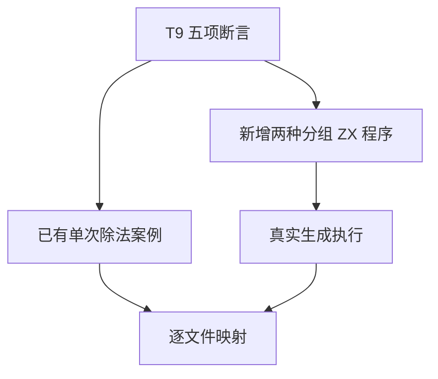
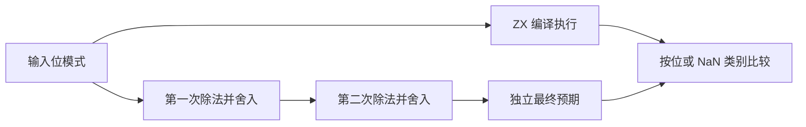

# Test262 除法分组求值对齐

## Intent：最终目标

补齐 Test262 division/S11.5.2_A4_T9.js 的全部断言，尤其是浮点溢出导致两种除法分组得到不同结果的行为，防止后端错误重结合。

## Data：可用证据

已逐项读取固定版本 T9：前四项为最大有限数分别除以 ±0.9 和 ±1；第五项比较 `a / (a / b)` 与 `(a / a) / b`。前四项已有具名输入，第五项缺少对应源程序。

## Edges：边界与限制

- 每次除法都独立执行 IEEE 最近偶数舍入，不能将整个算式化为一次有理数运算。
- 特殊值分类与零符号按既有浮点断言检查；NaN 不限定 payload。
- f64 对应上游 Number，f32 是 ZX 扩展，不重复算作上游文件。
- 不假设两个表达式总不相等：普通值可能相同，逐个比较独立预期。

## Answer：交付与成功标准

新增两种分组的 f32/f64 源程序，覆盖符号零、次正规数、最大有限数、无穷和 NaN 的中间结果。根回归通过后将 T9 保存为逐项审查记录。

## 执行与自我批判

新增 144 个运行案例：每个类型、每种分组各 36 个，全部通过 Debug 真实生成执行。运行组共 17,899/17,899 测试通过，178/178 步骤成功。

预期复用独立 Fraction 单次除法模型，每次运算均重新舍入。全部 144 个嵌套预期用 Node 交叉核对：f64 用 Number，f32 在每次除法后 Math.fround；结果一致。Node 检查只是预期交叉验证，不计入 ZX 案例。

T9 五项断言已完整关联：四个既有单次除法案例，加两个新的 f64 分组案例。右分组得到正零，左分组得到有限非零值，两个按位断言共同验证不相等。T9 标记为 equivalent；上游累计 44 项审查、129 个关联案例，53,553 项仍待审查。

本批没有发现生产缺陷。有限输入不能证明所有浮点优化正确；尤其没有把两个表达式一般性地断言为不相等。多模式验证仍不代表跨平台结果已验证。

## 最终验证

根 `zig build test -j4 --summary all`（ReleaseSafe）：269/269 步骤、31,139/31,139 Zig test 加 408 个隔离案例通过。目录累计 31,161 个有效案例。

生成一致性、注册审计、格式与 diff 空白检查通过。日志为 `/tmp/zxc-test262-batch7-runtime.log`、`/tmp/zxc-test262-batch7-root.log`；会话均已结束。
