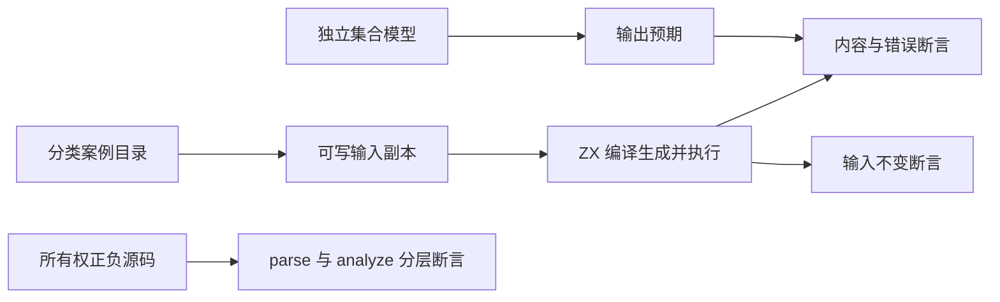

# Test262 集合与所有权对齐

## Intent：最终目标

扩展集合值行为、输入不可变、所有权传播和字符串字节契约，逐项对齐适用的 Test262 数组测试。保留 ZX 消费式 tuple、严格索引和显式 clone，不导入 JavaScript 可变原型与隐式转换。

## Data：可用证据

- 续接基线：新包 5,479 个登记案例；根 5,457 个 Zig test 与 408 个隔离案例通过。
- runtime 已实现 clone、push、pop、reverse、sort、concat、splice、map/filter/reduce；现有 compiler 边界测试提供真实生成执行样例。
- 已只读核对 11 个普通稠密数组上游文件；push/pop 另两份同时包含可写 length 或 undefined 语义，不能忽略差异后宣称等价。
- 所有权审查发现过度拒绝：owned 标量列表 concat 借用列表后，结果新分配缓冲区仍被标为 borrowed；splice 的同类结果也被整体污染。
- 未发现可确认的可变别名逃逸，不能把上述过度保守限制描述为内存安全漏洞。

## Edges：边界与限制

- 列表长度、内容和输入不变分别验证；不以输出正确替代输入不变。
- 只枚举具有结构意义的短序列和边界，使用独立 Python 模型计算预期；不同优化模式不增加案例数。
- 普通标量/不含列表的对象元素可以复制；包含嵌套可消费列表的借用元素必须继续传播 borrowed。不能把所有 concat/splice 结果统一改成 owned。
- 本阶段不引入按 tuple 槽追踪所有权的大型重构；嵌套借用的保守边界保留并测试。
- JS sort 对数字默认采用字符串排序，ZX 是数值排序；JS splice 截断越界，ZX 报错。只能按具体合法范围或 ASCII 排序条目映射。

## Answer：步骤与成功标准

1. 建立集合执行断言支持，传入可写输入副本，并比较执行前后输入内容。
2. 建立所有权阶段正负例，在修复前记录错误拒绝；区分可复制元素与嵌套列表。
3. 最小修复传播规则，证明原来的嵌套借用保护仍拒绝不安全消费。
4. 增加集合内容、长度、边界、操作组合和上游原始值的执行目录。
5. 增加字符串的 UTF-8 字节长度、内容相等、模板与集合排序，保留与 JS UTF-16 差异。
6. 运行相关及根回归、目录审计，更新逐项上游映射与本记录。

## 执行记录

### 所有权修复

先新增 156 个传播案例和 222 个消费案例。修复前，全前端集合为 2,480 通过、44 失败；44 个失败全部是 11 种可复制元素（8 数值、bool、string、无列表对象）的 concat/splice 借用参数结果被过度拒绝。

最小修改位于 `compiler/src/ownership/check.zig`：每个参数仍无条件执行 `value(..., move)`；只有元素本身包含可消费列表时，借用参数才污染结果所有权。没有按具体测试值分支，也没有关闭嵌套借用保护。

加入额外 26 个自引用参数反例，防止短路判断误跳过参数检查。当前所有权共 404 个案例；修复后前端 2,550/2,550 通过。源码与第三方 IR 共用同一个所有权检查器。

### 集合执行目录

集合目录位于 `tests/built_ins/list/<用途>/i64.*`，共 13,118 个案例。以长度 0–4、元素取 -1/0/1 的完整短序列为核心，补上游原始输入及极值；不是 13,118 种语法。

- push/pop/reverse/sort、concat 及连续 concat、concat 后 reverse。
- splice 合法区间穷举、空替换/增长/缩短、非法 start/count 和最大 u64；两返回槽内容与长度分别比较。splice 单项共 8,575 案例，是本批主要数量来源。
- map/filter/reduce、非交换累积验证迭代顺序、索引回调对空行的错误传播。
- 深克隆嵌套列表后消费；在 ZX 内构造两个指向同一借用列表的元素，再 clone、pop、reverse，验证输入和保留行不受修改。
- 每个案例先在独立 Arena 建立可写输入副本；执行后无论成功还是返回错误，都与原始输入深比较。输出预期来自 Python 列表/切片及独立累积模型，没有调用 zxc runtime 计算预期。

所有权复核中特别保留了嵌套借用的保守拒绝；没有引入 tuple 槽级所有权追踪。

### 字符串执行目录

`tests/built_ins/string/<用途>/cases.*` 共 1,712 个案例：值/长度/模板 484、optional 比较与回退 529、排序 88、concat 后 reverse 340、reduce 256、源码字面量 15。

覆盖 NUL、控制字节、中文、补充平面字符、组合与预组合字符、BOM、ZWJ、行分隔字符。长度预期使用 UTF-8 字节数；比较不进行 Unicode 归一化；排序预期显式按编码后的字节序。包含 UTF-16 与 UTF-8 顺序不同的输入，不能宣称 JavaScript String 兼容。

### 上游审查与生成器自检

新增 11 个稠密数组上游文件，保存全部适用的值/长度/输入不变断言，并明确记录对象身份、Array class、多参数签名及 truthiness 的适配。累计 32 个上游文件已审查，关联 93 个案例；53,565 个仍未审查。

上游 push/pop 的某些文件还测试可写 length、稀疏数组或 undefined，未把它们简单改成另一个空列表后关闭条目。

首次生成嵌套列表案例时，空外列表与单个空内列表的 ID 编码发生冲突，构建中的重复 ID 检查拒绝了整个目录。现已将嵌套层级加入 ID，全部目录可由生成器 `--check` 重建。这个问题说明生成用例本身也需要审计，失败批次未记为通过。

## 自我批判与续接

当前登记案例为 20,713，超过 30,000 仍需至少 9,288 个不同有效案例。数量增长主要来自有限输入矩阵，不能证明一般规模正确性。

本批生产修复是过度拒绝的改善，不是发现内存安全漏洞。输入副本的递归复制只是测试准备，真正预期来自目录中的独立值模型；没有用生产 clone 作为断言预期。

当前字符串集合主要使用有效 UTF-8 文本，加上宿主传入 NUL/控制字节；尚未全面覆盖任意非法 UTF-8 字节输入、资源失败或全部转义负例。RX、模块图、Store 宿主和跨平台执行仍待后续。

## 最终验证

| 命令或检查                                           | 实际结果                                                         |
| ---------------------------------------------------- | ---------------------------------------------------------------- |
| 包内 `zig build test -j4 --summary all`（Debug）     | 202/202 步骤；20,305/20,305 Zig test，加 408 个隔离案例全部通过  |
| 根 `zig build test -j4 --summary all`（ReleaseSafe） | 247/247 步骤；20,691/20,691 Zig test，加 408 个隔离案例全部通过  |
| 根 `zig build --summary all`                         | 5/5 步骤通过                                                     |
| 生成器 `--check` 与 `audit_matrix.py`                | 全部生成目录一致；20,713 个唯一登记案例；32 项上游审查           |
| 隔离报告独立核对                                     | Debug 与 ReleaseSafe 均恰好包含目录中的 408 个 ID，全部 `passed` |
| 生产 diff 空白检查与新增 Zig 格式检查                | 通过                                                             |

根回归比包内多出原有 386 个测试。不同模式不重复计入有效案例数。原始日志位于 `/tmp/zxc-test262-batch3-debug.log`、`/tmp/zxc-test262-batch3-root.log`、`/tmp/zxc-test262-batch3-build.log`；这些临时文件不是可移植交付物，恢复时可按上述命令重现。

本阶段结束时构建会话均已终止。下一阶段优先补齐短路的逐项上游映射，扩展模块图、RX 结构校验与资源失败；RX 目前公开接口接收合成 AST，不能把该类校验写成 XML 源码到执行的端到端验证。
