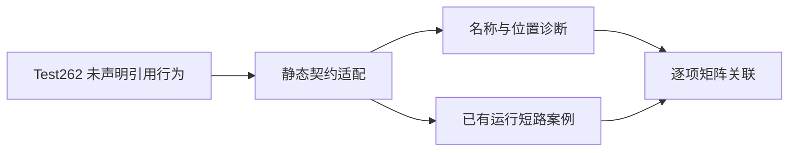
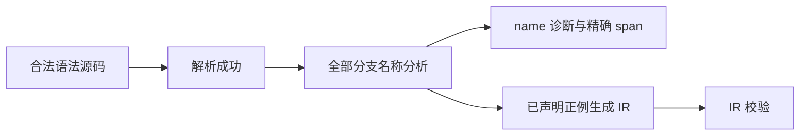

# Test262 静态名称与短路对齐

## Intent：最终目标

分开验证编译期名称检查与运行期分支选择，逐项记录 Test262 未声明引用测试在 ZX 中的适配，不把未执行分支当作免检区域。

## Data：可用证据

- 当前包 20,713 个案例，已有 460 个短路执行案例，尚未与对应上游文件建立审查关联。
- 已逐项阅读 logical-and、logical-or 的 A2.1_T2/T3/T4，以及 conditional 的 A2.1_T2 至 T6。
- 上游既包含实际求值未声明变量时抛 ReferenceError，也包含跳过未声明引用的成功行为。
- ZX IR 契约要求所有符号有声明；分析器通过 name 诊断报告未知值。运行期短路不取消静态名称检查。

## Edges：边界与限制

- 不支持 JavaScript 动态作用域与 Boolean/Object 包装器，不用简单布尔值替换对象后宣称等价。
- 编译负例必须先解析成功，再检查分析诊断种类和准确位置；同时增加已声明名称的正例。
- 对未选分支的上游案例，记录为 adapted：静态拒绝未知名称；另关联类型合法但运行访问越界的跳过测试，验证短路仍成立。
- 这些测试不验证抛出两个不同异常时的求值先后；对应 A2.4_T2 保持未审查。

## Answer：交付与成功标准

生成 &&、|| 两侧与条件表达式三个位置的名称正负例，接入统一目录、构建和审计。11 个上游文件逐项保存源哈希、适配理由和具体案例 ID。执行前端与根回归后写入结果，不修改未复现缺陷的生产代码。

## 执行与自我批判

新增 28 个案例：&&、|| 两侧位置分别取 true/false；条件表达式三个位置分别取 true/false。每个结构包含未声明负例和已声明正例。负例必须解析成功、分析返回 name，span 精确覆盖 missing；正例还通过 IR 校验。

包内 `zig build test-frontend -j4 --summary all`：4/4 步骤、2,578/2,578 测试通过。生产实现符合该契约，本批不修改生产代码。

根 `zig build test -j4 --summary all`（ReleaseSafe）：247/247 步骤、20,719/20,719 Zig test 通过，另有已接入的 408 个隔离案例通过。根汇总含原有 386 个测试，不重复计入新包。日志为 `/tmp/zxc-test262-batch4-frontend.log` 与 `/tmp/zxc-test262-batch4-root.log`，构建会话均已结束。

11 项逐文件审查保存在 `upstream/reviews/language/expressions/static_names.jsonl`；均为 adapted。累计 43 项审查、123 个关联案例，53,554 项仍未审查。目录累计 20,741 个有效案例，生成一致性和注册审计通过。

仅关联已有运行案例不能补足静态诊断覆盖，因此新增负例均配有同结构已声明正例。名称正例只证明分析和 IR 合法，不冒充运行结果。A2.4_T2 的双异常求值顺序仍无独立证据，本批没有关闭该上游条目。
