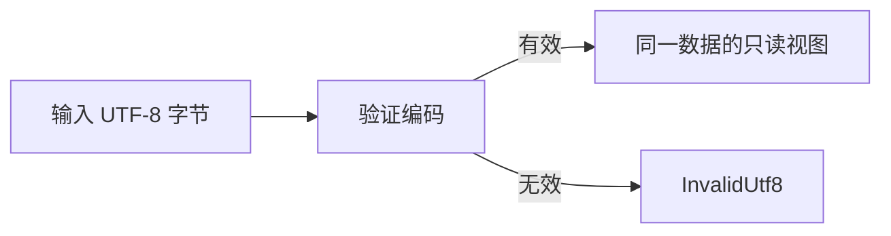

# UTF8 只读视图实施

## Intent：最终目标

UTF-8 编码和解码在确认输入有效后返回只读视图，不复制内容。ZX 调用形式保持不变，不暴露指针或引用语法。

## Data：可用证据

ZX 字符串和字节列表在 Zig 后端均表示为字节切片。当前 encodeUtf8/decodeUtf8 验证字节后调用 allocator.dupe，实际上没有转换编码。原生函数返回摘要默认只读借用，调用者已保护借用来源。

## Edges：边界与限制

视图依赖输入存活期，不代表拥有新数据。非法 UTF-8 仍报错。Base64、十六进制等真正改变内容的编码继续分配结果。本改动不决定新数组共享元素后是否允许消费，不开放借用字节数组的修改权限。

## Answer：实施与成功标准

移除 UTF-8 两个原生接口的隐藏 allocator 参数，保留验证并直接返回输入。迁移既有资源检查，使借用结果不被释放，检查视图地址一致。执行已有资源与标准库运行时回归，不新增测试用例。

## 自我复核

这只消除 UTF-8 表示转换中的冗余复制，不证明所有标准库函数零分配。输入生命周期仍须覆盖视图使用期；不能把视图当成独占可消费列表。

## 实际验证

两个接口已移除隐藏 allocator 参数，验证通过后返回输入视图。既有资源检查保持错误与释放断言，并检查有效 UTF-8 的输出地址与输入地址一致。

执行 packages/test 的 test-standard-resources 与 test-standard-runtime：102/102 构建步骤成功，3180/3180 测试通过。没有新增测试用例。该结果包括 UTF-8 错误拒绝、资源检查及标准库经生成代码的执行，不代表尚未完成的其他标准库功能组。
