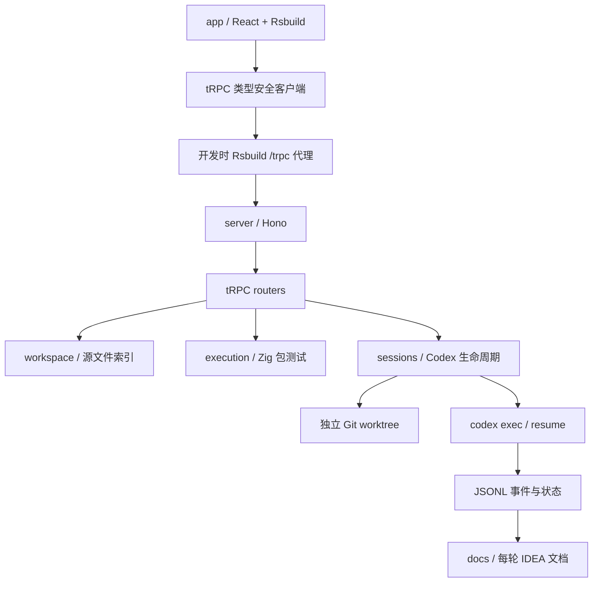
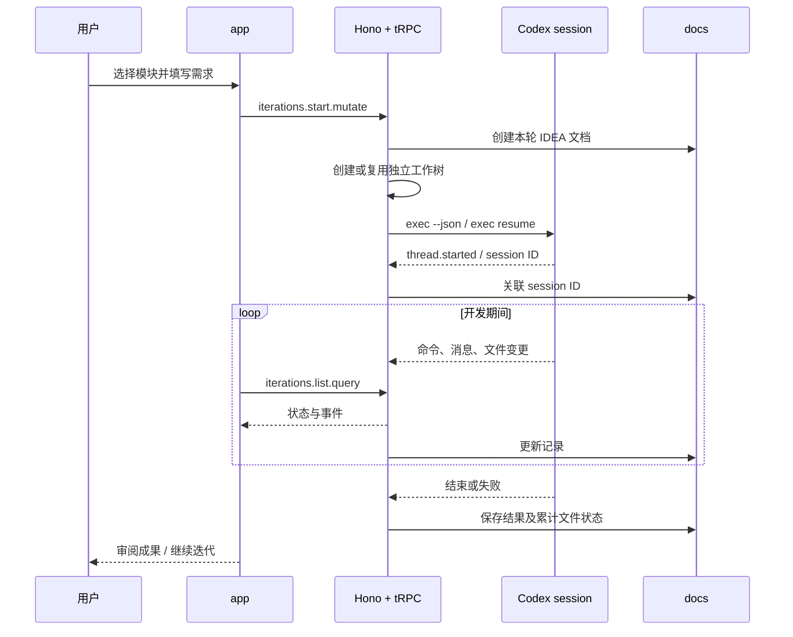

# zray 开发控制台实施记录

## Intent：最终目标

在 `packages/zray` 新增 zxc 开发控制台：预览测试和模块源码，执行已有 Zig 包测试，以 Codex session 驱动模块开发，实现并行可视化，每轮开发在 docs 中留下迭代文档。

最终架构按用户要求采用 `app`（React + Rsbuild）和 `server`（Hono），通过 tRPC 交互。`components.json` 位于 `app`，Git 和 Prettier 忽略规则统一在仓库根控制，包内不保留独立 Git 仓库或 ESLint 配置。

## Data：可用证据

### 实现依据

- 已阅读根 AGENTS、文档分工、RX 开发约定。
- 参考 polywise 的 Hono 入口、tRPC router/context、类型安全客户端、Rsbuild 和 Tailwind v4 接入。
- 通过 shadcn CLI 初始化指定 `b1VlJBCq` 预设，实际执行 `pnpx shadcn@latest add sidebar-08`；保留生成的基础组件，品牌、导航和模板内容替换为 zxc 开发工作区。
- CLI 解析预设为 Base UI / Luma / Neutral / Hugeicons。字体依用户要求替换成本地 Google Sans 和 Geist Mono。
- `shadcn info --cwd packages/zray/app` 确认样式与组件别名解析到 app 下正确路径；自定义字体使工具重新推导的预设代码不同，原始指定预设的组件风格和主题仍保留。
- tRPC 客户端只以 `import type` 引用服务端 Router，不把 Node 服务代码打入浏览器包。

### 验证结果

| 检查                      | 实际结果                                                                                                        |
| ------------------------- | --------------------------------------------------------------------------------------------------------------- |
| TypeScript                | `pnpm --filter @zxc/zray-app typecheck` 与 `pnpm --filter @zxc/zray-server typecheck` 通过                      |
| Rsbuild 生产构建          | `pnpm build:zray` 通过                                                                                          |
| 前后端启动                | 前端 4310、Hono 后端 4311 正常启动                                                                              |
| tRPC 经前端代理读取工作区 | 6 个包、92 个模块源文件、74 个测试文件                                                                          |
| tRPC 源码读取             | 成功读取 `packages/rx/src/root.zig`，2333 字符                                                                  |
| RX 包测试                 | 经 tRPC 启动 `zig build test`，退出码 0，passed                                                                 |
| Compiler 包测试           | 退出码 1，failed；真实日志正确返回                                                                              |
| Compiler 失败摘要         | 10/43 构建步骤成功、28 步失败；已运行的 312/312 测试通过，但整体构建未通过                                      |
| Compiler 失败原因         | ZX 测试输入触发 `spacing: blank lines do not match AST grouping; run zxc fmt`，包括运行时用例及 store generator |
| 构建后静态服务            | Hono 首页与两种字体文件返回 HTTP 200                                                                            |
| 本地请求边界              | tRPC 越界路径被拒绝，跨来源请求返回 403                                                                         |
| 最终联合启动              | 根 `pnpm dev:zray` 启动两个独立包，自动选中兼容的应用内置 Codex CLI                                             |
| Codex 全局 CLI            | 0.118.0 无法解析配置中的 `priority` service tier                                                                |
| Codex 应用内置 CLI        | 0.160.0，可读取配置，`login status` 确认 ChatGPT 登录                                                           |
| Codex 模型会话端到端      | 未实际发起模型调用；新建、继续、并发与停止会话未完成真实模型运行验证                                            |
| 浏览器视觉检查            | 遵照用户要求，未执行                                                                                            |
| 新增测试用例              | 未生成                                                                                                          |

Compiler 失败来自本次未修改的既有测试输入，未为了使控制台展示通过而改写测试或伪造结果。

### Zig 安装记录

用户明确要求安装 Zig 后，安装了 0.16.0，与仓库 `minimum_zig_version` 对齐。

- 平台：macOS x86_64。
- 安装目录：`/Users/xiewendao/.local/share/zig/zig-x86_64-macos-0.16.0`。
- 命令链接：`/usr/local/bin/zig`。
- 下载来自 Zig 官方列出的社区镜像，并与官方下载索引的 SHA-256 对照。
- 校验值：`0387557ed1877bc6a2e1802c8391953baddba76081876301c522f52977b52ba7`。
- `zig version` 返回 `0.16.0`，且已实际执行 RX 与 Compiler 包测试。

Codex 由程序自动探测：先检查 PATH，再检查 macOS 标准应用目录中的 Codex / ChatGPT 内置 CLI，通过版本与登录状态检查选择可用版本。不读取密钥文件，不修改全局配置，不依赖 `.env.local`。

## Edges：边界与限制

1. 源文件是模块关联粒度；源码预览不等于 RX Runtime 已实现。
2. 测试发现是文件和 build step 的文本索引，不是完整 Zig 解析器。执行单位为整个包。
3. 当前管理由 zray 创建的 CLI sessions，不导入任意已有桌面会话，不读取 Codex 私有数据库。
4. 每个新 session 使用独立 worktree，最多三个模块同时开发，同一模块互斥。
5. 新 worktree 复制 HEAD、已跟踪文件的当前差异、目标包未跟踪源码，不复制整个磁盘工作区。
6. 继续会话沿用既有工作树与 session；结果保留待审阅，不自动合入或清理。
7. 每份 docs 文档保存该轮结束时的累计变更清单；界面 diff 展示工作树当前累计状态，可能包括后续迭代。
8. CLI 使用 workspace-write 沙箱。需要交互批准的操作会失败，不会绕过沙箱或全局安全设置。
9. 正常关闭会停止受管进程；被强杀后可能遗留进程，重启时记录标为中断，用户需确认进程状态后再继续。
10. 本地工具只监听回环地址，检查请求 Host、Origin 和自定义请求头，不用于公网多用户服务。

### 数据存储

| 数据                 | 位置                                    | 生命周期             |
| -------------------- | --------------------------------------- | -------------------- |
| 模块与测试源码       | 仓库 packages                           | 按需读取             |
| 开发工作树           | `.zxc/zray/worktrees/<ID>`              | 保留供审阅           |
| Codex 事件与标准错误 | `.zxc/zray/events/<ID>.jsonl`           | 本地持久化           |
| 迭代元数据           | `.zxc/zray/iterations/<ID>.json`        | 原子写入，重启加载   |
| 逐轮 IDEA 文档       | `docs/YYYY-MM-DD/zray/模块迭代-<ID>.md` | 可提交 Git           |
| 测试日志             | 服务内存                                | 本次服务期间有界保留 |

每轮文档采用 IDEA 结构，摘要每节最多 280 行，完整输出保留在 JSONL 事件中，单份生成文档不超过 1000 行。

## Answer：交付结构与实现

### 目录职责

| 位置                    | 职责                                   |
| ----------------------- | -------------------------------------- |
| `app/rsbuild.config.ts` | React 构建、Tailwind PostCSS、开发代理 |
| `app/components.json`   | shadcn 组件及样式路径                  |
| `app/features`          | 总览、模块、测试、会话、迭代 UI        |
| `app/lib/rpc.ts`        | 类型安全的 tRPC HTTP batch 客户端      |
| `app/vendor`            | 生成的第三方 shadcn 组件               |
| `server/index.ts`       | Hono 服务启动与关闭                    |
| `server/app.ts`         | 请求边界、tRPC 挂载、构建后静态前端    |
| `server/rpc`            | 按工作区、执行、迭代划分 procedures    |
| `server/workspace`      | 真实文件发现与读取                     |
| `server/execution`      | Zig 测试进程与状态                     |
| `server/sessions`       | Codex 生命周期、工作树、事件与文档     |
| `shared/types.ts`       | 前后端数据类型                         |

app 和 server 各自保留独立 package.json、tsconfig.json，注册为 `@zxc/zray-app`、`@zxc/zray-server` 两个 workspace 包。zray 根没有 package.json、tsconfig.json，也不需要 `.env.local`。仓库根提供 `dev:zray`、`dev:zray:app`、`dev:zray:server`、`build:zray`、`start:zray` 命令。没有包内 `.git`、`.gitignore`、`.prettierignore`、Prettier 或 ESLint 配置。根配置增加工作区、启动脚本、必要构建脚本授权及忽略规则。

### 架构图



生产构建后由 Hono 直接提供 `app/dist` 静态前端，浏览器仍访问同源 `/trpc`。

### 迭代数据流



### 关键接口示例

```ts
const rpc = createTRPCClient<Router>({
	links: [
		httpBatchLink({
			url: '/trpc',
			headers: { 'X-Zray-Request': '1' }
		})
	]
})

await rpc.iterations.start.mutate({
	module: module_path,
	prompt,
	previous_id: previous?.id
})
```

- Query 负责读取文件、测试状态、迭代状态、文档和变更。
- Mutation 负责启动与停止测试、启动与停止迭代。
- Zod 校验输入，后端再按真实工作区验证模块和可执行包。
- Codex 用参数数组和 stdin 接收用户需求，不拼接 shell 命令。

### 自我审查

- 没有修改 Zig 业务源码或测试，没有伪造成功状态。
- 前后端职责已拆分，界面代码不会直接访问文件系统或启动进程。
- 模块开发集中在 session 流程，没有增加第二套直接文件编辑机制。
- 采用工作树隔离并行开发，不引入数据库、远程服务或额外调度框架。
- 类型检查、Rsbuild 构建和真实 tRPC 测试执行均有证据；真实 Codex 模型会话链路仍明确标为未验证。
- 没有做用户禁止的 UI 浏览器确认；构建通过不能证明最终视觉质量。
- 逐轮文档是事实记录，“待审阅”状态保留验收要求。

参考：[shadcn CLI](https://ui.shadcn.com/docs/cli)、[Codex 非交互模式](https://learn.chatgpt.com/docs/non-interactive-mode)、[tRPC Fetch 适配](https://trpc.io/docs/server/adapters/fetch)、[Zig 官方下载索引](https://ziglang.org/download/index.json)。
