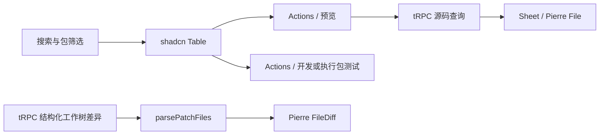

# zray 表格与代码预览迭代

## Intent：最终目标

- 模块预览、测试用例采用 shadcn Table，替代左侧文件列表。
- 行 Actions 提供预览、模块开发和包测试执行。
- 使用 diffs.com 渲染源码和变更。
- 页面只保留单行标题。
- Header 右侧显示 Zig 和 zxc 版本。

## Data：可用证据

- 实际执行 shadcn CLI 安装 Table。
- 参考 polywise 的 File / Virtualizer 用法，接入 @pierre/diffs。
- 版本接口实际返回 Zig `0.16.0`、zxc `0.0.1`。
- 真实仓库差异经后端拆分后，Pierre 成功解析 5 个已跟踪文件变更；读取 55 个未跟踪文本文件，没有因大小略过文件。
- `pnpm build:zray` 与根 Prettier 检查通过。
- 前后端开发服务分别保持监听 4310、4311。

## Edges：边界与限制

- 测试按钮明确为“执行包测试”，状态表示所属包结果，不能解释为所选文件单独通过。
- 源码通过 Sheet 打开；RX 按 XML 高亮，ZX 没有对应语法定义，按纯文本展示，不伪装成其他语言。
- 已跟踪变更使用 FileDiff，未跟踪文本文件使用 File；过大文件保留明确提示。
- 关闭 diff 行背景着色，保留当前中性 UI。
- zxc 版本来自根 build.zig.zon 声明，不代表另一个已安装二进制的版本。
- 未生成测试用例，未调用浏览器确认 UI，也没有发起模型任务。

## Answer：实现与验收

共享表格在 `app/components/source_table.tsx`，源码和变更显示分别在 `code_view.tsx`、`diff_view.tsx`。版本读取在 `server/workspace/files.ts`，经 `workspace.versions` 返回。



```ts
const versions = await rpc.workspace.versions.query()

const changes = await rpc.iterations.diff.query({ id: iteration.id })
```

自我审查：复用已有业务入口，没有为表格重写执行逻辑；后端分离 patch、未跟踪文本与略过文件，避免把拼接日志误当标准 diff。静态检查和真实数据解析通过，但不替代浏览器中的交互与视觉验收。

参考：[Diffs 官方介绍](https://diffs.com/)。
