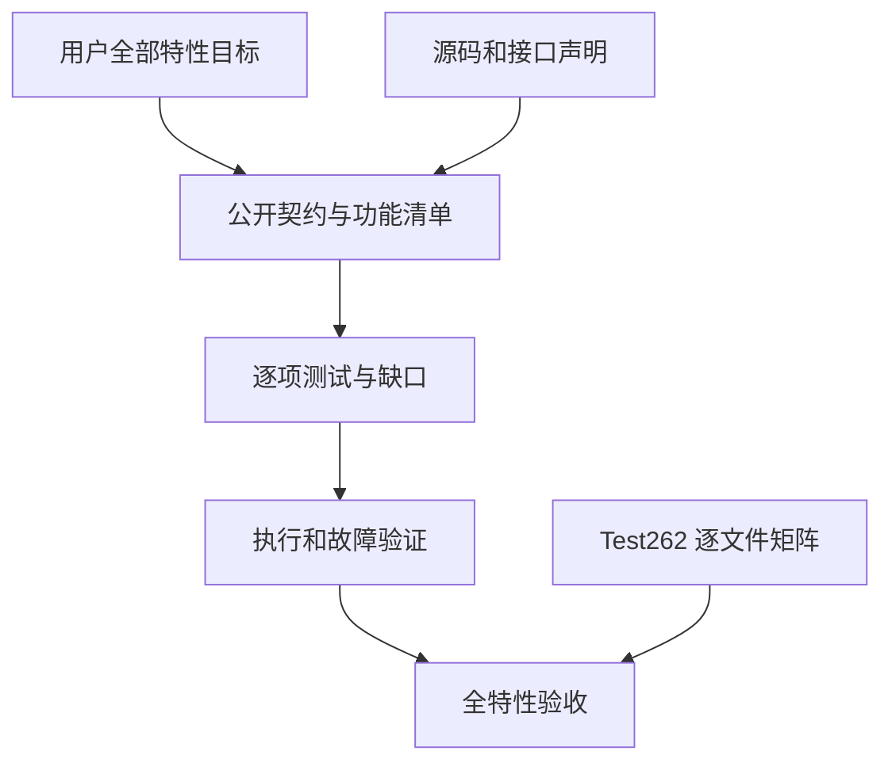

# zxc 全特性测试覆盖清单

## Intent：最终目标

响应用户新增要求：除了逐项 Test262 对齐，还为 zxc 全部特性实现与 Test262 同等粒度的测试。两条工作线独立验收；超过 30,000 个案例不能替代特性覆盖。

本清单是第一轮职责盘点，不宣称枚举已经完备。后续逐项展开为公开入口、合法行为、非法输入、错误阶段、资源失败、交互组合和运行模式，并关联实际执行证据。

## Data：可用证据

本轮读取根 build.zig、compiler README、ZX 设计文档章节、standard/modules.json 及七份接口声明，检查 compiler/test/rx 测试目录。标准库当前声明 68 个函数入口：encoding 6、crypto 17、三个 path 模块各 10、querystring 6、zlib 9；入口数量不是语义覆盖数量。

表中路径均相对仓库根目录。已有测试表示存在相关入口，不能据此推断所有边界已覆盖。执行记录阶段 110 保存最近完整根测试证据：1,249/1,249 步骤、61,500/61,500 条 Zig 测试及 1,906 个 Node 报告通过；并行实现改变后须重新验证。

| 特性域                                 | 当前证据入口                                                                                                 | 下一项必须核验的缺口                                                                                                                        |
| -------------------------------------- | ------------------------------------------------------------------------------------------------------------ | ------------------------------------------------------------------------------------------------------------------------------------------- |
| 词法、数值与字符串字面量、注释         | packages/test/tests/language/lexical                                                                         | 完整语法清单、诊断位置、跨文件编码组合                                                                                                      |
| 标量、枚举、optional、对象、列表、元组 | packages/compiler/tests/language/types_test.zig                                                              | 每种类型的嵌套、空值和非法组合逐项映射                                                                                                      |
| 算术、比较、逻辑、短路与求值顺序       | packages/test/tests/language/expressions                                                                     | 剩余 Test262 文件、跨操作符组合、所有数值类型                                                                                               |
| const、解构、if、switch、match、return | packages/compiler/tests/language                                                                             | match 已覆盖轨迹、标量、浮点、借用结果身份、跨模块枚举身份与列表返回所有权；更深聚合组合、生命周期与资源失败仍待验证                                                                                                          |
| 字符串模板、长度与比较                 | packages/test/tests/built_ins/string                                                                         | UTF-8 字节语义和组合表达式逐项审计                                                                                                          |
| map/filter/reduce、集合更新            | packages/test/tests/built_ins/list                                                                           | i64 消费族 10,855 条已恢复；字符串消费 428 条已恢复；嵌套与新资源边界仍待验证                                                               |
| 禁止深拷贝、消费与所有权合流           | packages/test/tests/ownership                                                                                | 404 个矩阵及返回摘要已测；细粒度借用、嵌套别名和运行时指针身份仍待验证                                                                      |
| 项目导入、类型连接、路径与无环         | packages/test/tests/rx/modules；packages/compiler/tests/modules                                              | ZX/RX 两套入口的差异、原生声明混合图                                                                                                        |
| 第三方 IR 合法性与版本                 | packages/test/tests/contracts/ir_test.zig；packages/compiler/tests/ir                                        | 新 external 描述、类型形状与非法图边界                                                                                                      |
| 编译分配失败                           | packages/compiler/tests/runtime/boundaries_test.zig                                                          | 新声明解析、转换和静态依赖代码路径                                                                                                          |
| Store 权限、暂存、失败与提交           | packages/test/tests/stores                                                                                   | 236 条引用 ABI 场景与独立快照检查通过；真实宿主版本协议和持久化仍不由此证明                                                                 |
| RX 文本解析及 CLI                      | packages/test/tests/rx/text；packages/test/tests/rx/cli                                                      | 全标签、属性与类型连接逐项覆盖清单                                                                                                          |
| RX Store、Flow、Gateway、依赖图        | packages/rx/tests                                                                                            | 完整公开标签与现有测试逐条对应，组合与资源失败                                                                                              |
| RX 调度与宿主执行                      | compiler README Edges                                                                                        | 区分尚未实现与已实现但未测试；不以图校验替代运行                                                                                            |
| 编码六个接口                           | packages/test/tests/standard/decoding；packages/test/tests/standard/encoding_crypto                          | 共享 ABI 运行专项已通过，六个接口的逐项覆盖审查继续进行                                                                                     |
| 密码学十七个接口                       | packages/test/tests/standard/crypto；packages/test/tests/standard/resources                                  | 共享 ABI 与资源专项已通过；全接口映射继续，功能测试不证明恒定时间                                                                           |
| path 三个模块各十个接口                | packages/test/tests/standard/path                                                                            | 默认平台入口与显式 POSIX/Windows 差异、声明迁移                                                                                             |
| querystring 六个接口                   | packages/compiler/standard/interfaces/querystring.d.zx                                                       | 540 条真实运行与九个逐分配失败测试已通过；有序 Entry 与 Node 对象差异明确，混合非法 Unicode 按 UTF-8 契约；跨模块返回借用及更广组合仍待审查 |
| zlib 九个接口                          | packages/compiler/standard/interfaces/zlib.d.zx                                                              | 231 条解压目录、264 次独立应用互操作和 22 个资源测试已通过；已修复并向实现会话报告内存写入 OOM 错误映射；可选 gzip 头与更多畸形流仍需扩展   |
| 原生声明及聚合转换                     | packages/test/tests/build_modes/native_declaration_test.ts；packages/test/tests/native/declarations_test.zig | 零/多参数与 namespace 已有 25 组执行，配置冲突和纯类型 namespace 已测；深层类型与跨模块身份仍待覆盖                                         |
| C 头文件与静态链接                     | packages/compiler/tests/runtime/native_fixture.zig；原生构建示例                                             | 独立自动 C ABI 入口、链接失败与平台边界                                                                                                     |
| app/lib、原生资源搬迁                  | packages/test/tests/build_modes                                                                              | 无 runtime 依赖的新产物契约、依赖选项与独立消费                                                                                             |
| 目标、CPU、汇编输出                    | compiler README 原生构建入口                                                                                 | 配置拒绝、汇编内容和支持目标矩阵                                                                                                            |
| requires/ensures 与 SMT                | packages/test/tests/contracts；packages/test/tests/verification                                              | 每个支持语法的证明与反例；不支持语法明确拒绝                                                                                                |
| 硬件图、RTL 与时钟握手                 | packages/test/tests/hardware                                                                                 | 支持运算符与位宽、非法输入、形式等价及目标限制                                                                                              |
| 格式化与风格诊断                       | packages/compiler/tests/style/format_test.zig                                                                | CLI check 幂等性、新声明文件、错误位置与不改写非法输入                                                                                      |
| pkg.yaml 清单、工作区与依赖 | packages/test/tests/package_manifest | 包清单/工作区/依赖图/导入隔离、1,502 个版本范围、初始化等累计 1,677 个 Node 测试；索引另 64 个。外部来源、锁文件、安装与更多原生边界仍待验证 |
| CLI 安装、帮助、参数与退出协议         | packages/test/tests/build_modes                                                                              | 公开子命令逐项验证、缺失资源、路径与 stdout/stderr 契约                                                                                     |
| DSL、genz、lint、zray 支撑包           | 各包 build.zig 与 src 待逐项读取                                                                             | 根 test 未直接列出所有支撑包；不能由编译器测试推定全覆盖                                                                                    |
| 动态插件旧接口                         | packages/test/tests/plugins                                                                                  | compiler 当前契约已取消动态插件；plugins 目录仍有历史 fixture，不得计为当前公开功能覆盖，需单独清理陈旧入口                                                                      |

## Edges：边界与限制

- 用户选择保留静态 ZX/RX 设计，数据库当前明确不实现。记录设计不适用与实现缺口，不能混为测试通过。
- compiler 当前文档明确静态链接及独立 app/lib，不支持动态插件；历史 plugins fixture 仍保留，不代表当前公开能力。产物搬迁与内嵌工具链由 build_modes/toolchain 入口分别留证，不能由旧插件测试推断。
- 根测试、外部 Yosys 专项、真实求解器和目标平台分别留证；一种环境通过不代表全平台。
- 网站展示不替代语言功能证据；遵守用户约束，不调用浏览器做 UI 确认。
- 68 个标准库声明仅按当前七份声明文件统计，后续接口变化必须同步审计，不能冻结成排除新接口的名单。

## Answer：交付格式与成功标准

1. 按本清单逐域细化公开入口与契约，补齐遗漏特性；每个独立语义规则、前置条件与预期关联稳定案例 ID，达到 Test262 的可定位粒度。
2. 审查现有合并循环与大型 Zig 测试，区分可独立失败的语义场景；参数数量和分配遍历次数不能代替规则覆盖。每个已实现特性至少关联实际合法执行、适用的拒绝边界和失败清理；交互性特性还需跨域组合。
3. 新增失败先复现并判断契约，再最小修复，禁止按用例特判。
4. 新静态后端落地后完成全量回归及独立产物验证；过期测试必须按真实契约调整。
5. 最终同时审计 Test262 全量矩阵和全特性覆盖，保留未实现、不适用、未验证项，不以测试总数代替完成判断。

## 自我批判

目录存在只能定位测试，不能证明覆盖。此版本避免给各域标记“完成”，下一轮必须读取具体断言，优先处理当前正在改变的静态链接和原生声明边界。当前最大的过程风险是实现与回归同时变化，使历史通过结果失效；通过固定每轮日志和明确执行范围控制这一风险。

### 阶段 78 补充：包版本范围

通过真实 pkg graph 新增 1,502 个独立命名案例，固定 npm semver 7.8.5 对照 59 个范围与 25 个版本，另外验证非法范围和 workspace 快捷形式。包管理专项现为 1,605 个 Node 测试全部通过。未覆盖所有溢出、超长字符串及发布安装行为；详情见 `../2026-10-04/版本范围独立对照验证.md`。

### 阶段 79 补充：包初始化

27 个真实 CLI 案例覆盖选项、YAML 回读、失败无文件、已有目标保护与并发排他创建，全部通过；包管理专项累计 1,632 个 Node 测试。未覆盖断电、磁盘写满及所有内核调度，详见 `../2026-10-04/包初始化行为验证.md`。

### 阶段 80 补充：一元负号转换边界

补七个前端拒绝与一个括号数值执行，unary-minus 剩余七个原文件逐一审阅完成。动态对象转换和 BigInt 包装不在当前静态契约，适配与排除均不代表原 JS 行为等价。相关专项 45,643 测试通过，详见 `../2026-10-04/Test262一元负号转换边界.md`。

### 阶段 81 补充：逻辑非转换边界

新增 11 个前端案例，区分名字解析、语法与 bool-only 类型拒绝。logical-not 剩余十个文件逐一审阅完成；动态对象真值、BigInt 与 Symbol 边界明确记载，不视为原 JS 行为通过。3,138 个前端测试通过，详见 `../2026-10-04/Test262逻辑非转换边界.md`。

### 阶段 82 补充：包索引与版本选择

64 个 CLI 案例全部通过，覆盖完整 Release 回读、候选顺序无关、预发布数字排序、无匹配与索引语义错误。归档摘要仅验证格式，不代表下载内容校验。详见 `../2026-10-04/包索引解析与版本选择验证.md`。

### 阶段 83 补充：索引资源与根验证

6 个逐分配点失败注入测试在 Debug/ReleaseSafe 通过，涵盖输入独立所有权和五类失败清理。真实 Z3 完整根 1,071/1,071 步骤、57,134/57,134 Zig 测试与包管理/索引 Node 1,696/1,696 通过。详见 `../2026-10-04/包索引资源失败验证.md`。

### 阶段 84 补充：比较操作数顺序

432 个真实生成代码测试覆盖六种比较的调用顺序、单次求值与首错传播，Debug/ReleaseSafe 各 765 个轨迹专项测试通过。四个上游关系运算求值先后案例完成适配，未将其当作对象转换顺序验证。详见 `../2026-10-04/Test262比较运算求值轨迹.md`。

### 阶段 85 补充：关系数值原式

32 条原式覆盖四种关系运算的小数、零附近与最大/最小值运算组合；42,548 个普通执行专项测试通过。常量源码检查与动态 IEEE 位级输入检查职责分开，详见 `../2026-10-04/Test262关系数值原式验证.md`。

### 阶段 86 补充：字符串关系边界

35 个真实前端案例区分 Unicode 转义、有效 UTF-8 及字符串加法组合的拒绝。不是新增字符串排序支持；四个原上游文件以静态差异适配，详见 `../2026-10-04/Test262字符串关系边界.md`。

### 阶段 87 补充：原生清单字段

45 个新增 Node 案例校验原生字段解析及定位诊断；包管理专项累计 1,677 个通过。仅代表清单结构有效性，后端链接与声明装载仍需各自证据，详见 `../2026-10-04/原生清单字段边界验证.md`。

### 阶段 88 补充：内嵌工具链

7 个生命周期场景证明本机单二进制在空 PATH、无效外部 Zig 库环境下能构建普通与标准库应用，损坏缓存按契约失败。跨平台、并发首次解包和所有缓存破坏仍需扩展，详见 `../2026-10-04/内嵌工具链独立运行验证.md`。

### 阶段 89 补充：工具链并发

两轮共享缓存并发集成通过，验证唯一完整目录、陈旧 partial 清理和四次构建产物正确；未模拟持锁崩溃或所有调度。详见 `../2026-10-04/内嵌工具链并发解包验证.md`。

### 阶段 90 补充：关系名称及完整根

72 个案例验证数值读取与名称失败边界，十二个上游文件完成静态适配。最新真实 Z3 完整根 1,106/1,106 步骤、57,705/57,705 Zig 测试与八组 Node 1,750/1,750 报告通过，覆盖新内嵌工具链入口。详见 `../2026-10-04/Test262关系名称解析验证.md`。

### 阶段 91 补充：跨模块 match

18 个执行案例和 2 个类型身份测试通过。验证共享与独立同名枚举、导入路径/顺序以及后续 pattern helper 的惰性；聚合返回所有权尚未据此宣称完成。详见 `../2026-10-04/跨模块匹配身份与惰性验证.md`。

### 阶段 92 补充：跨模块 match 所有权

24 个执行与 3 个前端对照验证 imported return 摘要经 match 合流后的 owned 消费和 borrowed 限制。未穷尽嵌套聚合和指针生命周期，详见 `../2026-10-04/跨模块匹配所有权验证.md`。

### 阶段 93 补充：RX 真实流程文本

新增 30 个独立文本测试；文本专项 39/39 通过。结构拒绝先成功解析 XML，另验证合法组合数据与 CRLF 属性值位置。尚不覆盖 RX Runtime、表达式类型和 Store 宿主联结。详见 `../2026-10-04/RX流程文本结构验证.md`。

### 阶段 94 补充：Gateway 真实文本

新增 46 个独立命名测试覆盖协议和方法解码、结构拒绝、嵌套数据、根类型及分配失败。文本专项 85/85 通过；没有执行网络适配器或 service 文件装载。详见 `../2026-10-04/Gateway真实文本契约验证.md`。

### 阶段 95 补充：Store 真实文本

新增 35 个测试覆盖版本边界、合法片段、结构拒绝、解码后名称冲突、原始诊断位置与分配失败。文本专项 120/120 通过；初值类型解码、生命周期及宿主联结仍不能从这些结果推断。详见 `../2026-10-04/Store真实文本契约验证.md`。

### 阶段 96 补充：相等名称解析

新增 36 个案例覆盖五种读取形态和分析期未绑定名称诊断；十二个上游文件静态适配，累计 340/53,597。相关专项 45,871/45,871 通过，不推断混型转换、动态对象写入或运行时异常语义。详见 `../2026-10-04/Test262相等名称解析验证.md`。

### 阶段 97 补充：相等求值顺序

复核并执行 144 条已有相等调用轨迹，新增八个赋值语法拒绝；十六个上游文件静态适配，累计 356/53,597。专项 3,976/3,976 通过。赋值拒绝不证明赋值副作用语义。详见 `../2026-10-04/Test262相等求值顺序验证.md`。

### 阶段 98 补充：相等空白字符

新增 192 个前端/运行案例分离 ASCII 接受、非 ASCII 词法拒绝与 bool/数值类型拒绝，左右位置独立覆盖。四份 A1 静态适配，上游累计 360/53,597，专项 46,071/46,071 通过。详见 `../2026-10-04/Test262相等空白字符验证.md`。

### 阶段 99 补充：最新完整根证据

真实 Z3 完整根 1,168/1,168 步骤、58,099/58,099 Zig 测试及 1,750/1,750 Node 报告通过。更新 match、包管理和历史插件摘要，保留未覆盖边界。详见 `../2026-10-04/阶段九十九完整根回归.md`。

### 阶段 100 补充：聚合相等静态边界

新增 30 个前端案例验证对象/列表自身、别名等比较拒绝，并有字段标量接受对照。两份 A7 设计边界适配，上游累计 362/53,597；前端 3,361/3,361 通过。详见 `../2026-10-04/Test262对象相等边界验证.md`。

### 阶段 101 补充：可选值相等

新增 184 个案例验证可选标量相等、零/空值区别及聚合双向 null 比较；专项 46,285/46,285 通过。上游累计 364/53,597。字符串相同内容不同地址尚无本轮独立证据。详见 `../2026-10-04/可选值相等执行验证.md`。

### 阶段 102 补充：字符串独立存储

64 个案例强制普通/可选字符串在不同地址比较，涵盖空串、NUL 后差异和前缀长度，补齐阶段 101 提出的证据缺口。运行专项 42,976/42,976 通过。详见 `../2026-10-04/独立存储字符串相等验证.md`。

### 阶段 103 补充：可选浮点特殊值

新增 3,042 个精确位模式执行，区分 null、四种 NaN、正负零、无穷与正规/次正规边界。运行专项 46,018/46,018，浮点专项 25,236/25,236 通过。非全部位模式穷举，未验证 NaN 载荷与异常标志。详见 `../2026-10-04/可选浮点特殊值比较验证.md`。

### 阶段 104 补充：数字字符串相等边界

40 个前端案例固定字面量/绑定变量的混型拒绝和同型接受，四份 ToNumber 上游文件静态适配。上游累计 368/53,597，前端 3,413/3,413 通过。详见 `../2026-10-04/Test262数值字符串相等边界.md`。

### 阶段 105 补充：布尔不等转换

13 个前端案例区分标量类型拒绝、装箱/匿名函数语法拒绝与合法 bool 对照。两份上游静态边界适配，累计 370/53,597；前端 3,426/3,426 通过。详见 `../2026-10-04/Test262布尔不等转换边界.md`。

### 阶段 106 补充：可选枚举比较

28 个案例补齐 optional 枚举相等、空值和名义类型隔离，排序仍拒绝。相关专项 49,472/49,472 通过。未验证 JSON 枚举直接编解码和跨模块 optional 重导出。详见 `../2026-10-04/可选枚举比较验证.md`。

### 阶段 107 补充：直接枚举 JSON

32 个真实 app Node 测试补齐阶段 106 未覆盖的直接枚举 optional/list/object JSON 输入输出。专项 32/32 通过，已接入根 test，尚未新跑完整根。详见 `../2026-10-04/枚举JSON应用边界验证.md`。

### 阶段 108 补充：整数 JSON 精度

96 个应用 Node 测试直接比较十进制文本，验证 u64/i64 范围、2^53 邻域和格式接受/拒绝。专项 96/96 通过，JSON Node 合计 128。未外推极端指数或巨大文本。详见 `../2026-10-04/整数JSON精度与范围验证.md`。

### 阶段 109 补充：应用进程协议

28 个 Node 场景验证 argc、void 输出、非法 JSON 和执行失败空 stdout，专项 28/28 通过；JSON/协议 Node 合计 156。尚不覆盖宿主输出写入失败。详见 `../2026-10-04/应用参数与输出协议验证.md`。

### 阶段 110 补充：最新完整根与 Context 待验

真实 Z3 完整根 1,249/1,249 步骤、61,500/61,500 Zig 与 1,906/1,906 Node 报告通过。详见 `../2026-10-04/阶段一百一十完整根回归.md`。

### 阶段 111 补充：Context 文本结构及依赖

### 阶段112补充：Context入口绑定

## 阶段113：Context共享类型与生成代码运行

新增8个Zig测试，三个项目通过真实提供方类型表、analyzeProject、validateIr、emitBundle和生成代码执行，验证同名异型字段、反向槽位绑定、显式helper输入与宿主字符串/对象借用身份。专项12/12步骤、8/8测试通过，日志 `/tmp/zxc-context-runtime-final.log`。测试生成器公开类型引用错误已修正，无生产修改或新缺陷。

## 阶段114：Context共享类型资源

新增6个Zig测试：两个入口在提供方类型表破坏/释放后仍能保有独立结果、校验IR并生成代码，以及两个入口成功/未知id拒绝共4条分配失败轨迹。专项10/10步骤、27/27测试通过，日志 `/tmp/zxc-context-shared-resources.log`。无生产修改或新缺陷；格式、diff、草稿一致性通过。

## 阶段115：最新完整根回归

真实Z3完整根实际退出0，1,273/1,273步骤、61,586/61,586 Zig测试及1,906/1,906 Node报告通过，失败、取消、跳过为零。阶段111—114新增86个Context测试已纳入，更新为最新完整根基线。日志 `/tmp/zxc-stage115-root.log`。

独立目录审计61,382，上游370/53,597，唯一关联1,884，无新增案例或生产修改。IDEA、两图、统计口径及尚未覆盖边界见 `../2026-10-04/阶段一百一十五完整根回归.md`。

## 阶段116：共享类型表输入边界

新增30个Zig具名案例（25拒绝、5合法），同时覆盖单文件和项目入口。检查标量前缀、无环引用、对象字段排序/唯一性与枚举声明；非法表精确contract诊断，合法表通过validateIr。专项12/12步骤、57/57测试通过，日志 `/tmp/zxc-context-shared-input.log`。格式、diff和草稿一致性通过，无生产修改或缺陷通知。

## 阶段117：Test262减法名称读取

新增21个执行与5个前端案例，对应五种原始读取形状、名称精确诊断和已绑定对照；三个上游原文哈希核验后登记adapted，明确const/对象初始化和静态错误差异。前端+执行专项992/992步骤、49,498/49,498测试通过，日志 `/tmp/zxc-subtraction-names.log`。生成、类型、审计、格式、diff、草稿检查通过，无生产修改。

登记61,408，上游373/53,597（238 adapted、102 equivalent、33 excluded），未审阅53,224，唯一关联1,910。最新完整根阶段115。IDEA、两图及自我批判见 `../2026-10-04/Test262减法名称读取验证.md`。

## 阶段118：Test262减法求值顺序

新增16个直接/绑定与正反顺序的减法调用轨迹、4个赋值语法拒绝案例。四个A2.4原文哈希核验后登记adapted，动态转换相关文件保持未审阅登记。前端+轨迹专项38/38步骤、4,228/4,228测试通过，日志 `/tmp/zxc-subtraction-order.log`。生成、类型、审计、格式、diff、草稿一致性通过，无生产修改。

目录61,428，上游377/53,597（242 adapted、102 equivalent、33 excluded），未审阅53,220，唯一关联1,930。最新完整根阶段115。IDEA、两图与自我批判见 `../2026-10-04/Test262减法求值顺序验证.md`。

## 阶段119：Test262减法类型转换

新增72个前端案例对应14个A3原文全部CHECK，原文表达式和哈希逐项核验；42syntax、21type_mismatch、8name、1合法数值，数值额外复用既有执行证据。null - undefined首轮预期name错误，经源码核实先拒绝左null后修正为type_mismatch。最终992/992步骤、49,574/49,574测试通过，日志 `/tmp/zxc-subtraction-conversion-final.log`。无生产修改或缺陷通知。

生成、类型、审计、格式、diff、草稿检查通过。目录61,500，上游391/53,597（256 adapted、102 equivalent、33 excluded），未审阅53,206，唯一关联2,002。最新完整根阶段115。IDEA、图示与边界见 `../2026-10-04/Test262减法类型转换边界.md`。

## 阶段120：Test262减法空白边界

新增60个前端与54个运行案例，覆盖A1九种空白与组合串的左右/双侧位置、混合类型以及0/-1/2结果。原文哈希核验后登记1条adapted，明确Unicode空白拒绝及不提供eval。专项996/996步骤、49,688/49,688测试通过，日志 `/tmp/zxc-subtraction-whitespace.log`，生成、类型、审计、格式、diff、草稿检查通过。无生产修改。

目录61,614，上游392/53,597（257 adapted、102 equivalent、33 excluded），未审阅53,205，唯一关联2,116。最新完整根阶段115。IDEA、图示与自我批判见 `../2026-10-04/Test262减法空白边界验证.md`。

## 阶段121：减法剩余动态协议审阅

八个文件逐项核验原文和哈希：DefaultValue、ToNumber顺序、五个BigInt文件及完整动态转换顺序，各自新增excluded理由。BigInt算术289项全量提取、无剩余代码、独立整数结果核验通过，未当作zxc执行测试。减法目录查询matched_unreviewed=0；目录审计通过，日志 `/tmp/zxc-subtraction-protocol-audit.log`。

没有新增测试或生产修改，目录61,614，上游400/53,597（257 adapted、102 equivalent、41 excluded），未审阅53,197，唯一关联2,116。最新完整根阶段115。IDEA、逐文件表、两图与自我批判见 `../2026-10-04/Test262减法剩余协议审阅.md`。

## 阶段122：最新完整根回归

真实Z3完整根实际退出0，1,291/1,291步骤、61,848/61,848 Zig测试与1,906/1,906 Node报告通过，失败、取消、跳过为零。比阶段115增262，与30个Context及232个目录案例一致。日志 `/tmp/zxc-stage122-root.log`，更新为最新完整根基线。

独立目录审计61,614，上游400/53,597，唯一关联2,116；无新增案例或生产修改。IDEA、两图、统计口径和自我批判见 `../2026-10-04/阶段一百二十二完整根回归.md`。

## 阶段123：解析缓存复用与生命周期

跟进实现会话新增ParseCache，补14个独立Zig测试：6个直接缓存、6个项目入口及2条分配失败。验证内容失效、规范化路径、依赖签名重检、诊断源编号更新，以及缓存替换/销毁后旧IR仍保留旧数值并可生成。专项8/8步骤、14/14测试通过，日志 `/tmp/zxc-parse-cache-final.log`，已接入根依赖。格式、diff、草稿一致性通过，无生产修改或缺陷通知。

目录61,614、上游400/53,597不变，最新完整根阶段122。IDEA、两图及元数据/并发限制见 `../2026-10-04/解析缓存复用与生命周期验证.md`。

## 阶段124：项目模块记录

新增10个Zig API测试，验证source模块可达性、拓扑及直接导入源码顺序、纯类型/入口/函数身份、导出类型、摘要与缓存释放后的记录。部分依赖装载成功后失败不返回部分元数据，两条分配失败轨迹通过。初始夹具关键字变量名修正后，专项6/6步骤、10/10测试通过，日志 `/tmp/zxc-module-record-tests-fixed.log`。已接入根依赖，格式、diff、草稿检查通过，无生产修改。

目录61,614、上游400/53,597不变，最新完整根阶段122。IDEA、两图和native/legacy边界见 `../2026-10-04/项目模块记录验证.md`。

## 阶段125：枚举来源与外部依赖（待契约决策）

新增12个Zig测试，当前8通过、4失败，专项退出1（3/6步骤成功），日志 `/tmp/zxc-nominal-origin-control.log`。重复legacy枚举接口创建独立TypeId，与同一外部导出签名一致的IR门禁冲突，分析返回.ir但validateIr失败；单次导入对照通过。已发送用户指定会话，后者确认根因并向用户询问共享/独立类型身份选择。

没有放宽断言、跳过失败或修改生产。此前artifact缺失的瞬时构建问题已由实现会话补齐。测试草稿、格式与diff检查通过；目录61,614、上游400/53,597不变。阶段122全绿基线不覆盖本轮新失败。IDEA、完整证据和后续ABI验证要求见 `../2026-10-04/枚举来源与外部依赖验证.md`。

## 阶段126：模块局部产物提取

新增14个Zig测试，验证模块提取、被检查但未使用的导入保留、无关类型裁剪、全局函数1→局部0及枚举实际编号变化、分析释放后产物拥有数据、6个输入边界与2条分配失败轨迹。专项8/8步骤、14/14测试通过，日志 `/tmp/zxc-module-artifact-tests-final.log`。格式、diff、草稿一致性通过，无生产修改。

目录61,614、上游400/53,597不变，最新完整根阶段122。阶段125的4个legacy枚举失败仍待用户身份决策，根未恢复全绿。IDEA、图示和未联结限制见 `../2026-10-04/模块局部产物提取验证.md`。

## 阶段127：模块产物状态槽位

新增7个Zig测试，验证入口Store/Context槽位元数据与权限、非入口隔离、实际类型重编号、get/set引用、改写释放原分析后的独立拥有及两条分配失败。专项6/6步骤、7/7测试通过，日志 `/tmp/zxc-artifact-slots.log`。格式、diff、草稿一致性通过，无生产修改。

目录61,614、上游400/53,597不变，最新完整根阶段122；不外推阶段125枚举问题已经解决。IDEA、两图与提取/执行边界见 `../2026-10-04/模块产物状态槽位验证.md`。

## 阶段128：模块产物联结运行

新增4个独立Zig运行测试，两个项目分别生成原始与重新联结代码；原分析和产物均在下一阶段前释放，产物反序输入联结器。明确断言helper加1、Store暂存值、一次提交、冲突回滚及连续调用。专项9/9步骤、4/4测试通过，日志 `/tmp/zxc-link-runtime.log`。格式、diff、草稿一致性通过，无生产修改。

目录61,614、上游400/53,597不变，最新完整根阶段122；阶段125问题本轮未回归，不外推已修复。IDEA、两图和内存宿主限制见 `../2026-10-04/模块产物联结运行验证.md`。

## 阶段129：模块联结失败边界

新增18个Zig测试：9个依赖图边界、5个接口边界、4条联结分配失败轨迹。验证缺失模块、未调用导入仍必需、自环与传递环、纯类型入口可达性、类型导出/绑定缺失及函数体身份。专项8/8步骤、18/18测试通过，日志 `/tmp/zxc-link-boundaries.log`。已接入根依赖，格式、diff、草稿检查通过，无生产修改。

目录61,614、上游400/53,597不变，最新完整根仍阶段122；阶段125问题未重跑，不宣称当前根全绿。IDEA、两图及模拟产物损坏的边界见 `../2026-10-04/模块联结失败边界验证.md`。

## 阶段130：模块类型合并身份

新增12个Zig测试，验证结构类型共享、source枚举同源合并/异源区分及其容器传播、成员冲突、不同局部编号重映射、输入释放后的结果独立性、四个损坏边界及两条分配失败。专项8/8步骤、12/12测试通过，日志 `/tmp/zxc-type-merge-final.log`。格式、diff、草稿检查通过，已接入根依赖，无生产修改。

目录61,614、上游400/53,597不变；最新完整根阶段122，阶段125失败未回归。IDEA、两图与类型合并和完整联结的边界见 `../2026-10-04/模块类型合并身份验证.md`。

## 阶段131：原生模块产物联结

新增6个Zig测试：真实双源码模块共享native枚举和函数，联结去重及签名统一、反序输入和释放产物后IR/bundle生成、命名空间与fallible冲突拒绝、两条分配失败轨迹。修正夹具导入语法并使用emitBundle后，专项6/6步骤、6/6测试通过，日志 `/tmp/zxc-native-link-bundle.log`。格式、diff、草稿检查通过，无生产修改或缺陷误报。

目录61,614、上游400/53,597不变，最新完整根阶段122；阶段125失败未回归。IDEA、两图、夹具纠错及尚未实际编译执行native宿主的限制见 `../2026-10-04/原生模块产物联结验证.md`。

## 阶段132：原生联结宿主执行

新增4个native语义场景，分别在原始和重新联结两个构建配置执行，共8个Zig测试。实际生成各自ABI、编译宿主并执行，验证两种枚举输入的返回值与两次调用轨迹，以及helper/main宿主失败传播和短路。专项8/8步骤、8/8测试通过，日志 `/tmp/zxc-native-runtime-final.log`。格式、diff、7份草稿一致性通过，无生产修改。

目录61,614、上游400/53,597不变，最新完整根仍阶段122，阶段125失败未回归。IDEA、两图、构建纠错和枚举ABI适用边界见 `../2026-10-04/原生联结宿主执行验证.md`。

## 阶段133：语义缓存编解码

新增13个Zig测试：真实产物往返及独立拥有、四模块解码后反序联结、格式/构建指纹/内容摘要/JSON/IR版本/类型表/深度边界及两条分配失败。专项8/8步骤、13/13测试通过，日志 `/tmp/zxc-cache-codec.log`。格式、diff、草稿一致性通过，无生产修改。

目录61,614、上游400/53,597不变，最新完整根阶段122，阶段125失败未回归。IDEA、两图和编解码不能替代跨进程缓存证据的限制见 `../2026-10-04/语义缓存编解码验证.md`。

## 阶段134：语义缓存复用失效

新增7个Zig测试，验证双模块命中、helper函数体变化后入口复用但最终IR更新、签名不兼容诊断及修复、输入顺序/路径规范化、缓存替换销毁后的结果独立性，以及两条完整分配失败流程。专项6/6步骤、7/7测试通过，日志 `/tmp/zxc-semantic-cache.log`。格式、diff、草稿检查通过，无生产修改。

目录61,614、上游400/53,597不变，最新完整根仍阶段122，阶段125失败未回归。IDEA、两图与进程内缓存的适用边界见 `../2026-10-04/语义缓存复用失效验证.md`。

## 阶段135：跨进程持久缓存

新增5个Node场景，分别启动真实CLI进程验证冷写/热命中、helper变化、截断恢复、禁用缓存保留哨兵、缓存路径互换拒绝。热命中生成Zig实际编译执行，输入7返回8。专项10/10步骤、5/5 Node测试通过，日志 `/tmp/zxc-persistent-cache.log`。包级TS检查、Zig格式、diff及草稿检查通过，无生产修改。

目录61,614、上游400/53,597不变，最新完整根阶段122，阶段125失败未回归。IDEA、两图和普通CLI入口适用边界见 `../2026-10-04/跨进程持久缓存验证.md`。

## 阶段136：Test262乘法空白与转换边界

新增186个登记案例（132前端、54运行），核对A1十项空白和A3十四文件全部72表达式，新增15条adapted。专项1,001/1,001步骤、49,874/49,874测试通过，日志 `/tmp/zxc-multiplication-boundary.log`；哈希/表达式校验、目录审计、生成一致性、TS与diff检查通过。

目录61,800，上游415/53,597（272 adapted、102 equivalent、41 excluded），唯一关联2,302。Unicode空白和动态转换静态拒绝不等同ECMAScript兼容。最新完整根仍阶段122，阶段125失败未回归。IDEA、两图及模板关联纠错见 `../2026-10-04/Test262乘法空白与转换边界.md`。

## 阶段137：Test262乘法求值顺序

新增20个登记案例（16真实调用轨迹、4赋值语法），逐文件审阅A2.4四文件，新增四条adapted。专项42/42步骤、4,512/4,512测试通过，日志 `/tmp/zxc-multiplication-order.log`。哈希/预期独立校验、目录审计、TS、生成一致性、diff与草稿检查通过，无生产修改。

目录61,820，上游419/53,597，唯一关联2,322。错误传播与赋值拒绝差异明确记录，不冒充JS动态语义；最新完整根仍阶段122，阶段125失败未回归。IDEA与两图见 `../2026-10-04/Test262乘法求值顺序验证.md`。

## 阶段138：Test262乘法剩余协议

逐文件审阅乘法剩余8个动态转换/BigInt文件，新增8条excluded；乘法未审阅归零，不代表原语义兼容。153个BigInt乘法预期独立全量核验，覆盖17个操作数的全部无序对，结果幅度128位；不计入ZX测试。审阅校验、目录审计、剩余查询及diff通过，无生产修改。

目录仍61,820，上游427/53,597（276 adapted、102 equivalent、49 excluded），唯一关联2,322。最新完整根阶段122，阶段125失败未回归。IDEA、两图与153/289计数纠错见 `../2026-10-04/Test262乘法剩余协议审阅.md`。

## 阶段139：Test262除法空白转换与顺序

新增206个登记案例（136前端、54普通运行、16调用轨迹），核验19个原文件并新增19条adapted。专项1,046/1,046步骤、50,881/50,881测试通过，日志 `/tmp/zxc-division-boundary.log`。两份独立审阅脚本、目录审计、TS、生成一致性、diff和13份草稿检查通过，无生产修改。

目录62,026，上游446/53,597（295 adapted、102 equivalent、49 excluded），唯一关联2,528。除法NaN/Infinity与ZX静态拒绝差异明确记录。最新完整根仍阶段122，阶段125失败未回归。IDEA、两图见 `../2026-10-04/Test262除法空白转换与顺序验证.md`。

## 阶段140：Test262除法名称与词法上下文

新增10个案例（4名称前端、6运行），审阅六文件（5adapted、1excluded）。验证五种取值位置、左右名称诊断、跨行18/2/9及instance/of/g。修正void/null测试接入后专项1,017/1,017步骤、50,078/50,078测试通过，日志 `/tmp/zxc-division-names-final.log`。哈希/预期核验、TS、审计、生成一致性、diff和草稿检查通过，无生产修改。

目录62,036，上游452/53,597，唯一关联2,538；block-eval明确未支持。最新完整根阶段122，阶段125失败未回归。IDEA和两图见 `../2026-10-04/Test262除法名称与词法上下文验证.md`。

## 阶段141：Test262除法剩余协议

审阅剩余9个动态转换/BigInt文件，新增9条excluded，除法目录未审阅归零；不是上游运行通过。256项BigInt算术完整覆盖16×16非零操作数，向零截断独立核验通过，其中90项与向下取整不同；另核查4项除零RangeError。审阅脚本、目录审计、剩余查询、diff及草稿检查通过，无生产修改。

目录仍62,036，上游461/53,597（300 adapted、102 equivalent、59 excluded），唯一关联2,538。最新完整根阶段122，阶段125失败未回归。IDEA、两图与初始零分子假设纠错见 `../2026-10-04/Test262除法剩余协议审阅.md`。

## 阶段142：独立模块生成缓存

新增9个Zig测试，覆盖可达文件/依赖、全命中与无缓存输出一致、helper体变化仅重生成1单元、结果独立性、拒绝门禁及分配失败。专项8/8步骤、9/9测试通过，日志 `/tmp/zxc-module-generation.log`。格式、diff、草稿检查通过，无生产修改。

同时重跑枚举来源专项，当前仍8/12通过、4个legacy失败，日志 `/tmp/zxc-nominal-stage142.log`，已向指定实现会话发送更新证据。目录62,036、上游461/53,597不变，最新完整根仍阶段122。IDEA与两图见 `../2026-10-04/独立模块生成缓存验证.md`。

## 阶段143：生成缓存跨进程运行

新增3个Node场景，经真实CLI app构建验证冷/热/修改/禁用缓存、全部截断恢复及错误键内容互换。8次构建、18次应用调用，专项10/10步骤、3/3 Node测试通过，日志 `/tmp/zxc-generation-runtime.log`。生成计数与实际运行输出符合独立预期；TS、格式、diff和草稿检查通过，无生产修改。

目录62,036、上游461/53,597不变，最新完整根阶段122，阶段142已复核的四个legacy失败仍保留。IDEA、两图与后端重编译边界见 `../2026-10-04/生成缓存跨进程运行验证.md`。

## 阶段144：原生对象生成缓存运行

新增1个Node集成测试，4次实际app构建、28次调用覆盖冷/热、native独立声明重排及禁用生成缓存。重排仅生成ABI单元，入口和适配器复用；对象列表、可空枚举和宿主错误均正确。专项10/10步骤、1/1 Node测试通过，日志 `/tmp/zxc-native-generation.log`。TS、格式、diff和草稿检查通过，无生产修改。

目录62,036、上游461/53,597不变，最新完整根阶段122，四个legacy失败仍保留。IDEA、两图与调用计数边界见 `../2026-10-04/原生对象生成缓存运行验证.md`。

## 阶段145：完整根回归与生成一致性接入

真实Z3 5.1.0最终完整根退出1：1,410/1,415步骤成功，62,400/62,404 Zig测试通过，4个失败全部为已知legacy枚举接口；14组Node合计1,915/1,915通过，无新增失败。最终日志 `/tmp/zxc-stage145-root-final.log`。

补齐7个近期乘法/除法生成器的根--check接入；此前专项单独检查过，但根列表遗漏，本轮修正。执行记录阶段121起原文迁至执行记录第二册，第一册保留链接，避免超过1000行。目录62,036、上游461/53,597不变。阶段145是最新完整执行，最后完整全绿仍阶段122。IDEA、两图、初次/最终运行区别及统计见 `../2026-10-04/阶段一百四十五完整根回归.md`。

## 阶段146：Test262余数空白转换与顺序

新增206个登记案例（136前端、54普通运行、16轨迹），审阅19份上游文件，新增19条adapted。保留余数特有赋值初值1与赋值2，独立核查全部表达式。专项1,066/1,066步骤、51,097/51,097测试通过，日志 `/tmp/zxc-modulus-boundary.log`；原文校验、TS、审计、生成一致性、格式、diff及13份草稿通过，三个生成器同步接入根--check。

目录62,242，上游480/53,597（319 adapted、102 equivalent、59 excluded），唯一关联2,744。最新完整执行阶段145仍有4个legacy失败，最后全绿阶段122。IDEA和两图见 `../2026-10-04/Test262余数空白转换与顺序验证.md`。

## 阶段147：Test262余数取值与跨行

新增9个案例（4前端、5运行）与4条adapted审阅，保留原1%2五种取值位置和18%7%3跨行序列。专项1,029/1,029步骤、50,277/50,277测试通过，日志 `/tmp/zxc-modulus-names.log`。原文独立校验、TS、审计、生成一致性、格式、diff及七份草稿通过；生成器同步接入根--check。

目录62,251，上游484/53,597（323 adapted、102 equivalent、59 excluded），唯一关联2,753。最新完整执行阶段145仍有4个legacy失败，最后全绿阶段122。IDEA、两图和适配边界见 `../2026-10-04/Test262余数取值与跨行验证.md`。

## 阶段148：Test262余数浮点八项断言

完整核对A4_T7四个数值断言和四个截断公式，关联四个既有f64精确位模式案例，不重复登记。新增1条equivalent来源审阅；原文独立校验、审计、草稿与diff通过。浮点专项185/185步骤、25,236/25,236测试通过，日志 `/tmp/zxc-modulus-floating.log`。

目录62,251，上游485/53,597（323 adapted、103 equivalent、59 excluded），唯一关联2,757。最新完整根执行阶段145仍4个legacy失败，最后全绿阶段122。IDEA、两图和宿主预期计算边界见 `../2026-10-04/Test262余数浮点断言核验.md`。

## 阶段149：后端协议边界与资源

新增17个独立Zig API测试并接入test-backend-protocol及根test，最终13通过4失败（3/5步骤成功），日志 `/tmp/zxc-backend-protocol-final.log`。有效非空诊断对照与正常所有权/分配失败检查通过；损坏ErrorBundle的根列表、消息索引、字符串索引与文本终止符四项被错误接受，已通知实现会话并保留失败回归。

没有生产修改；格式、diff、三份草稿通过。目录62,251，上游485/53,597不变。最近完整根阶段145的4个legacy失败之外，本轮新增4个协议失败。IDEA、两图、构造和自我批判见 `../2026-10-04/后端协议边界与资源验证.md`。

## 阶段150：后端协议修复复验与非空诊断资源

新增8个API测试，当前25/25通过、9/9步骤成功，日志 `/tmp/zxc-backend-protocol-resources.log`。上一轮四个损坏ErrorBundle失败经实现会话修复后通过，未放宽断言。新增覆盖摘要缓存标志/长度/保留位、signal、未知tag、非法前缀、非空和损坏诊断逐分配失败清理，已通知实现会话复验结果。

目录62,251，上游485/53,597不变；格式、diff与五份草稿通过。最新完整根阶段145的legacy失败仍未被本轮专项验证。IDEA、两图及剩余边界见 `../2026-10-04/后端协议摘要与分配失败验证.md`。

## 阶段151：后端诊断引用图

新增9个API测试，当前协议专项34/34通过、11/11步骤成功，日志 `/tmp/zxc-backend-graph.log`。覆盖深度256/257、共享DAG展开量、多个根精确1,048,576/1,048,577阈值、自循环与间接循环、重复根、来源引用循环及共享图分配失败。没有生产修改或新增缺陷。

目录62,251，上游485/53,597不变；格式、diff与两份草稿通过。最新完整根执行仍阶段145。IDEA、两图、独立计数推导和限制见 `../2026-10-04/后端诊断引用图验证.md`。

## 阶段152：后端诊断来源边界

新增9个来源API测试，协议专项43/43通过、13/13步骤成功，日志 `/tmp/zxc-backend-source.log`。覆盖行列与跨度算术、路径及源码行索引、引用轨迹存储、隐藏计数哨兵、合法非循环来源引用。按std消费者区分普通减法与饱和减法，不编造更强边界。无生产修改或新缺陷。

目录62,251，上游485/53,597不变；格式、diff、一份草稿通过。最新完整根执行仍阶段145。IDEA、两图及渲染成本未覆盖限制见 `../2026-10-04/后端诊断来源边界验证.md`。

## 阶段153：后端产物发布门禁

新增8个发布API测试，4/4步骤、8/8测试通过，日志 `/tmp/zxc-backend-publish.log`。真实临时文件验证成功复制与各拒绝路径保留旧二进制/汇编；响应由fixture构造。构建缓存逐字节镜像8个生产源码解决模块目录边界，未修改生产导出或复制实现逻辑。

目录62,251，上游485/53,597不变；格式、diff、两份草稿通过。根test已接入，新缺陷无；最新完整根执行仍阶段145。IDEA、两图及未覆盖真实编译/中途复制失败的边界见 `../2026-10-04/后端产物发布门禁验证.md`。

## 阶段154：后端依赖与产物定位

新增4个定位API测试，发布专项12/12通过、6/6步骤成功，日志 `/tmp/zxc-backend-resolve-final.log`。四前缀映射、重复依赖收敛、路径归一化、Linux/Windows按摘要命名及失败响应无产物路径均验证。修正测试预期摘要手写长度错误，未修改生产逻辑。

目录62,251，上游485/53,597不变；格式、diff与一份草稿通过。最新完整根执行仍阶段145。IDEA、两图及未执行真实后端的边界见 `../2026-10-04/后端依赖与产物定位验证.md`。

## 阶段155：后端真实进程与发布

新增1个Node集成测试，4/4步骤、1/1通过，日志 `/tmp/zxc-backend-runtime.log`。独立cache中8次真实后端请求覆盖冷/热、传递依赖变化和编译失败；发布二进制实际退出7→11，失败时二进制与汇编哈希保持，旧程序可运行。已报告实现会话，无新缺陷。

目录62,251，上游485/53,597不变；TS、格式、diff、两份草稿通过。最新完整根仍阶段145。IDEA、两图和未走ZX前端/runObserved参数准备的边界见 `../2026-10-04/后端真实进程与发布验证.md`。

## 阶段156：Test262余数动态协议缺口

逐项审阅剩余9份动态协议/BigInt原文并登记excluded，未冒充ZX通过。独立校验全部256个BigInt余数AST断言、完整16×16有序对、90个符号差异、哈希和动态协议断言轨迹；校验、审计与草稿/diff通过。日志 `/tmp/zxc-modulus-protocol-review.log`、`/tmp/zxc-modulus-protocol-audit.log`。

目录62,251不变，上游494/53,597（323 adapted、103 equivalent、68 excluded），唯一关联2,757。动态协议缺口仍未实现，不能以审阅结束宣称兼容；最新完整根仍阶段145。IDEA与两图见 `../2026-10-04/Test262余数动态协议缺口审阅.md`。

## 阶段157：Test262加法取值位置

新增8个案例（4前端、4运行）与3条adapted来源，保留原1+1=2五种取值位置，并使用不同左右值及符号扩展。专项1,033/1,033步骤、50,285/50,285测试通过，日志 `/tmp/zxc-addition-names.log`；原文校验、审计、TS、生成一致性、格式、diff及五份草稿通过。

目录62,259，上游497/53,597（326 adapted、103 equivalent、68 excluded），唯一关联2,765。没有生产修改或新缺陷；最新完整根仍阶段145。IDEA与两图见 `../2026-10-04/Test262加法取值位置验证.md`。

## 阶段158：Test262加法空白与顺序

新增134个案例（64前端、54运行、16轨迹）与5条adapted来源。原文十项空白、赋值初值0及LR/RL首错误轨迹独立核验。专项1,086/1,086步骤、51,248/51,248测试通过，日志 `/tmp/zxc-addition-boundary.log`；TS、审计、生成一致性、格式、diff和9份草稿通过。

目录62,393，上游502/53,597（331 adapted、103 equivalent、68 excluded），唯一关联2,899。最新完整根仍阶段145。IDEA、两图和适配边界见 `../2026-10-04/Test262加法空白与顺序验证.md`。

## 阶段159：Test262加法字符串边界

新增45个案例（36原式诊断、9显式模板运行）与6条adapted审阅，明确模板不是字符串+实现。专项1,041/1,041步骤、50,448/50,448测试通过，日志 `/tmp/zxc-addition-strings.log`；原文哈希/全部表达式、审计、TS、生成一致性、格式、diff与5份草稿通过。

目录62,438，上游508/53,597（337 adapted、103 equivalent、68 excluded），唯一关联2,944。动态字符串加法语义仍未实现；最新完整根仍阶段145。IDEA、两图和能力边界见 `../2026-10-04/Test262加法字符串边界验证.md`。

## 阶段160：完整根回归与两个新缺陷闭环

三轮完整根执行：首轮被genz嵌套函数语法错误阻断；实现修复后第二轮发现发布路径释放丢失NUL长度导致11条分配器错误；已通知实现会话并修复。第三轮最终1,472/1,477步骤成功，62,857/62,861 Zig测试通过，15组Node共1,916/1,916通过，退出1；剩余4个断言全为已知legacy身份问题。最终日志 `/tmp/zxc-stage160-root-verified.log`。

目录62,438、上游508/53,597不变，审计/TS/格式/diff通过。最新完整执行阶段160仍红，最后全绿阶段122。两个新增回归均在最终完整图复验消失；详细IDEA、两图及三轮区分见 `../2026-10-04/阶段一百六十完整根回归.md`。

## 阶段161：后端发布路径别名与资源

新增6个API测试，发布/定位专项18/18通过、8/8步骤成功，日志 `/tmp/zxc-backend-paths.log`。父目录链接重叠/输出冲突拒绝，最终链接按原子替换契约安全替换且输入不变；缺失多层父目录及两条逐分配失败路径通过。无生产修改或新增缺陷。

目录62,438、上游508/53,597不变；格式、diff与一份草稿通过。最新完整根仍阶段160的4个legacy失败。IDEA、两图及跨平台/双产物事务限制见 `../2026-10-04/后端发布路径别名与资源验证.md`。

## 阶段162：真实后端发布前输入变化与恢复

扩展既有1个Node集成为8轮driver/16次后端请求，4/4步骤、1/1通过，日志 `/tmp/zxc-backend-input-race.log`。根源文件与传递依赖在成功编译后改变时，published=false且两产物哈希及旧程序行为不变；下一次构建恢复发布13/15新结果。没有生产钩子或新缺陷，独立案例数不膨胀。

目录62,438、上游508/53,597不变；TS、格式、diff、两份草稿通过。最新完整根仍阶段160。IDEA、两图和确定性时序边界见 `../2026-10-04/后端发布前输入变化与恢复验证.md`。

## 阶段163：持续构建CLI恢复

新增1个真实watch CLI Node集成测试，最终10/10步骤、1/1通过，日志 `/tmp/zxc-watch-recovery-final.log`。同一进程覆盖首次发布、依赖修改、语法失败/修复、依赖删除/恢复，18次应用运行；失败时两产物哈希不变。首轮缺失依赖等待条件错误经独立诊断核实修正，未放宽行为断言。

目录62,438、上游508/53,597不变，TS/格式/diff/草稿通过；已通知实现会话通过证据，无生产修改。最新完整根仍阶段160。IDEA与两图见 `../2026-10-04/持续构建CLI恢复验证.md`。

## 阶段164：持续导出库恢复

新增1个真实watch库模式Node测试，10/10步骤、1/1通过，日志 `/tmp/zxc-watch-library.log`。三次成功发布与语法失败保留状态均由实际Zig消费者编译调用，输出9/12/12/16；当前生成库文件哈希在失败时不变，用户keep.txt始终保留。

目录62,438、上游508/53,597不变；TS、格式、diff、两份草稿通过，根已接入。最新完整根仍阶段160。IDEA、两图与目录非事务边界见 `../2026-10-04/持续导出库恢复验证.md`。

## 阶段165：持续构建缺失C头文件恢复

新增1个真实C头文件watch Node集成，10/10步骤、1/1通过，日志 `/tmp/zxc-watch-headers.log`。首次缺失不发布、相同错误五秒静默、只创建头文件即可恢复、修改失效、删除保留两产物哈希、重建恢复均通过；12次应用实际调用。无生产修改或新缺陷。

目录62,438、上游508/53,597不变；TS/格式/diff/草稿通过。最新完整根仍阶段160。IDEA、两图与重试次数证据边界见 `../2026-10-04/持续构建缺失头文件恢复验证.md`。

## 阶段166：Test262加法数值转换边界

新增36前端案例、8条adapted来源，完整核验36原式（含11项NaN）、哈希及既有1+1运行结果。专项1,041/1,041步骤、50,484/50,484测试通过，日志 `/tmp/zxc-addition-conversion.log`；TS、审计、生成一致性、格式、diff与3份草稿通过。

目录62,474，上游516/53,597（345 adapted、103 equivalent、68 excluded），唯一关联2,980。隐式转换未实现，不能把拒绝案例计作原JS通过。最新完整根仍阶段160。IDEA与两图见 `../2026-10-04/Test262加法数值转换边界验证.md`。

## 阶段167：包归档完整性与解包边界

新增38个Zig API测试，专项8/8步骤、38/38通过，日志 `/tmp/zxc-package-archive-final.log`。覆盖独立gzip/tar夹具的实际解包内容、摘要、执行位、长文件名、损坏结构、路径越界、重复条目、既有文件保护和四条逐分配失败路径；Python tarfile独立确认合法夹具。

目录62,474、上游516/53,597不变；TS、生成一致性、格式、diff及草稿通过，无生产修改或新缺陷。最新完整根仍阶段160。IDEA、两图与安装层未覆盖边界见 `包归档完整性与解包边界验证.md`。

## 阶段168：共享包存储完整性与恢复

新增21个Zig API测试，覆盖首次准备、离线复用、归档重建、内容/回执篡改拒绝和逐分配失败清理。首轮修正测试夹具哨兵路径类型后，再补充目录与归档字节断言；最终联合归档专项15/15步骤、59/59测试通过，日志 `/tmp/zxc-package-store-verified.log`。

目录62,474、上游516/53,597不变。格式、生成一致性、diff及5份草稿通过；无生产修改或新实现缺陷。安装CLI、锁文件、依赖图与并发仍未在此轮验证；最新完整根阶段160。IDEA和两图见 `共享包存储完整性与恢复验证.md`。

## 阶段169：真实HTTP包下载与并发缓存

新增17个Node测试，最初15项HTTP/缓存/并发通过；进一步加入两个受控正文未结束的场景，发现生产下载器在头部拒绝后仍通过请求清理读取正文，两个拒绝时序断言失败。已发送实现会话，未放宽断言或修改生产源码。四个冷缓存进程通过HTTP响应屏障实际竞争发布，随后四个离线进程无新增请求地复用成功。

最终验证日志见 `/tmp/zxc-package-http-final.log`；IDEA、两图、复现与证据边界见 `包HTTP下载与并发缓存验证.md`。目录62,474、上游516/53,597不变；TS、格式、生成一致性、diff和6份草稿通过。最新完整根仍阶段160，除原4个legacy失败外，本轮新增2个专项失败待实现修复。

## 阶段170：HTTP修复闭环与完整根回归

HTTP头部拒绝阻塞已由实现会话修复，原断言不变，联合专项20/20步骤、59/59 Zig和17/17 Node通过。完整根使用实际Z3，最终1,499/1,506步骤、62,958/62,962 Zig、21组Node共1,935/1,936通过，退出1。Zig四项全为既有legacy身份契约冲突；Node一项为并行安装实现更新诊断时旧CLI/新预期混用。

根进程结束后重新构建当前CLI，包清单专项1,677/1,677通过，确认诊断案例恢复；不覆盖原根失败记录。相较阶段160新增101 Zig及20 Node与阶段记录吻合。审计、TS、格式/diff通过；目录62,474、上游516/53,597不变。最新完整执行阶段170仍红，最后完整全绿阶段122。IDEA、两图、机器统计及契约复核见 `阶段一百七十完整根回归.md`。

## 阶段171：包安装CLI与版本隔离

新增6个Node测试，最终11/11步骤、6/6通过，日志 `/tmp/zxc-package-install-final.log`。两个工作区应用分别选择不同calc/core传递版本，4次构建12次调用验证输入+9/+24；删除来源、映射与解包目录后，离线冻结安装从归档恢复且锁/映射字节不变。5个失败场景检查精确错误与元数据保留。

首轮运行夹具缺少空行触发spacing拒绝，修正夹具后复验通过；无生产修改或新缺陷。TS、格式、diff、4份草稿通过。目录62,474、上游516/53,597不变，最新完整根仍阶段170。IDEA和两图见 `包安装CLI与版本隔离验证.md`。

## 阶段172：Test262加法动态协议缺口审阅

逐项审阅加法剩余17份原文，登记17条excluded未支持能力。核验306项BigInt算术断言，实际为153个操作数对各重复两次；17个来源哈希、全部独立整数预期、协议断言及六组轨迹通过。参考Node严格/非严格34次执行通过，不计作ZX通过案例。

上游审阅533/53,597（345 adapted、103 equivalent、85 excluded），未审阅53,064；加法48份全部已登记，但动态语义仍未支持。目录62,474、唯一关联2,980不变；审计、diff、草稿一致性通过。最新完整根仍阶段170。IDEA与两图见 `Test262加法动态协议缺口审阅.md`。

## 阶段173：锁文件依赖图边界

新增17个Zig API测试，5/5步骤、17/17通过，日志 `/tmp/zxc-package-lock-graphs-final.log`。256/257节点深度边界、正反遍历、共享尾部先后顺序、环、非法边和不可达归档均验证，两条逐分配失败路径通过。首轮夹具缺少当前必填format_version，补齐明确版本后通过。

无生产修改或新缺陷；格式、diff、3份草稿通过。目录62,474、上游533/53,597不变；最新完整根仍阶段170。IDEA和两图见 `锁文件依赖图边界验证.md`。

## 阶段174：锁文件解析与所有权

新增27个Zig测试，联合上一轮图测试10/10步骤、44/44通过，日志 `/tmp/zxc-package-lock-parsing.log`。20项字段/来源/边错误、覆盖输入后的完整数据所有权、序列化往返及六条逐分配失败路径均通过。

无生产修改或新缺陷；格式、diff、4份草稿通过。目录62,474、上游533/53,597不变，最新完整根仍阶段170。IDEA和两图见 `锁文件解析与所有权验证.md`。

## 阶段175：已安装包导入隔离与损坏恢复

新增8个Node测试，安装专项13/13步骤、14/14通过，日志 `/tmp/zxc-package-install-boundaries.log`。4项未授权导入拒绝、2项正常声明/本包别名运行、2项缓存内容/错误映射拒绝与恢复均验证。新增场景4次成功构建12次运行，结合既有场景本轮8次构建24次运行。

无生产修改或新缺陷；TS、格式、diff、2份草稿通过。目录62,474、上游533/53,597不变，最新完整根仍阶段170。IDEA和两图见 `已安装包导入隔离与损坏恢复验证.md`。

## 阶段176：锁文件工作区定位

新增19个Zig测试，锁文件联合专项12/12步骤、63/63通过，日志 `/tmp/zxc-lock-workspace.log`。名称、版本、别名、作用域名与相对路径定位，以及越界/无效owner拒绝和两条分配失败路径均验证。定位自身不等于允许图自环，契约分别测试。

无生产修改或新缺陷；格式、diff、2份草稿通过。目录62,474、上游533/53,597不变，最新完整根仍阶段170。IDEA及两图见 `锁文件工作区定位验证.md`。

## 阶段177：安装依赖图持续构建恢复

新增1个安装watch Node集成，10/10步骤、1/1通过，日志 `/tmp/zxc-install-watch.log`。同一进程从未安装恢复、清单改变后保留旧产物、安装升级后输出更新、映射删除保留及离线冻结恢复均验证，15次应用调用。锁/映射字节及失败时双产物哈希均核对。

无生产修改或新缺陷；TS、格式、diff、草稿通过。目录62,474、上游533/53,597不变，最新完整根仍阶段170。IDEA与两图见 `安装依赖图持续构建恢复验证.md`。

## 阶段178：原生包同名模块与对象ABI回归

新增3个Node测试，当前1过2失败：两个同名原生模块的标量对照两次构建6次运行通过；不同Request对象布局导致应用与库发布均在IR提取前置校验失败，库重新安装步骤尚未执行。最终日志 `/tmp/zxc-native-packages-final.log`，8/10步骤成功，退出1。

已发送实现会话，对方确认声明身份分组问题并接入修复验证。断言未放宽、生产源码未改。TS、格式、diff、3份草稿通过。目录62,474、上游533/53,597不变；最新完整根阶段170之外新增2个专项失败。IDEA、两图及阶段边界见 `原生包同名模块与ABI验证.md`。

## 阶段179：Test262关系运算空白边界

新增240前端、216运行案例及4条adapted审阅。四份原文40项逐项核验，保留greater组合>=与less-equal组合>两处实际运算符。专项17/17步骤、456/456通过，日志 `/tmp/zxc-relational-whitespace.log`；独立原文/字节位置/预期、TS、生成一致性、审计、格式、diff及6份草稿通过。

目录62,930，上游537/53,597（349 adapted、103 equivalent、85 excluded），唯一关联3,436。原生包对象ABI修复仍在实现会话进行，阶段178两项失败未在本轮复验；最新完整根阶段170。IDEA及两图见 `Test262关系运算空白边界验证.md`。

## 阶段180：原生包ABI修复复验与标量迁移

新增1个标量库重新发布Node对照，复用原对象迁移流程。专项 `zig build test-native-packages --summary all` 最终10/10步骤、4/4 Node通过，退出0，日志 `/tmp/zxc-native-packages-migration-final.log`。同名标量与不同对象布局应用各两次构建六次执行；标量和对象库分别删除原项目、发布目录、原registry及cache/packages后重新安装，每项运行三组输入，总计18次程序执行。阶段178两项失败已在本地修复后复验通过，不再登记为当前专项失败。

生产修复由实现会话负责，本轮仅参数化测试并同步草稿。TypeScript、格式、diff和草稿一致性通过。目录62,930、上游537/53,597保持不变；未重跑完整根，最新完整根仍阶段170，既有其他失败不能据此清除。IDEA与两图见 `原生包同名模块与ABI验证.md`。

## 阶段181：测试包全量回归与清单输出修复

在packages/test目录运行完整test（真实Z3），1484/1490步骤成功；63091/63095 Zig通过，保留4项已知legacy失败；1945/1955 Node通过，10项清单失败，无跳过取消。两项为公开新增include_paths/abi_aliases默认值期望；八项为内部identity泄露，已交实现会话修复对外序列化，未放宽八项断言。当前清单专项14/14步骤、1677/1677 Node通过。

单独补跑编译器49/49步骤、347/347 Zig与RX3/3步骤、39/39 Zig均通过。完整测试包失败、清单修复复验、独立自测分列，不能合并声称仓库根全绿；最新实际仓库根仍阶段170。原生包4项本次也全部通过。TS、目录审计、格式、diff、草稿通过；目录62930、上游537/53597不变。

IDEA、两图、日志与范围校准见 `docs/2026-10-04/阶段一百八十一测试包全量回归.md`，结构化结果见 `docs/2026-10-04/阶段一百八十一回归结果.json`。下一步补新增原生清单字段解析边界，继续上游语义与特性覆盖。

## 阶段182：原生清单作用域字段解析边界

新增50个Node用例：18个path/header与include_paths/abi_aliases三状态组合，32个结构与诊断反例。清单联合专项14/14步骤、1727/1727通过，日志 `/tmp/zxc-native-scope-manifest.log`；TS、格式、diff和两份草稿一致性通过。没有生产修改或新缺陷。

明确区分省略null与显式空数组，核对非空项顺序及精确错误位置。解析成功不证明文件存在或ABI别名可联结，语义层UnknownNativeAbiAlias/ConflictingNativeAbiAlias仍需后续独立覆盖。目录62930、上游537/53597不变；最新完整测试包181、仓库根170的结果没有被专项覆盖。IDEA、两图及自我复核见 `docs/2026-10-04/原生清单作用域字段边界验证.md`。

## 阶段183：ABI别名执行与失败产物保护

新增8个原生ABI别名Node场景，默认/改名/共享canonical类型/同目标重复映射通过，未知与冲突目标正确拒绝。原7项6通过1失败，追加保留测试单独失败；共揭示一个非缓存构建发布缺陷：显式空映射触发正确Zig错误后，新的目标留下0字节文件，已有可执行文件被截断为空。追加回归故障前仅构建成功（阶段184复核纠正执行记录），失败后哈希不保留。

已将证据交实现会话并获正在修复的确认，保留断言；未改生产源码。日志 `/tmp/zxc-native-aliases.log`、`/tmp/zxc-native-alias-empty.log`、`/tmp/zxc-native-alias-preservation-final.log` 分列，不伪称一次8项联合结果。TS、格式、diff、两份草稿通过。目录62930、上游537/53597不变。IDEA、两图及自我复核见 `docs/2026-10-04/原生ABI别名解析与执行验证.md`；专项 `zig build test-native-aliases`。

## 阶段184：后端失败产物修复复验

新增2个二进制/汇编产物保护场景，ABI别名专项现在10/10 Node、10/10步骤联合通过，退出0，日志 `/tmp/zxc-native-aliases-fixed.log`。阶段183的新目标空文件及旧目标截断两个失败均已复验恢复。非缓存路径保持不变，四种成功映射12次调用加两种保留场景故障前后各3次，共24次程序执行通过；二进制/汇编非空基线和故障后SHA256均有断言。

自我复核修正阶段183文字：当时故障前execute未接入，仅构建与哈希证明截断；本轮已明确执行并更新原记录。生产修复由实现会话完成，已发送联合通过证据。TS、格式、diff、两份草稿通过。目录62930、上游537/53597不变，未重跑全量；最新完整测试包181、仓库根170。IDEA、两图、边界与日志见 `docs/2026-10-04/原生ABI别名解析与执行验证.md`。

## 阶段185：Test262小于比较隐式转换边界

完整阅读12份less-than A3.1原文，保留62个表达式并新增62前端用例、12条adapted审阅。36语法拒绝、17类型拒绝、8名称拒绝、1数值分析成功；保留T1.3实际Null/Undefined语义，不照搬别的运算符编号。联合既有216运行案例，专项17/17步骤278/278通过。JS原结果、哈希、表达式、前端分类及控制源码独立核验通过；TS、生成一致性、审计、格式、diff及4草稿通过。

目录62992（前端4437、运行46565），上游549/53597（361 adapted、103 equivalent、85 excluded），剩余53048，关联3498。ZX拒绝转换不声称JS等价；无生产修改或新缺陷。IDEA、两图及自我复核见 `docs/2026-10-04/Test262小于比较转换边界验证.md`，日志 `/tmp/zxc-less-than-conversion.log`。最新全量范围状态不变。

## 阶段186：其余关系比较隐式转换边界

完整读取greater-than、less-than-or-equal、greater-than-or-equal共36份A3.1原文，新增三目录各62项，共186前端及36条adapted审阅。108语法拒绝、51类型拒绝、24名称拒绝、3数字成功。联合既有216运行案例，17/17步骤402/402通过，日志 `/tmp/zxc-relational-conversion.log`。

独立核验36哈希186原表达式/JS结果及三个运行控制通过，明确NaN关系比较不能简单取反；TS、生成一致性、审计、格式、diff和6份草稿通过。目录63178（前端4623、运行46565），上游585/53597（397 adapted、103 equivalent、85 excluded），剩余53012、关联3684。无生产修改或新缺陷，未重跑全量。IDEA、两图与自我复核见 `docs/2026-10-04/Test262关系比较转换边界验证.md`。

## 阶段187：字符串包装对象与动态字符串化审阅

完整阅读四种关系运算A3.2共8份原文40个CHECK。T1.1新增24前端（12syntax、12type_mismatch）全部通过，5/5步骤；T1.2四份16项动态Object/Function toString协议登记excluded，不制造替代案例。新增4 adapted、4 excluded。日志 `/tmp/zxc-relational-string-conversion.log`。

8哈希40原始条件、24字符串原结果/前端分类及excluded边界独立核验通过；TS、生成一致性、审计、格式、diff和7草稿通过。目录63202（前端4647、运行46565），上游593/53597（401 adapted、103 equivalent、89 excluded），剩余53004、关联3708。无生产修改或新缺陷，未重跑全量。IDEA、两图和自我复核见 `docs/2026-10-04/Test262字符串比较转换审阅.md`。

## 阶段188：关系求值与动态转换顺序边界

完整审阅16份原文20场景，新增16赋值表达式语法拒绝测试（精确=跨度）；12条adapted、4条valueOf抛错协议excluded。联合既有845项调用轨迹测试（含432关系比较），54/54步骤861/861通过，日志 `/tmp/zxc-relational-assignment.log`。明确普通调用顺序不能替代动态转换顺序。

16哈希20场景、原初值/运行预期和精确跨度独立校验通过；TS、生成一致性、审计、格式、diff和4草稿通过。目录63218（前端4663、运行46565、轨迹844），上游609/53597（413 adapted、103 equivalent、93 excluded），剩余52988、关联3724。无生产修改或新缺陷，未重跑全量。IDEA、两图和自我复核见 `docs/2026-10-04/Test262关系求值顺序边界审阅.md`。

## 阶段189：其余关系字符串排序边界

完整阅读12份A4.10/.11/.12原文96CHECK，新增96原式+9真实UTF8变体，共105前端；30词法拒绝（保留单引号及Unicode转义）、75类型拒绝。5/5步骤105/105通过，日志 `/tmp/zxc-relational-string-order.log`。12条adapted，不宣称实现JS字符串排序。

独立核验12哈希96原式及UTF16代码单元排序预期、30准确跨度和9变体通过；TS、生成一致性、审计、格式、diff和6草稿通过。目录63323（前端4768、运行46565），上游621/53597（425 adapted、103 equivalent、93 excluded），剩余52976、关联3829。无生产修改或新缺陷，未重跑全量。IDEA、两图与自我复核见 `docs/2026-10-04/Test262关系字符串排序边界验证.md`。

## 阶段190：关系动态转换协议缺口审阅

完整阅读12份原文，覆盖4×8个DefaultValue协议场景及8×2个ES5访问标记断言，全部登记excluded。按执行体保留0/2，不采用错误提示中的1；accessed=true仅证明调用发生，不虚称完整顺序。12份JS原文独立上下文参考执行通过，日志 `/tmp/zxc-relational-protocols-reference.log`，不计为ZX通过。

目录审计与证据一致性、diff通过。目录63323、关联3829不变，上游633/53597（425 adapted、103 equivalent、105 excluded），剩余52964。四个关系运算目录现仅余28份BigInt（8/8/6/6），不混同全仓剩余。无生产修改或新ZX测试，未重跑全量。IDEA、两图与自我复核见 `docs/2026-10-04/Test262关系动态转换协议审阅.md`。

## 阶段191：BigInt布尔Symbol与非有限比较审阅

完整审阅8份原文72断言（28boolean、4Symbol TypeError、40Infinity/NaN），新增8条excluded。JS独立参考上下文核验72断言及精确异常构造器通过，日志 `/tmp/zxc-relational-bigint-mixed-reference.log`，不计ZX通过。小BigInt未替换为固定宽度整数。

审计、哈希/次数/证据一致性及diff通过。上游641/53597（425 adapted、103 equivalent、113 excluded），剩余52956；目录63323、关联3829不变。四个关系目录各剩5份共20份。无生产修改或新增ZX案例，未重跑全量。IDEA、两图与自我复核见 `docs/2026-10-04/Test262BigInt混合关系比较审阅.md`。

## 阶段192：BigInt精确比较及关系目录覆盖核对

逐项审阅剩余20份BigInt原文，438断言430不同表达式（8个原文重复保留）；新增20条excluded。JS参考执行20份438断言通过，Python整数/Fraction独立预期通过，确认1024位整数是Number.MAX_VALUE±1。日志 `/tmp/zxc-relational-bigint-precision-reference.log` 与 `/tmp/zxc-relational-bigint-precision-exact.log`，均非ZX通过。

重新枚举四类关系目录184份全部已审阅：104 adapted、32 equivalent、48 excluded、0未审阅。范围闭合不等于实现完成。上游661/53597（425 adapted、103 equivalent、133 excluded），剩余52936；目录63323、关联3829不变。审计、证据一致性、diff通过，无生产修改或新ZX测试。IDEA、两图及自我复核见 `docs/2026-10-04/Test262BigInt精确关系比较审阅.md`。

## 阶段193：Context枚举来源入口与缓存边界

新增28个独立Zig API测试：单文件/项目的9类来源表场景各一组、6个入口分配失败、3个来源变化缓存和1个缓存分配失败。专项16/16步骤85/85通过（57既有+28新增），日志 `/tmp/zxc-context-nominal-all.log`。缓存检查实际analyzed/reused计数与返回来源。无生产修改，无新发现生产缺陷。元数据验证不等于实际Context枚举传值和运行验证；后者继续推进。

## 阶段194：Context枚举跨模块传值与真实运行

新增8个API测试及3个宿主运行语义测试。真实声明提供Settings，注入main后返回mode；同源类型复用、异源拒绝、同源成员顺序冲突拒绝、提供方/缓存释放后的IR与来源以及逐分配点故障注入全部通过。API专项18/18步骤93/93；冷/热两个生成产物分别执行3个成员断言，运行专项9/9步骤6/6，不重复计数为6个语义案例。日志 `/tmp/zxc-context-transfer.log`、`/tmp/zxc-context-transfer-runtime.log`。

## 阶段195：独立表达式绑定入口

新增40个Zig API测试：18种绑定/期望类型边界×analyze与compile，加4个逐分配点故障注入。4/4步骤40/40通过，日志 `/tmp/zxc-expression-bindings.log`。验证路径冲突、相邻前缀、名称/类型诊断以及可执行IR的输入元组顺序与输出类型。尚未运行生成代码，未覆盖XML调用点。没有生产修改或新缺陷。

审计、格式、diff及草稿一致性通过；目录63323、上游661/53597不变。IDEA、两图和自我复核见 `docs/2026-10-04/表达式绑定入口验证.md`。实现会话仍在推进RX调用点组件。

## 阶段196：表达式绑定生成代码实际运行

新增9个宿主测试，覆盖绑定声明顺序/相邻前缀、动态分支及未选除零、中文/ASCII借用字符串在arena释放后的指针和内容。显式Input布局下12/12步骤9/9通过，日志 `/tmp/zxc-expression-runtime-typed.log`。

首次隐式元组指针输入9项失败；纯Zig探针独立复现同样现象，证据不指向zxc语义，已将复现和显式宿主布局建议发送实现会话。详见IDEA文档 `docs/2026-10-04/表达式绑定实际运行验证.md`。无生产修改，工具链内部问题未修复。审计/格式/diff/草稿一致性通过，目录63323与上游661/53597不变；未重跑完整仓库。

## 阶段197：XML表达式原文位置与生命周期

新增15个测试，通过公开application.expression.compile编译真实XML属性。覆盖实体首尾、CR/LF/CRLF、UTF8前缀、实体换行、EOF、合法IR根span、四字节实体内起止边界及2个分配失败轨迹。4/4步骤15/15通过，日志 `/tmp/zxc-xml-expression-final.log`。

首次公开模块构建遇到实现会话在建call.zig命名冲突，已反馈并在其修正后复验通过、回传结果。本会话未改生产代码。审计/格式/diff/草稿一致性通过；目录63323、上游661/53597不变。IDEA、两图及自我复核见 `docs/2026-10-04/XML表达式诊断映射验证.md`。未覆盖完整Call/Context联结或全仓库回归。

## 阶段198：RX调用点Context映射与参数联结

新增11个公开API测试，真实XML Context提供方经类型联结进入Call。核对41/73宿主引用在单值、覆盖和不同id并存时的精确槽位，验证提供方/参数/callee IR及释放输入后的结果；覆盖参数不匹配、目标缺失、纯类型目标、Context注入纯类型、service/setter边界和两项分配失败轨迹。4/4步骤11/11通过，日志 `/tmp/zxc-rx-call-link-final.log`。

## 阶段199：RX调用点组合实际运行

四个具名宿主测试分别运行单提供方与同id覆盖配置，共8/8通过，9/9构建步骤成功，日志 `/tmp/zxc-rx-call-runtime.log`。真实XML编译两个provider及参数，ZX读取Context，按实际slots选对象；输入改变后分别得到10/15、1/2、25/20。逐模块IR验证和ABI文本一致性通过，运行时逐分配点失败清理通过。

## 阶段200：完整测试包回归

完整packages/test退出1：1533/1539步骤成功、63609/63613 Zig通过，4失败全部为已知legacy枚举来源IR无效。28组Node汇总2015/2015通过。另有求解器CLI因本次遗漏ZXC_TEST_SOLVER而FileNotFound；同产物显式指定既有Z3 5.1.0后20场景通过。原始完整退出状态不改写为成功。TypeScript检查通过，近期新增Context/表达式/XML/RXcall所有专项在完整构建中通过。

日志 `/tmp/zxc-stage200-full-test.log`、`/tmp/zxc-stage200-solver-recheck.log`、`/tmp/zxc-stage200-typecheck.log`。已向实现会话发送完整失败证据，未修改生产代码或断言。IDEA与统计边界见 `docs/2026-10-04/测试包阶段200完整回归.md`。目录63323、上游661/53597不变，根仓库ReleaseSafe未在本轮重跑。

阶段201及之后的记录已完整移至[第二册](../2026-10-04/zxc全特性测试覆盖清单（二）.md)。
