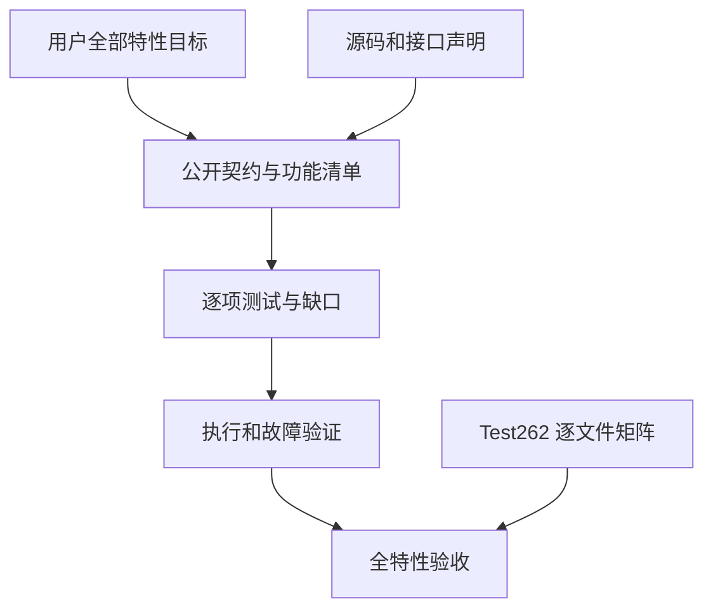

# zxc 全特性测试覆盖清单

## Intent：最终目标

响应用户新增要求：除了逐项 Test262 对齐，还为 zxc 全部特性实现与 Test262 同等粒度的测试。两条工作线独立验收；超过 30,000 个案例不能替代特性覆盖。

本清单是第一轮职责盘点，不宣称枚举已经完备。后续逐项展开为公开入口、合法行为、非法输入、错误阶段、资源失败、交互组合和运行模式，并关联实际执行证据。

## Data：可用证据

本轮读取根 build.zig、compiler README、ZX 设计文档章节、standard/modules.json 及七份接口声明，检查 compiler/test/rx 测试目录。标准库当前声明 68 个函数入口：encoding 6、crypto 17、三个 path 模块各 10、querystring 6、zlib 9；入口数量不是语义覆盖数量。

表中路径均相对仓库根目录。已有测试表示存在相关入口，不能据此推断所有边界已覆盖。执行记录阶段 60 保存最近完整根测试证据：868/868 步骤、52,493/52,493 条 Zig 测试通过，阶段 47—60 另有相关专项结果；并行实现改变后须重新验证。

| 特性域                                 | 当前证据入口                                                                                                 | 下一项必须核验的缺口                                                                                                                        |
| -------------------------------------- | ------------------------------------------------------------------------------------------------------------ | ------------------------------------------------------------------------------------------------------------------------------------------- |
| 词法、数值与字符串字面量、注释         | packages/test/tests/language/lexical                                                                         | 完整语法清单、诊断位置、跨文件编码组合                                                                                                      |
| 标量、枚举、optional、对象、列表、元组 | packages/compiler/tests/language/types_test.zig                                                              | 每种类型的嵌套、空值和非法组合逐项映射                                                                                                      |
| 算术、比较、逻辑、短路与求值顺序       | packages/test/tests/language/expressions                                                                     | 剩余 Test262 文件、跨操作符组合、所有数值类型                                                                                               |
| const、解构、if、switch、match、return | packages/compiler/tests/language                                                                             | 每个分支的实际执行与非法控制流边界                                                                                                          |
| 字符串模板、长度与比较                 | packages/test/tests/built_ins/string                                                                         | UTF-8 字节语义和组合表达式逐项审计                                                                                                          |
| map/filter/reduce、集合更新            | packages/test/tests/built_ins/list                                                                           | i64 消费族 10,855 条已恢复；字符串消费 428 条已恢复；嵌套与新资源边界仍待验证                                                               |
| 禁止深拷贝、消费与所有权合流           | packages/test/tests/ownership                                                                                | 404 个矩阵及返回摘要已测；细粒度借用、嵌套别名和运行时指针身份仍待验证                                                                      |
| 项目导入、类型连接、路径与无环         | packages/test/tests/rx/modules；packages/compiler/tests/modules                                              | ZX/RX 两套入口的差异、原生声明混合图                                                                                                        |
| 第三方 IR 合法性与版本                 | packages/test/tests/contracts/ir_test.zig；packages/compiler/tests/ir                                        | 新 external 描述、类型形状与非法图边界                                                                                                      |
| 编译分配失败                           | packages/compiler/tests/runtime/boundaries_test.zig                                                          | 新声明解析、转换和静态依赖代码路径                                                                                                          |
| Store 权限、暂存、失败与提交           | packages/test/tests/stores                                                                                   | 236 条引用 ABI 场景与独立快照检查通过；真实宿主版本协议和持久化仍不由此证明                                                                 |
| RX 文本解析及 CLI                      | packages/test/tests/rx/text；packages/test/tests/rx/cli                                                      | 全标签、属性与类型连接逐项覆盖清单                                                                                                          |
| RX Store、Flow、Gateway、依赖图        | packages/rx/tests                                                                                            | 完整公开标签与现有测试逐条对应，组合与资源失败                                                                                              |
| RX 调度与宿主执行                      | compiler README Edges                                                                                        | 区分尚未实现与已实现但未测试；不以图校验替代运行                                                                                            |
| 编码六个接口                           | packages/test/tests/standard/decoding；packages/test/tests/standard/encoding_crypto                          | 共享 ABI 运行专项已通过，六个接口的逐项覆盖审查继续进行                                                                                     |
| 密码学十七个接口                       | packages/test/tests/standard/crypto；packages/test/tests/standard/resources                                  | 共享 ABI 与资源专项已通过；全接口映射继续，功能测试不证明恒定时间                                                                           |
| path 三个模块各十个接口                | packages/test/tests/standard/path                                                                            | 默认平台入口与显式 POSIX/Windows 差异、声明迁移                                                                                             |
| querystring 六个接口                   | packages/compiler/standard/interfaces/querystring.d.zx                                                       | 540 条真实运行与九个逐分配失败测试已通过；有序 Entry 与 Node 对象差异明确，混合非法 Unicode 按 UTF-8 契约；跨模块返回借用及更广组合仍待审查 |
| zlib 九个接口                          | packages/compiler/standard/interfaces/zlib.d.zx                                                              | 新实现仅有互操作示例；需登记三种格式、级别、截断、校验和、连续成员、输出上限及资源失败的独立测试                                            |
| 原生声明及聚合转换                     | packages/test/tests/build_modes/native_declaration_test.ts；packages/test/tests/native/declarations_test.zig | 零/多参数与 namespace 已有 25 组执行，配置冲突和纯类型 namespace 已测；深层类型与跨模块身份仍待覆盖                                         |
| C 头文件与静态链接                     | packages/compiler/tests/runtime/native_fixture.zig；原生构建示例                                             | 独立自动 C ABI 入口、链接失败与平台边界                                                                                                     |
| app/lib、原生资源搬迁                  | packages/test/tests/build_modes                                                                              | 无 runtime 依赖的新产物契约、依赖选项与独立消费                                                                                             |
| 目标、CPU、汇编输出                    | compiler README 原生构建入口                                                                                 | 配置拒绝、汇编内容和支持目标矩阵                                                                                                            |
| requires/ensures 与 SMT                | packages/test/tests/contracts；packages/test/tests/verification                                              | 每个支持语法的证明与反例；不支持语法明确拒绝                                                                                                |
| 硬件图、RTL 与时钟握手                 | packages/test/tests/hardware                                                                                 | 支持运算符与位宽、非法输入、形式等价及目标限制                                                                                              |
| 格式化与风格诊断                       | packages/compiler/tests/style/format_test.zig                                                                | CLI check 幂等性、新声明文件、错误位置与不改写非法输入                                                                                      |
| CLI 安装、帮助、参数与退出协议         | packages/test/tests/build_modes                                                                              | 公开子命令逐项验证、缺失资源、路径与 stdout/stderr 契约                                                                                     |
| DSL、genz、lint、zray 支撑包           | 各包 build.zig 与 src 待逐项读取                                                                             | 根 test 未直接列出所有支撑包；不能由编译器测试推定全覆盖                                                                                    |
| 动态插件旧接口                         | packages/test/tests/plugins                                                                                  | 并行线程正取消动态加载；按最终契约迁移或撤销旧正例，添加旧配置拒绝检查                                                                      |

## Edges：边界与限制

- 用户选择保留静态 ZX/RX 设计，数据库当前明确不实现。记录设计不适用与实现缺口，不能混为测试通过。
- 并行线程已说明将取消动态加载、使产物不依赖 zxc runtime。当前源码仍可见旧依赖，不能提前声明迁移成功。历史插件测试也不能证明新静态产物要求。
- 根测试、外部 Yosys 专项、真实求解器和目标平台分别留证；一种环境通过不代表全平台。
- 网站展示不替代语言功能证据；遵守用户约束，不调用浏览器做 UI 确认。
- 68 个标准库声明仅按当前七份声明文件统计，后续接口变化必须同步审计，不能冻结成排除新接口的名单。

## Answer：交付格式与成功标准

1. 按本清单逐域细化公开入口与契约，补齐遗漏特性；每个独立语义规则、前置条件与预期关联稳定案例 ID，达到 Test262 的可定位粒度。
2. 审查现有合并循环与大型 Zig 测试，区分可独立失败的语义场景；参数数量和分配遍历次数不能代替规则覆盖。每个已实现特性至少关联实际合法执行、适用的拒绝边界和失败清理；交互性特性还需跨域组合。
3. 新增失败先复现并判断契约，再最小修复，禁止按用例特判。
4. 新静态后端落地后完成全量回归及独立产物验证；过期测试必须按真实契约调整。
5. 最终同时审计 Test262 全量矩阵和全特性覆盖，保留未实现、不适用、未验证项，不以测试总数代替完成判断。

## 自我批判

目录存在只能定位测试，不能证明覆盖。此版本避免给各域标记“完成”，下一轮必须读取具体断言，优先处理当前正在改变的静态链接和原生声明边界。当前最大的过程风险是实现与回归同时变化，使历史通过结果失效；通过固定每轮日志和明确执行范围控制这一风险。
