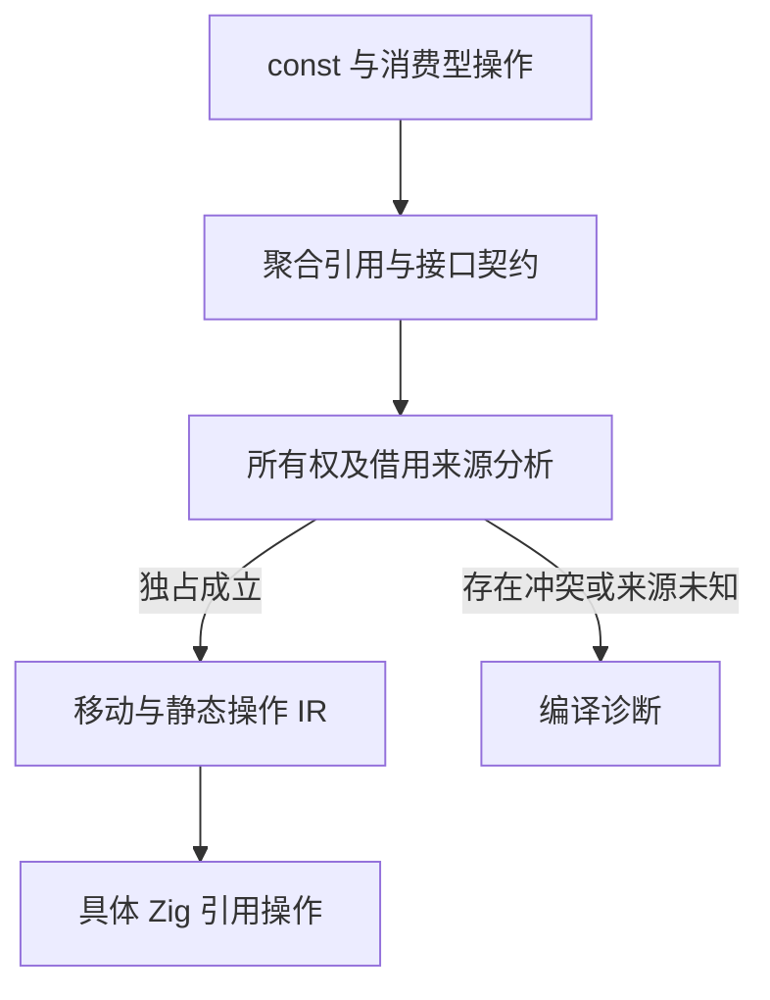
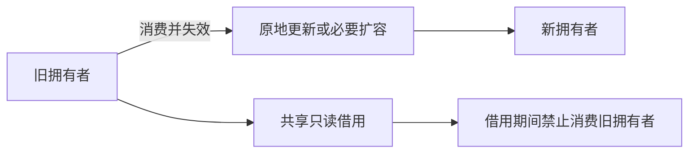

# 不可变绑定与唯一所有权实施

## Intent：最终目标

根据用户提供的不可变设计参考和明确选择，zxc 保持 const 绑定：聚合值按引用传递，标量交给 Zig 优化；只有一个可变所有者，允许共享只读借用；禁止显式深拷贝及编译器隐式深拷贝。取消动态加载，产物不依赖 zxc 专用运行时。

## Data：可用证据

用户提供的《编程语言为啥要支持可变变量 let》对话，提出使用消费型容器操作和独占所有权，在不可变绑定语法下复用存储。原文属于设计讨论，不是经验证的性能报告。其中“唯一性不成立时自动复制”与用户本轮明确要求冲突，不采用。

改造前源码事实：

- calls.zig 仍识别 clone，IR 仍存在 clone 节点。
- ownership/check.zig 仅以 containsList 判定资源；纯对象、元组和字符串没有完整来源建模。
- 调用返回聚合统一视为 borrowed，无法区分新拥有结果与借用输入结果。
- 返回处没有输出来源摘要；原生接口声明也没有所有权契约。
- Zig 后端的对象与元组仍是值布局，native_conversion 仍可能重建对象或逐元素分配转换。

这些事实说明，仅移除 clone 的语法入口不足以实现新语义，不能把别名赋值改成浅拷贝后宣称完成。

## Edges：边界与限制

- const 禁止重新绑定，不禁止编译器在独占证明成立时修改底层内存。
- 所有权移动只改变编译期权限，并传递引用或描述符，不递归复制对象图。
- 原地更新需要独占证明；证明不成立时拒绝，不自动复制、不引入运行时引用计数或写时复制。
- 标量、布尔值和枚举交给 Zig；字符串是只读字节引用，列表是切片/容器引用，对象和元组使用稳定存储引用，optional 保留完整标签语义。
- 新对象构造、算法输出分配、容器扩容与深拷贝不同。允许必要的新存储和标量/引用槽搬移，不允许递归复制已有聚合元素。
- 不能返回栈上临时对象地址；借用结果必须有可证明的来源和有效期。
- 不凭 allocator 参数猜测原生返回值拥有权，也不把同字段结构当成相同 Zig ABI。
- 不承诺全 const 或按引用传递在所有负载上都更快；验收先看复制、分配和别名语义，再看实测优化结果。

## Answer：交付格式与成功标准

先补充 IR 的聚合引用分类与函数所有权摘要，再同步前端、IR 校验、所有权分析和后端。普通 ZX 调用图无环，可自底向上分析；原生声明需要明确契约，不能通过反射猜测。

执行顺序：

1. 将全部聚合纳入资源分析，区分拥有值、共享只读借用和已移动值。
2. 描述函数输入借用/消费模式，以及返回新拥有值、转移值或借用视图的来源。
3. 调用点按契约读借或移动；借用存活期间不得消费其 owner。
4. 让对象/元组和容器元素实际使用引用表示，构造值使用稳定存储，不产生悬空地址。
5. 移除 clone 语法、IR 和后端，移除原生边界的隐式聚合复制；不能直接共享 ABI 的接口明确拒绝。
6. 保留消费型数组操作和已有错误语义；适配既有回归，不新增针对性用例。

示意语义（不是新增 API 承诺）：

```ts
const values = [3, 1, 2]
const [sorted_values, _] = values.sort()

return sorted_values
```

sort 消费 values，sorted_values 接续拥有权；此后读取 values 应报错。如果 values 存在仍有效的只读借用，该消费同样应报错。这里不需要 let，也不需要复制数组来保留旧版本。





## 自我批判

参考对话中把 LLVM SSA 简化为“所有内存天然 const”、把不可变更新一概描述为整图复制，以及把独占不足自动退化为复制，都不能直接当成 zxc 的实现规范。zxc 需要明示的语义和可检查的 IR 契约；禁止深拷贝也不能以悬空引用、可变别名或错误的 owned 标记为代价。

当前这份文档描述已确认的设计与分阶段实现，不代表聚合引用及借用生命周期已经完整实现。零运行时的独立改造记录在《零运行时与静态链接实施》中。

## 第一阶段执行记录

- clone 源码入口明确诊断不支持；删除 IR 节点、IR 校验分支及后端深复制生成器，IR 实验版本升为 5。
- 所有权分类覆盖对象、元组、列表、optional 引用和字符串视图，不再只检查包含列表的值。
- Program/Function.output_ownership 记录返回摘要。项目按无环依赖顺序分析，调用者可接续新拥有结果；借用结果保守冻结其可能借用的实参。原生返回保持 borrowed，禁止从 allocator 标记猜测所有权。
- 校验器重新分析普通函数摘要，不接受未能证明的 owned/copy。原生接口当前不接受声称 owned 的原始 IR。
- reduce 合并零次迭代的初值所有权与回调结果；字符串视图的原生调用也传播借用限制。这两项来自独立只读审查，已修复遗漏。
- 原生数组逐元素转换和分配已删除，不再通过复制修复 ABI 不匹配；不兼容的切片由 Zig 静态类型检查拒绝。对象/元组共享引用 ABI 尚待实现。

实际构建已通过。`唯一所有权示例/main.zx` 调用另一个模块创建列表，接续拥有权排序并返回 `[1,2,3]`。原有 deep_clone 源文件现在明确报“不支持深拷贝”。没有新增测试用例，也没有把旧 clone 行为的回归改成另一种期望以宣称通过。

此前 52140 条全量回归证明的是零运行时阶段基线，不证明本阶段的新语言语义。含 clone 的旧回归需要在后续语义迁移中明确处理；当前不能将其视为仍然全绿。

## 第二阶段：普通 ZX 聚合引用表示

ZX 不存在指针语法。参数、返回值、局部绑定和解构都使用普通 ZX 类型，用户无需写引用标记、取地址或解引用。

仅在生成 Zig 代码时，后端分离存储布局 layouts 与表达式类型 types，将对象和元组映射为 Zig 的只读引用表示，嵌套字段与聚合列表元素也由后端统一处理。这是编译器实现细节，不是 ZX 类型系统新增语法。

新对象与元组通过调用者 allocator.create 获得存储，然后初始化标量和引用字段；返回引用不指向函数栈上的临时量。列表操作搬移的是标量或引用槽，不递归复制对象图。当前构造会产生必要的存储分配，尚未实现逃逸分析或调用者输出槽优化，不能宣称零分配或所有场景更快。

验证证据：编译器构建成功；跨模块拥有列表排序返回 `[1,2,3]`；密码学派生与验证应用、POSIX/Windows 路径应用均实际编译执行成功；既有 `zig build zx-example` 执行得到 amount=80、factor=0.75。实际生成文件中 Input/Output/嵌套 PathInfo 均为 `*const` 类型。

独立只读复核未发现普通构造返回栈引用或 allocator 使用追踪遗漏。以下边界仍未完成：

- native_conversion 仍重建原生对象/元组的字段表示，尚未统一到共享类型 ABI；不能称为原生零转换。
- Store pending 现在保存对象引用，host 必须保证 arena 覆盖被保留引用的完整存活期，而不只是 commit 调用期间。请求结束释放 arena 的宿主不满足这个前提；持久区域或区域所有权转移仍需明确实施。
- Store 宿主参数及旧的零分配断言需要按新 ABI 重新验证；本轮没有修改断言以掩盖行为变化。
