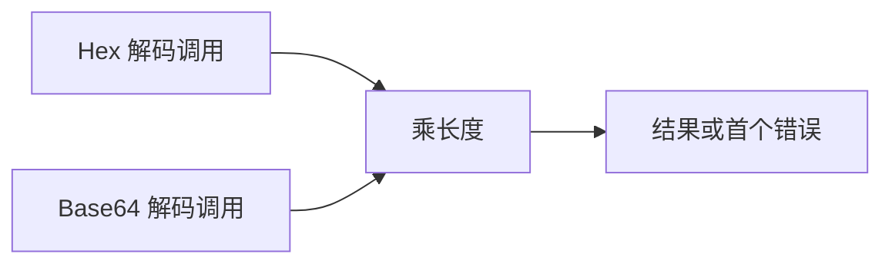
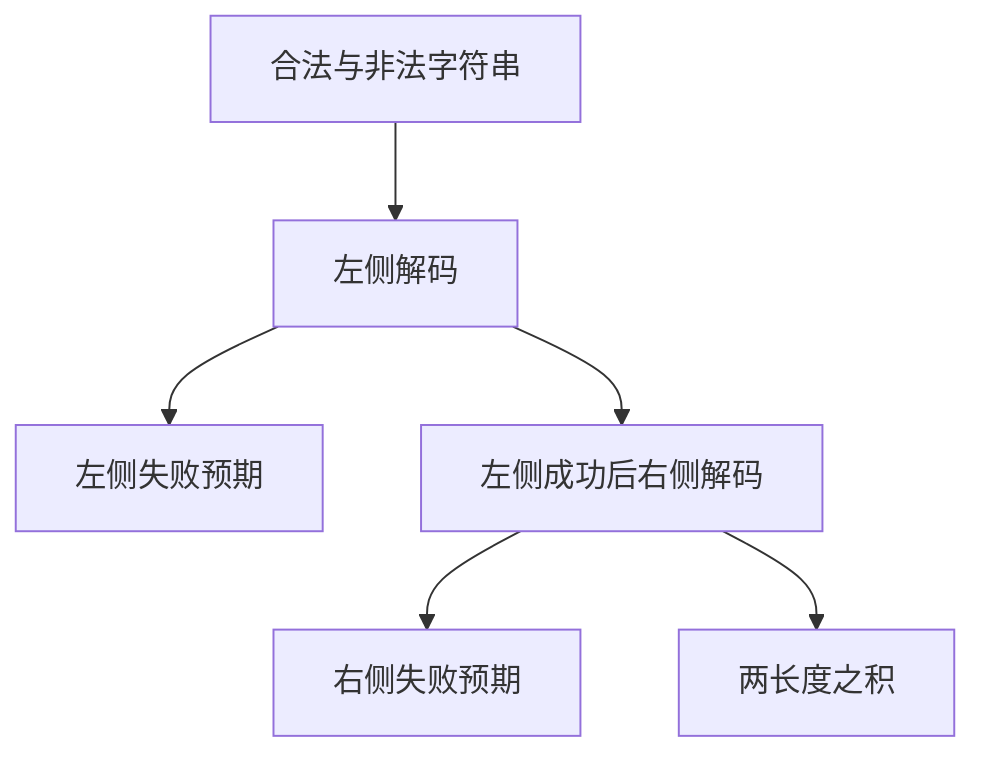
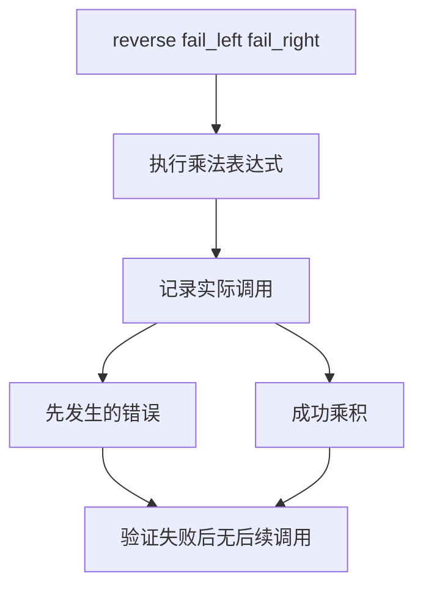

# 乘法操作数失败顺序验证

## Intent：最终目标

验证真实可失败调用作为乘法操作数时的错误传播顺序，补充普通数值输入不能观察到的执行行为。

## Data：可用证据

已读取上游 `S11.5.1_A2.3_T1.js` 和 `order-of-evaluation.js`。它们包括 GetValue、ToPrimitive、ToNumeric 各阶段及 trace。ZX 没有这些动态转换阶段，但已有 Hex/Base64 可失败标准库调用，可观察同时失败时传播哪个错误。

## Edges：边界与限制

本轮仅验证 ZX 两个调用作为左右操作数的失败顺序，不将两个上游文件登记为 equivalent 或 adapted：原文的多阶段转换及 trace 尚未覆盖。返回第一个错误也不能独立证明右侧从未执行；该部分由下文新增的调用 trace 测试补足。

## Answer：交付与成功标准

两个通用 ZX 程序分别将 Hex/Base64 解码长度作为左右操作数，并交换位置。输入包含合法、奇数 Hex、非法字符、错误 Base64 填充。独立预期优先取左侧错误，其次右侧错误，均成功则乘长度。草案位于 `docs/2026-10-03/operand_errors/`。

## 执行记录与自我批判

Debug runtime 318/318 步骤、25,512/25,512 测试通过。根 ReleaseSafe 442/442 步骤、39,521/39,521 Zig 测试通过，11 个 CLI 场景及隔离安全执行步骤通过。日志 `/tmp/zxc-test262-operand-errors-root.log`。TypeScript、生成一致性和目录审计通过。两份上游文件继续未审查状态，不能将本轮局部证据扩张成完整动态求值顺序对齐。

## 调用轨迹增补计划

Intent：补足右侧是否实际执行的观察。

Data：公开 compileProject 的 externals 可绑定测试探针，生成模块与测试共用同一个 probe 模块实例。

Edges：探针的全局记录仅用于测试观察，不添加到生产运行时；不据此新增 JS 动态转换语义映射。当前只验证宿主目标与实际执行的优化模式。

Answer：两种源码调用顺序 × 左右各两种成功/失败状态，8 个场景由 1 个 Zig 测试遍历，另计支持测试，不计作 JSONL 案例。

草案位于 `docs/2026-10-03/operand_trace/`；实际测试在 `packages/test/tests/runtime/evaluation_order/`，通过 `test-evaluation-order` 接入根构建。Debug、ReleaseFast 专项均 5/5 步骤、1/1 Zig 测试（8 个场景）通过。根 ReleaseSafe 447/447 步骤、39,522/39,522 Zig 测试通过，11 个 CLI 场景及隔离安全执行步骤通过。日志 `/tmp/zxc-test262-operand-trace-fast.log`、`/tmp/zxc-test262-operand-trace-root.log`。
