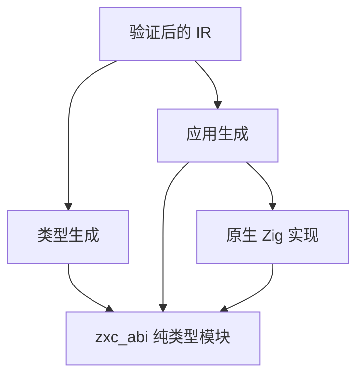

# 共享原生类型接口实施

## Intent：最终目标

ZX 源码不包含指针语法；参数、返回值、局部绑定都只写普通 ZX 类型，引用表示完全由编译器处理。

在编译产物层面，ZX 与 Zig 原生模块共享由声明生成的同一组 Zig 类型。对象和元组使用只读引用，复合数组传递切片；不通过逐字段重建或数组复制消除类型差异。

## Data：可用证据

普通 ZX 对象和元组已生成 `*const` 类型。当前原生调用仍使用 `native_conversion.zig` 重建对象和元组，且独立 Zig 结构体存在名义类型差异。IR 已保存所有声明类型、原生模块导出及函数输入输出。

## Edges：边界与限制

共享 ABI 文件只承载类型，不依赖应用代码或原生实现。生成的数字类型编号是编译产物内部细节；原生代码通过模块标识、导出类型名或函数的 Input/Output 使用声明类型。所有参与者必须链接同一个 Zig 模块实例。C ABI、Store 生命周期和调用者 arena 的回收契约另行处理。

先提供可验证的编译器双文件生成接口。旧单文件接口的原生转换暂时保留，不能把新接口的验证结果表述为 CLI、标准库或所有原生调用已经零复制。

## Answer：交付格式与成功标准

1. 类型生成独立成一个职责明确的模块，同一实现服务单文件和双文件生成。
2. 双文件产物包含程序源码和 `zxc_abi` 类型源码，明确释放接口。
3. 双文件模式下，原生调用直接使用共享类型，不经过字段转换。
4. 运行真实 Zig 消费示例，检查返回引用及切片地址一致；完成编译和本次差异检查。
5. 后续迁移 CLI app/lib 打包、标准库和现有原生消费端，再移除旧转换实现。




## 执行记录

已实现 `compiler.zig.emitBundle`，返回独立持有的 `source` 和 `types`，并提供统一 deinit。单文件接口和双文件接口共用类型生成实现。双文件路径直接传入与返回原生引用；共享文件只含类型及命名空间，不含运行时导入。

原生类型访问示意：

```zig
const abi = @import("zxc_abi").native.@"zig:transport";

pub fn echo(input: abi.echo.Input) abi.echo.Output {
    return input;
}
```

实际运行 `共享原生类型示例` 内的 `zig build`：先分析真实 ZX 和 .d.zx 文件、生成两份源码，再构建并运行 Zig 消费程序。结果为 `object, tuple, array and element references preserved; arena capacity: 0`。覆盖对象、元组、复合数组、元素引用地址保持，以及此透传路径没有 arena 分配。生成的函数体为直接 `echo(in)` 与直接返回；不存在原生字段重建。

仓库 `zig build` 已通过。本次差异空白检查通过。没有浏览器检查，也没有新增 tests 文件。

## 自我批判与剩余工作

这一结果证明共享接口可工作，不能外推为整个项目完成零复制迁移。CLI 仍调用单文件生成接口；标准库记录参数、原生返回新值、lib 打包和既有消费端仍需迁移。旧 `native_conversion.zig` 尚未删除。对象新构造仍会显式分配 arena 内存；此处容量为零仅适用于透传示例。调用者仍负责输入、输出和 Store 引用的有效期。

后续必须把验证入口也接入双文件生成，保证形式化契约校验不能绕过；当前公开 emitBundle 与 emit 一样拒绝含未验证契约的 IR。完成全链路迁移后，再删去过渡期的单文件原生转换分支。

## CLI 与标准库迁移计划

把带契约验证的编译入口增加类型输出通道；仅在校验成功后同时输出程序和 ABI。app 缓存身份纳入 ABI 内容，app 和 lib 都将同一个 ABI 模块实例注册给应用和原生依赖。标准库的记录参数直接引用 ABI 声明，返回记录的函数显式使用 allocator 创建结果；不通过反射猜测布局。验证使用已有加密与路径示例，以及库的实际消费。

## CLI 与标准库迁移结果

已接通 verified_compile 的类型输出通道，先校验 IR 和所需证明，再输出程序与 ABI。app 缓存加入 ABI 内容，构建时应用与各原生依赖导入同一个 zxc_abi 模块。lib 写入 abi.zig，其 build.zig 也使用同一个模块实例。zxc_abi 名称保留，项目原生模块不可覆盖。

密码学记录参数引用声明生成的类型。AEAD 加密结果与路径 parse 结果显式分配记录，路径声明同步增加 allocator/throws。ABI 的函数命名空间提供 InputValue/OutputValue 表示记录布局，原生实现无需反射推导布局。ZX 调用语法完全不变。

实际验证：

- 仓库 zig build 通过。
- 现有路径示例构建执行通过，POSIX 与 Windows 路径规范化结果正确。
- 现有 derive 示例构建执行通过；SHA-256/SHA-512 的 PBKDF2、HMAC、HKDF 与独立 Python 计算一致，验证标志均为 true。
- 现有 encrypt/decrypt 示例构建执行通过，AES-128-GCM、AES-256-GCM、ChaCha20-Poly1305 三种算法往返恢复原输入。
- CLI 将共享原生类型示例打包成 lib；独立 Zig 构建依赖消费生成的 library 模块，引用地址保持且 arena 容量为 0。运行材料在相邻“共享原生类型库消费”目录。
- 带契约的 discount 示例经本地 z3 证明、共享 ABI 构建与执行，结果 final_price=80；求解器失败时构建拒绝且不产生输出程序。
- 本次差异空白检查通过。

仍未完成：旧单文件源码生成接口、既有源码消费测试与独立标准库直接消费的迁移；旧原生转换分支尚未删除，Store 持久区域仍未闭合。因此不能宣称整个仓库回归通过或全目标完成。

## 最新语言边界确认

用户明确：ZX 不存在指针。前端类型语法已确认只接受普通命名类型、对象、元组及数组/可选等类型形式，不接受指针类型。所有对参数、返回值和局部绑定的引用处理属于编译器职责，不能要求 ZX 作者书写 Zig 的引用表示。文档已据此澄清；Zig 宿主集成示例只描述生成端接口。

## 统一原生生成路径

删除旧原生字段转换模块，所有原生参数与结果直接传递。CLI 源码导出遇到原生模块时，以 --out 指定程序文件，同时生成 <输出文件>.abi.zig；消费方必须将该类型文件注册为同一个 zxc_abi 模块。纯 ZX 源码维持单文件输出。原生程序不允许仅向 stdout 输出缺少类型文件的代码；只返回单份源码的 API 明确拒绝此模式，使用 analyzeProject 与 emitBundle 或带 type_output 的验证入口。

统一路径实际验证：仓库 zig build 通过；CLI 导出的程序和伴随 ABI 文件经 Zig 编译执行，对象、元组、数组及元素引用保持，arena 容量为 0；原生程序省略 --out 时明确拒绝且 stdout 为空；纯 ZX 导出未引入 ABI 依赖；既有 zig build zx-example 通过，输出 amount=80、factor=0.75。源码格式与差异空白检查通过。既有原生测试消费端尚待迁移，不能将这些检查表述为全量回归通过。

## 标准库独立消费迁移计划

标准库的 Zig 构建模块需要完整的共享类型文件。构建工具从现有标准库清单生成导入源码，经真实前端分析与类型生成得到 ABI，禁止另写一套手工结构体。生成工具运行于宿主目标，标准库仍使用消费方目标。已有资源回归只迁移参数形式和新增结果记录的释放，保留原来的正确性及分配失败断言。

标准库独立消费迁移结果：compiler 构建模块已分离宿主生成工具与消费方目标；导出的 standard 模块自动依赖从正式清单生成的 ABI。运行 packages/test 的 zig build test-standard-resources --summary all，8/8 构建步骤成功、6/6 既有测试通过，包括成功分配释放、解码错误释放、AEAD 认证失败与逐次 OOM 注入、HMAC/KDF 的分配失败清理。新增结果记录的释放已进入原有检查。仓库 zig build、源码格式和差异空白检查通过。这一结果不覆盖全部原生集成或 Store 生命周期。

## 原生聚合消费回归迁移计划

迁移既有原生声明集成样例，使其从共享 ABI 引用类型，并显式构造业务计算产生的新结果。ABI 增加独立的 layouts 命名空间，按模块标识和声明类型名暴露存储布局，避免原生代码通过反射猜测引用背后的记录类型。该命名空间与原生函数/类型命名空间分离，不占用用户声明名。保留已有输入组合、错误传播和分配失败断言，补充基线数组引用保持检查。

原生聚合消费回归迁移结果：新增 ABI layouts 命名空间，原生 bridge 样例使用正式声明类型和命名布局，基线数组保持原引用；资源检查去掉旧类型反射。现有手动 Zig 消费命令补齐共享 ABI 依赖。最终版本运行 packages/test 的 zig build test-build-modes --summary all 通过，包含可搬迁 ZX/Zig 库、源码与资源校验、四类路径拒绝、72 组聚合调用、原生错误传播、两组 arena 分配失败遍历，以及 25 组零参数/多参数/allocator/命名空间调用。未新增测试用例，保留业务期望并增加现有检查中的基线引用相等断言。源码格式及差异空白检查通过。

## 通用回归构建核查

当前工作区的 runtime 构建已按清单 shared_abi 标识，为每个程序创建独立 ABI 模块，并让该程序与标准库实例共同导入；现有伴随文件路径足够，因此不增加新的 CLI 参数。实际运行 test-standard-runtime：95/95 步骤、3174/3174 用例通过。随后迁移仍调用单文件编译 API 的求值顺序生成器，保留原有顺序和提前失败断言。

求值顺序生成器已迁移到 analyzeProject + emitBundle，程序构建导入对应 ABI，既有输入改为宿主引用形式。test-evaluation-order 实际通过：6/6 步骤、1/1 测试，内部遍历正反顺序与两个失败标志的 8 种组合，保留调用轨迹及提前失败断言。

更广运行时检查：test-runtime 当前为 608/615 步骤成功，已运行 37461/37461 用例通过，但整体失败。两个失败入口是 string-sort 与 string-concat_reverse，仍使用已禁止的 clone；它们在编译阶段被正确拒绝。没有删掉这些用例或恢复深复制来制造通过。后续需按真正的所有权契约迁移，尤其区分新容器本身的独占存储与其中元素的只读借用，不能用绕过检查的改写替代所有权实现。Store 生命周期也仍未完成。

编译器包的独立原生生成入口也已改为分析后输出程序与 ABI，原生记录样例改用声明类型并直接借用返回值。新增构建筛选入口 test-native-runtime 复用既有 runtime 用例，不新增测试用例、不排除其在完整回归中的执行。实际结果为 6/6 步骤、2/2 测试通过，源码格式及差异检查通过。新数组是否允许共享只读元素并进行外层操作，仍等待用户语义选择；对应规则与边界见《容器与元素所有权分离方案》。
