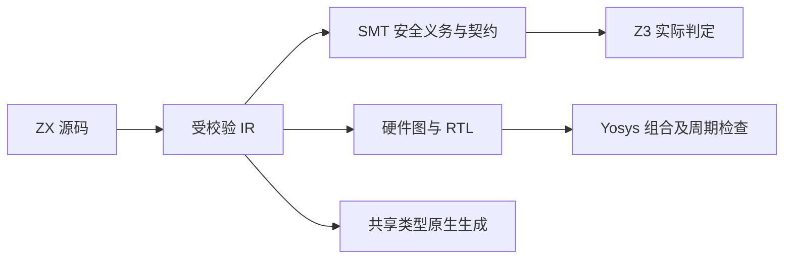

# 共享类型迁移后的能力边界复核

## Intent：最终目标

在共享类型迁移后重新核验原生模块、所有权摘要、形式化验证与硬件生成的现有边界。保持完整目标，不以其中几个通过的命令代替整体完成。

## Data：实际执行证据

所有命令均在 packages/test 执行，没有新增测试用例或改变预期。

| 命令                                                                                     | 结果                       | 覆盖范围                                                                                     |
| ---------------------------------------------------------------------------------------- | -------------------------- | -------------------------------------------------------------------------------------------- |
| zig build test-contracts test-native-declarations test-ownership-contracts --summary all | 16/16 步骤，19/19 测试通过 | 契约入口、IR 校验、原生声明及配置、返回所有权摘要                                            |
| zig build test-hardware-resources test-verification-resources --summary all              | 9/9 步骤，8/8 测试通过     | 硬件图边界、无效 IR、资源释放与分配失败                                                      |
| zig build test-verification --summary all                                                | 4/4 步骤，20 个场景通过    | 实际 Z3 验证，包含正确证明、溢出等反例、不可满足前提、当前不支持类型拒绝                     |
| zig build test-hardware-evaluation --summary all                                         | 4/4 步骤通过               | 实际 Yosys RTL 检查：条件加法 72 组、带符号除法与余数 72 组；时钟模式 14 周期、56 条信号记录 |

验证环境通过 ZXC_TEST_SOLVER 指向仓库 .zxc/tools/verification/bin/z3，通过 ZXC_TEST_YOSYS 指向 .zxc/tools/fpga/bin/yowasp-yosys。源码和编译产物以当前工作区为准。

## Edges：不能外推的结论

- 20 个验证场景不能证明任意 ZX 程序正确；形式化支持仍受已实现类型和运算子集限制。
- RTL 工具验证不等于实体 FPGA 板卡验证，也不证明所有位宽与所有周期序列。
- 现有单层所有权摘要的检查通过，不代表尚未实现的递归容器/子值权限模型已经成立。
- 新数组共享借用元素后能否排序的语义问题仍待用户选择；本轮未改变该规则。
- 旧 clone 回归入口和 Store 持久引用生命周期尚未收尾，完整目标仍未完成。

## Answer：交付与成功标准

本轮交付是当前状态下的实际校验证据及其边界，不修改语言语义，不放宽检查，也不将整个目标标记完成。下一阶段继续处理未完成项，并以其对应的实际源码、运行和资源检查作为完成依据。

## 自我批判

通过数量只是被执行范围的记录。部分构建命中缓存，但测试与外部工具确实执行；不能将缓存命中、编译成功或少量示例当成全语言证明。每个未完成项仍须单独验证，语义选择也不能由自动续跑消息替代用户回答。

## 原生逻辑模块身份修复计划

发现共享 ABI 将每个原生实现模块都按逻辑 specifier 输出命名空间，而现有外部注册允许同一逻辑模块的不同导出来自不同实现模块，因此可能生成重复声明。函数类型命名还使用实现成员末段，丢失公开导出名。修复应按逻辑模块合并类型命名空间，保留公开导出名，并在 IR 校验中拒绝同名但类型冲突的声明。不得通过禁止原本合法的多实现模块组合规避问题。

原生逻辑模块身份修复结果：IR 外部函数新增可选 export_name，声明加载保留公开名称，旧默认导入仍可从成员末段推导。共享 ABI 按 specifier 合并实现模块；重复且同型的公开类型和函数只生成一次，类型冲突在 IR 校验阶段拒绝。多实现示例位于“多实现原生模块示例”：两个 Zig 文件都实现 apply，分别作为同一个逻辑模块的 increment 与 double 导出。实际 app 编译运行输入 7，输出 incremented=8、doubled=14。

验证：仓库 zig build 通过；契约与原生声明 13/13 构建步骤、16/16 测试通过；独立原生运行时 6/6 步骤、2/2 测试通过；差异空白检查通过。没有新增 tests 用例。该验证确认多实现的正向消费和现有校验回归，不能代替新增元数据的全部对抗性 IR 检查。

## C 模块、汇编与跨架构复核

使用既有“原生构建示例/native_math.zx”及其配置，将 zig:calibration 的乘法和 c:math 的 sqrt 放入同一个应用。通过当前 CLI 生成宿主程序与汇编，实际执行 value/factor 为 (0,2)、(2,3)、(9,4)、(25,0.5) 的输入，结果均符合乘法和平方根。

宿主产物为 x86_64 Mach-O，汇编非空；对应计算位置含 vsqrtsd 与 vmulsd。再使用 --target aarch64-macos --cpu apple_m1 生成同源程序与汇编，构建成功，file 确认为 arm64 Mach-O，汇编含 fsqrt 与 fmul。arm64 产物没有在本轮执行，因此只证明跨架构生成与链接成功。

产物在 .zxc/examples/native_math_shared 及 native_math_shared_arm64，汇编使用同名 .s 文件。本轮未修改源代码或增加测试用例。这是标量 C 数学接口和显式目标参数的实际验证，不代表所有 C 类型边界均支持，也不证明汇编性能最优。
