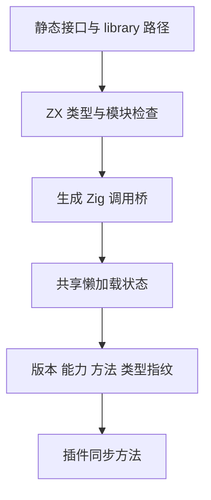

# 动态插件与懒加载实施

## Intent：最终目标

让经过项目声明的 c:/zig: 原生接口通过动态库提供实现，并在第一次实际调用时加载。保持编译期类型检查，明确 ABI、所有权、生命周期、错误与纯度边界。

## Data：实现设计

项目 native_modules 新增 library 字段，与 path/header 互斥。对应 externals 仍声明自包含 ZX Input/Output；实现必须使用 allocator_argument=true、fallible=true，且不展开 tuple。构建器为声明成员生成 Zig 类型与调用桥，连接同一个 zx_runtime。

动态库导出 C 符号 zxc_plugin_v1，返回不可变 Descriptor。ABI v1 包含版本、结构尺寸、能力位与方法表；每个方法包含名称、类型指纹与同步 C 函数指针。Zig 插件可使用 runtime.plugins.method 生成适配器。

输入与结果采用 JSON 字节协议；数值宽度、类型结构、字段名进入 SHA-256 接口指纹。对象字段排序后计算，避免不同字段声明顺序产生误判。方法名与指纹在调用前检查，能力仅接受 pure。

宿主分配输出缓冲，插件通过同步 write 回调复制字节；插件自己的 arena 在回调完成后释放。宿主解析输出时复制所有需要保留的数据，不让切片引用已经释放的插件内存。输入/输出分别限制为 16 MiB。

## Edges：边界与限制

- ABI 是同步、同进程、受信任原生代码接口；pure 是注册方审查后声明的契约，不是操作系统沙箱，也不能阻止恶意插件访问文件或网络。
- 每个规范化库路径对应加载状态与锁，首次调用校验并加载，成功保留到进程退出。调用串行执行，避免默认要求插件线程安全；同库重入不受支持。
- 锁和缓存按配置中的绝对路径区分，不合并不同符号链接指向的同一文件。项目应统一插件路径，不能把路径级串行化当作整个进程的文件身份级锁。
- 加载失败被记录；该进程内不会反复尝试。替换文件、热更新与运行中卸载尚未实现，需重新启动进程。
- 编译时不打开动态库。未声明成员仍无法通过编译；懒加载不等于推迟静态名称与类型校验。
- 路径以配置目录解析为绝对路径。app 与 lib 均生成桥接模块；lib 不复制动态库文件，跨机器发布仍需要显式部署依赖。
- ABI v1 采用 Zig JSON 编解码约定：u8 切片与字符串均按该约定编码，整数数字必须无损处理。不同语言实现必须遵守相同线协议和指纹算法。
- void 编码为 null；对象字段必须完整且无多余字段，tuple 按数组处理。整数只接受十进制整数字面量，枚举只接受声明成员名，非有限浮点拒绝。解析先保留数字文本，避免中间浮点转换损失整数精度。
- 公共 Library.invoke 的直接调用方也须使用调用级 arena；返回值与解码临时数据均由该 arena 管理。
- std.DynLib 的当前平台支持限制仍适用；本轮在 macOS 验证 .dylib，不能据此宣称 Windows DLL 和所有 Linux 链接方式已验证。
- 形式验证仍拒绝原生调用，不把插件的 pure 位当作函数数学语义。

## Answer：交付与成功标准

交付 C ABI 定义、Zig SDK、宿主懒加载器、项目配置/构建桥接，以及可复用动态库和 ZX 调用示例。验收需包括动态库缺失时未调用路径可执行、首次调用失败、实际动态库加载执行成功与 lib 构建接入。




## 自我复核

必须区分编译接口可信、ABI 一致与插件代码安全：前两项可由静态检查和协议校验提供证据，最后一项仍依赖注册审查。不能以扩展名正确、成功 dlopen 或单次乘法执行替代完整生命周期、并发和跨平台验证。

### 构建与实际执行

示例 [calibration.zig](动态插件示例/calibration.zig) 通过 SDK 声明 scale 方法；[calibrate.zx](动态插件示例/calibrate.zx) 在 enabled 时调用。动态库构建命令：

```sh
mkdir -p .zxc/examples/plugins

zig build-lib -dynamic -OReleaseSafe --dep zx_runtime \
  -Mroot=docs/2026-10-03/动态插件示例/calibration.zig \
  -Mzx_runtime=packages/compiler/src/runtime/root.zig \
  -lc -femit-bin=.zxc/examples/plugins/calibration.dylib

zig-out/bin/zxc build docs/2026-10-03/动态插件示例/calibrate.zx \
  --project docs/2026-10-03/动态插件示例/zxc.json \
  --out .zxc/examples/calibrate
```

实际先在动态库不存在时完成宿主构建：enabled=false 返回 81，enabled=true 返回 FileNotFound。随后生成动态库，同一宿主在 enabled=true、factor=1.5、value=81 时返回 121.5；关闭时仍返回 81。该顺序确认宿主构建与未调用路径不要求动态库已经存在。

lib 导出成功，生成目录的 Zig build 脚本执行通过。C ABI 头文件已安装为 include/zxc_plugin.h，并通过 Zig C 编译器以 C 语言编译。初次 -fsyntax-only 调用工具返回 FileNotFound；使用绝对路径实际编译头文件后通过，没有将初次失败记为通过。

[consumer.zx](动态插件示例/consumer.zx) 使用导出库的 zxc.json 作为项目配置构建成功，实际调用动态插件返回 121.5。传入非有限浮点时返回 PluginNonFiniteNumber。SDK 另外公开 fingerprint(Input, Output)，便于生成其他语言插件所需的指纹常量。

独立只读审查发现并修复了整数经过浮点舍入后误接受、枚举数字字符串语义未进入指纹的问题。其他所有权、锁和桥接检查未发现本范围内的实质漏洞；没有据此声称跨平台与安全沙箱验证完成。

最终根回归 538/538 步骤、47767/47767 测试通过，日志 `/tmp/zxc-plugin-final-regression.log`。首轮插件回归期待旧解码器的错误类型而失败，当前并行测试已按新协议更新后通过；实现没有退回宽松转换。本轮未新增或编辑测试用例。
