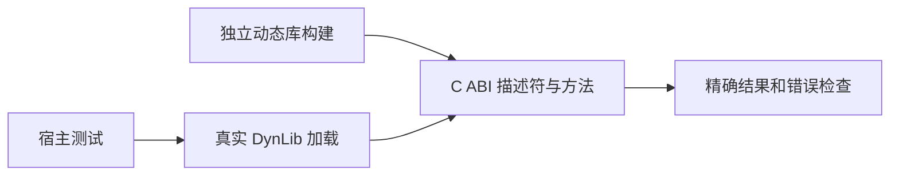
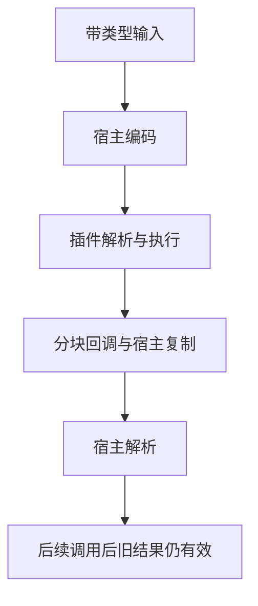

# 动态插件协议回归测试

## Intent：最终目标

为并行新增动态插件提供真实动态库加载与 C ABI 调用验证，检查类型、字节所有权和失败传播。

## Data：可用证据

当前 ABI v1 使用同步 JSON 字节回调，宿主校验版本、尺寸、pure 能力、方法表和类型指纹；成功库保留到进程结束。源码入口位于 runtime/plugins，已有示例仅覆盖标量乘法。

## Edges：边界与限制

运行时协议与真实 ZX 桥接分开检查；直接 Zig 调用不算 ZX 源码端到端覆盖。动态库是受信任本机代码，畸形描述符用有效内存构造，不执行悬垂指针等未定义行为。平台范围以实际运行系统为准，不计入 Test262 上游审查。

## Answer：交付与成功标准

多层目录 tests/plugins/fixtures 放动态库，独立宿主测试覆盖懒加载、复用、嵌套值、整数边界、方法与 schema 错误、分块输出和协议错误。通过真实编译动态库和 Zig 测试运行器验证；错误检查具体值。

## 执行与自我复核

运行时分为 5 个 Zig 测试组：

1. 首次调用前未加载；输入/输出对象字段顺序不同仍匹配；u64 最大值、i64 两端、Unicode/NUL 字符串、optional 与空列表无损往返；后续调用不破坏旧结果。
2. 未注册方法与输入/输出类型指纹不符均在执行前拒绝。
3. 多次 write 拼接，未完整 JSON、类型错误、非零状态、超限输出、空输出、先输出后失败；整数小数拒绝、溢出与 9007199254740993 精确解码。
4. 8 个真实动态库覆盖版本、尺寸、能力、空表、超大表、重名、空名、缺失入口；重复调用检查失败稳定且未置加载成功状态。
5. 宿主 arena 底层分配失败遍历，检查错误传播和清理。

首次执行中 4 组通过，第 3 组的测试预期把不完整 JSON `[` 写成 UnexpectedToken，而实际 parser 正确返回 UnexpectedEndOfInput；已根据 JSON 语法修正测试预期，不计为产品缺陷。并行实现新增严格 codec 后，类型错误按 InvalidPluginValue 检查。修正后含新增整数边界的 5 组全部通过；真实 ZX 桥接检查通过。最终根 ReleaseSafe 538/538 步骤、47,767/47,767 根 Zig 测试通过，另执行 5 个插件协议 Zig 测试及插件桥接脚本；退出码 0。日志 `/tmp/zxc-test262-plugin-root.log`，专项日志 `/tmp/zxc-test262-plugin-protocol-final.log`。TypeScript、Zig 格式检查及 diff 空白检查通过。

新增独立真实 ZX 桥接检查：先隐藏动态库，仍能构建 app 并执行不调用插件的分支；实际调用才报告 FileNotFound；恢复库后新进程返回 12，并核验 PluginCallFailed / PluginOutputTooLarge 传递。

自我批判：同进程重复失败返回相同错误，并不能单独证明没有再次 dlopen；该用例只验证外部可观察状态。未覆盖同库重入、跨平台、并发压力、任意不可信 C 指针，以及动态插件 lib 分发。没有把测试中的协议固定响应当作业务实现，fixture 的目的就是产生可观测的协议边界。所有新增项独立于 JSONL 目录计数，目录仍 47,822；上游审查数不变。
