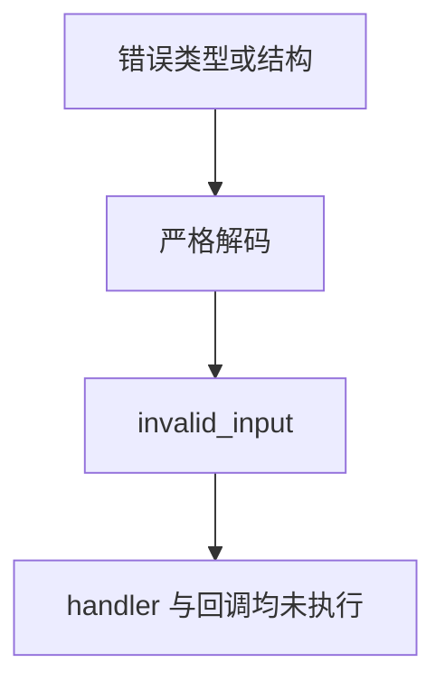

# 动态插件数据协议边界

## Intent：最终目标

验证插件 ABI 的数据表示和严格类型转换，避免只验证成功动态加载而漏掉值语义变化。

## Data：可用证据

现有 codec 对对象字段数量、元组长度、枚举成员名和数值类型进行检查；整数按十进制整数字面量读取，非有限浮点拒绝。SDK 方法通过 C 函数指针接收原始 JSON，写回字节由宿主复制。

## Edges：边界与限制

本轮直接使用公开 plugins.method 的 C ABI 入口，以人工写出的 JSON 作为独立协议输入，避免只用同一个 codec 编解码互相掩盖错误。此层不替代上一阶段动态库与真实 ZX 桥接测试，也不增加 Test262 上游审查数。

## Answer：交付与成功标准

tests/plugins/wire_test.zig 按数据职责分组，检查精确状态、写回次数、结果字节和值的浮点位模式。静态错误输入不应调用 handler 或输出回调；SDK 输出失败必须传播。根插件专项会一并执行。

## 执行与自我复核

新增 6 个具名 Zig 测试组：

- 标量、整数边界、optional、枚举与 void 的独立 JSON 字节往返。
- 拒绝数字字符串、布尔强制转换、整数小数/指数形式、负数到无符号、溢出，以及枚举数字标签。
- 对象字段名与数量、重复字段、元组严格长度、嵌套列表元素类型；Unicode 与 NUL 字符串保留。
- f32/f64 有限边界（含正负零、最小正规数、最小次正规数、最大值）按位往返；过大指数和字符串形式非有限数拒绝。
- 输出回调拒绝时返回 output_failed。
- 超长输入在读取字节前返回 invalid_input，handler 失败返回 call_failed；不触发输出回调。

最终 6 组全部通过；既有 5 组动态库协议及真实 ZX 桥接同时通过。根 ReleaseSafe 538/538 步骤、47,767/47,767 根 Zig 测试通过，退出码 0；11 个插件 Zig 测试由脚本独立执行，不重复计入根 Zig 汇总。日志 `/tmp/zxc-test262-plugin-wire-root.log`。TypeScript 与 diff 空白检查通过。SDK 测试走公开方法生成器及 C 函数指针；真实动态库和 ZX 桥接继续由上一阶段覆盖。

自我批判：浮点往返中的输入格式化和最终独立位检查仍使用 Zig 标准 JSON 工具，因此它验证“不改变给定浮点值”，不能独立证明所有十进制到二进制舍入边界。整数 JSON 字面量及错误结构则直接写出，不依赖被测 codec 生成。单组内遍历不扩张为独立 JSONL 用例，目录仍 47,822；本轮没有新增 Test262 上游审查，也未发现需修改生产实现的失败。
