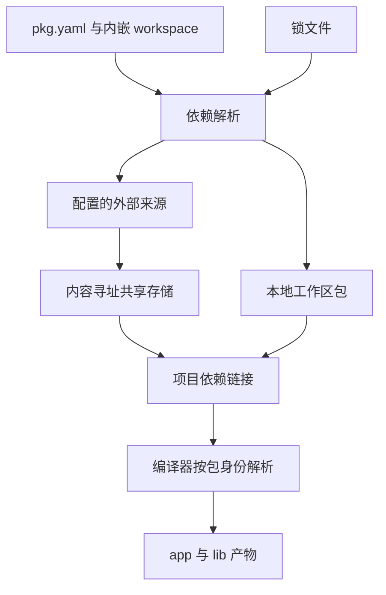

# 包管理与工作区实施计划

## Intent：最终目标

实现 zxc 内置包管理，包清单命名为 `pkg.yaml`，工作区配置直接放在同一个文件中，不要求独立的 workspace.yaml。参考 pnpm 的依赖隔离、共享存储和 monorepo 工作流，并接入 ZX 无前缀导入解析、RX 函数项目分析和 app/lib 构建。

## Data：可用证据

- 用户明确新增上述包管理目标；此前已有模块、标准库、形式化、汇编、FPGA 与 app/lib 目标继续保留。
- [pnpm 存储与链接结构](https://pnpm.io/symlinked-node-modules-structure)：内容寻址存储保存文件，安装目录构造包依赖关系，直接依赖与传递依赖各自可见。
- [pnpm workspace 协议](https://pnpm.io/workspaces)：workspace 依赖可要求本地包匹配，缺失时不能悄悄替换成注册表包。
- 当前 zxc 仅通过 `zxc.json` 的 packages 条目将裸包名映射到 ZX 入口；尚无 pkg.yaml 解析、版本解析、安装、锁文件、共享包存储和工作区发现。
- 现有 RX/ZX 均要求静态模块图无环。包管理不能通过链接布局绕过编译器的无环检查。

## Edges：边界与限制

- 参考 pnpm 的机制，不引入 Node.js、npm 包执行或 JavaScript 模块兼容承诺；包内容和可执行入口遵循 ZX/Zig 契约。
- workspace 配置属于 pkg.yaml，不另建必须维护的第二份工作区清单。
- 不把文件复制脚本或全局名称到入口的映射冒充完整包管理；不同依赖拥有者可解析不同版本，编译器必须知道导入所属包。
- 共享存储需要内容完整性、原子写入和跨进程一致性；项目依赖链接不能允许项目修改污染共享内容。
- registry 来源、发布服务与认证尚无现有服务证据；不得虚构可用注册表。实现前明确协议与配置，安装命令只连接用户配置的真实来源。
- 现有 zxc.json 编译配置在迁移规则确定前保持兼容；不把新增包清单解释成已获授权删除既有配置。
- 不新增测试用例，不执行浏览器 UI；使用已有回归和真实独立示例验证。

## Answer：交付与成功标准

| 工作项    | 验收要求                                                                    | 当前证据           |
| --------- | --------------------------------------------------------------------------- | ------------------ |
| pkg.yaml  | 明确 Schema、源码位置诊断、重复键和无效字段拒绝，稳定读写                   | 未实现             |
| workspace | 同文件工作区成员配置、成员发现、唯一身份、本地协议与版本匹配                | 未实现             |
| 依赖图    | 直接依赖可见、每个包独立解析、版本选择、完整传递闭包                        | 仅有手工全局包映射 |
| 锁文件    | 精确版本/来源/完整性、可重复安装、冻结模式                                  | 未实现             |
| 共享存储  | 内容寻址、完整性校验、并发原子安装、离线复用                                | 未实现             |
| 项目链接  | 工作区本地链接、外部包隔离、移动与重新安装可恢复                            | 未实现             |
| CLI       | 内置初始化、安装、增删/更新、查询、工作区选择和打包入口；所有操作有真实效果 | 未实现             |
| 编译联结  | ZX/RX/app/lib 使用同一包解析结果，不依赖调用目录偶然找到包                  | 未实现             |
| 对外分发  | 可搬迁包产物、依赖元数据与校验；若支持发布，验证真实配置来源                | 未实现             |

实施顺序：先锁定清单与工作区数据模型，再接通本地工作区解析和编译；随后实现锁定、共享存储、外部来源获取和 CLI 变更操作；最后验证搬迁、隔离、离线与冲突边界。每个中间步骤仅记录实际完成范围，全部验收前保持整体目标未完成。

## 自我复核

本文是新增目标的实施计划，不是已实现报告。pnpm 的链接结构依赖 Node 的解析行为；zxc 不能原样照搬目录后假定可用。真实成功标准是不同拥有者的依赖正确解析、共享内容保持完整、工作区和产物可用，而不是目录看起来相似。
