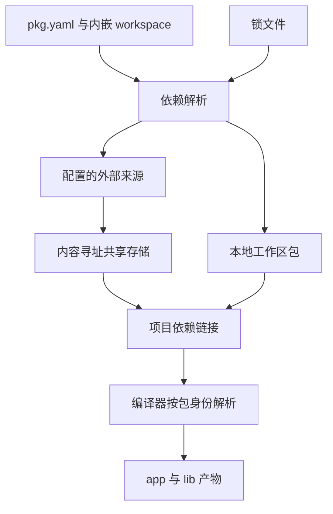
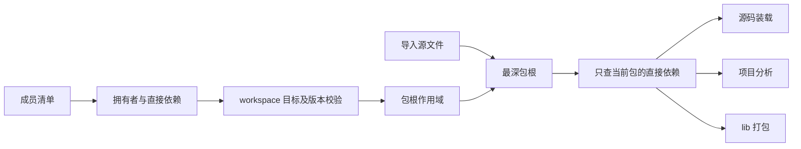

# 包管理与工作区实施计划

## Intent：最终目标

实现 zxc 内置包管理，包清单命名为 `pkg.yaml`，工作区配置直接放在同一个文件中，不要求独立的 workspace.yaml。参考 pnpm 的依赖隔离、共享存储和 monorepo 工作流，并接入 ZX 无前缀导入解析、RX 函数项目分析和 app/lib 构建。

## Data：可用证据

- 用户明确新增上述包管理目标；此前已有模块、标准库、形式化、汇编、FPGA 与 app/lib 目标继续保留。
- [pnpm 存储与链接结构](https://pnpm.io/symlinked-node-modules-structure)：内容寻址存储保存文件，安装目录构造包依赖关系，直接依赖与传递依赖各自可见。
- [pnpm workspace 协议](https://pnpm.io/workspaces)：workspace 依赖可要求本地包匹配，缺失时不能悄悄替换成注册表包。
- 当前已实现 pkg.yaml 读取/写入、工作区发现、workspace 版本匹配、拥有者依赖隔离及编译接入。用户随后要求以 pkg.yaml 完全替代 zxc.json，并在 packages/pkgs 维护多版本索引；已据此调整实现。
- 现有 RX/ZX 均要求静态模块图无环。包管理不能通过链接布局绕过编译器的无环检查。

## Edges：边界与限制

- 参考 pnpm 的机制，不引入 Node.js、npm 包执行或 JavaScript 模块兼容承诺；包内容和可执行入口遵循 ZX/Zig 契约。
- workspace 配置属于 pkg.yaml，不另建必须维护的第二份工作区清单。
- 不把文件复制脚本或全局名称到入口的映射冒充完整包管理；不同依赖拥有者可解析不同版本，编译器必须知道导入所属包。
- 共享存储需要内容完整性、原子写入和跨进程一致性；项目依赖链接不能允许项目修改污染共享内容。
- registry 来源、发布服务与认证尚无现有服务证据；不得虚构可用注册表。实现前明确协议与配置，安装命令只连接用户配置的真实来源。
- 按用户最新要求删除 zxc.json 配置入口，包身份、依赖、原生接口与链接配置统一放在 pkg.yaml。早期保留兼容的方案已撤销。
- 不新增测试用例，不执行浏览器 UI；使用已有回归和真实独立示例验证。

## Answer：交付与成功标准

| 工作项    | 验收要求                                                                    | 当前证据                                                       |
| --------- | --------------------------------------------------------------------------- | -------------------------------------------------------------- |
| pkg.yaml  | 明确 Schema、源码位置诊断、重复键和无效字段拒绝，稳定读写                   | 读取、写入及原生配置统一完成                                   |
| workspace | 同文件工作区成员配置、成员发现、唯一身份、本地协议与版本匹配                | 本地发现、协议与版本匹配完成                                   |
| 依赖图    | 直接依赖可见、每个包独立解析、版本选择、完整传递闭包                        | 本地 ZX 依赖闭包及隔离完成；外部未接入                         |
| 锁文件    | 精确版本/来源/完整性、可重复安装、冻结模式                                  | 未实现                                                         |
| 共享存储  | 内容寻址、完整性校验、并发原子安装、离线复用                                | 未实现                                                         |
| 项目链接  | 工作区本地链接、外部包隔离、移动与重新安装可恢复                            | 未实现                                                         |
| CLI       | 内置初始化、安装、增删/更新、查询、工作区选择和打包入口；所有操作有真实效果 | inspect/workspace/graph/index/resolve 已有；安装变更命令未完成 |
| 编译联结  | ZX/RX/app/lib 使用同一包解析结果，不依赖调用目录偶然找到包                  | 本地 ZX 闭包已接通；依赖包原生配置分域未完成                   |
| 对外分发  | 可搬迁包产物、依赖元数据与校验；若支持发布，验证真实配置来源                | lib 可搬迁；pkgs 多版本索引已有；获取与安装未完成              |

实施顺序：先锁定清单与工作区数据模型，再接通本地工作区解析和编译；随后实现锁定、共享存储、外部来源获取和 CLI 变更操作；最后验证搬迁、隔离、离线与冲突边界。每个中间步骤仅记录实际完成范围，全部验收前保持整体目标未完成。




## 自我复核

本文是新增目标的实施计划，不是已实现报告。pnpm 的链接结构依赖 Node 的解析行为；zxc 不能原样照搬目录后假定可用。真实成功标准是不同拥有者的依赖正确解析、共享内容保持完整、工作区和产物可用，而不是目录看起来相似。

## 清单读取实施

使用固定提交的 libyaml 0.2.5 作为静态 YAML 语法解析依赖；版本、URL 和 Zig 内容哈希写入构建清单，许可证随 zxc 安装。没有引入外部 YAML 命令或动态库运行依赖。曾检查的 Zig YAML 实现对映射键等语法存在限制，未将其接入正式构建。

初始 Schema：必填 `name`、`version`；可选 `entry`、`private`、`dependencies`、`dev_dependencies`、`workspace`。`workspace.packages` 为包含/排除模式列表，直接位于 pkg.yaml。未知字段、重复键、多个 YAML 文档和错误形状必须明确报错。当前 `inspect` 只读取并校验清单，不执行依赖解析或安装。

来源：[libyaml 官方仓库](https://github.com/yaml/libyaml)，固定提交 `2c891fc7a770e8ba2fec34fc6b545c672beb37e6`；源码为 MIT 许可。清单 Schema、字段约束和诊断由 zxc 的 Zig 代码负责。

### 已实现的读取入口

```sh
zxc pkg inspect pkg.yaml
```

命令输出已校验字段的 JSON，未提供路径时读取当前目录的 pkg.yaml。`name` 支持普通小写包名和 `@scope/name`；`version` 使用语义版本；`entry` 如有声明，必须是包内 `.zx` 路径。`private` 为布尔值，依赖表的值保留为后续解析器处理的要求字符串。workspace 模式目前只校验形状与根边界，尚未展开为实际成员。

示例见《包管理示例/pkg.yaml》。读取层支持 YAML 引号、流式映射与别名；只接受清单 Schema 对应的字段和类型，不执行自定义 YAML tag 或合并扩展。

### 实际验证与自我复核

- 根构建通过，安装产物包含 `share/zxc/licenses/libyaml.txt`。
- 真实 inspect 命令已核对作用域包名、workspace、流式映射、别名复用、显式布尔 tag。
- 根与依赖表中引号形式不同但解码后相同的键均判为重复；未知字段、无效版本、错误容器形状、字符串冒充布尔、自定义 tag、工作区路径越界、多文档（含空额外文档）、错误 YAML 和循环别名均明确拒绝并报告行列。
- `git diff --check` 通过；未新增测试用例。手工核对所做的示例变更已恢复。
- 未实现版本范围求解、注册表访问、workspace 成员发现、锁文件、安装或共享存储；inspect 成功不能作为这些功能的证明。C 解析器静态链接不等于所有跨平台发布矩阵已经验证，交叉构建需在 CI feature 中单独验收。

读取层补充验证：已有 `test-rx-cli` 与 `test-build-modes` 通过；后者包含 app、搬迁后的 ZX/Zig lib 与 native bundle。macOS `otool -L` 显示可执行文件仅依赖系统库，未引入 libyaml 动态运行依赖。

## 工作区成员发现实施

Intent：让包管理获得确定的真实成员集合，为按拥有者解析依赖提供身份基础。

Data：清单已保留 `workspace.packages`；当前编译器仍使用旧全局映射，不能据此证明工作区隔离已完成。

Edges：根包始终属于工作区。模式采用 `/` 分段，支持段内 `*`、`?` 与独立路径段 `**`，`!` 模式统一排除；尚未支持的字符组、花括号和 extglob 明确拒绝。遍历跳过 `.git`、`.zxc`、`.zig-cache`、`zig-out`、`zig-pkg`、`node_modules`；不跟随目录符号链接。清单实际路径必须位于根内。按路径排序，拒绝成员包名重复；嵌套 workspace 不自行建立第二套发现规则。

Answer：`zxc pkg workspace [pkg.yaml]` 输出根与成员路径和已校验清单；只发现，不安装。通过真实临时工作区核对递归模式、排除、排序、重复包名、非法清单与路径边界，不新增测试文件。


### 成员发现实际结果与自我复核

- 真实示例命令输出根包、`packages/app`、`packages/math`，顺序确定。
- 临时目录手工核对通过：`*`、`?`、`**`、跨层路径、排除先于包含声明、重复包名、非法成员字段、符号链接清单越界、目录别名不递归、未支持模式明确拒绝；临时目录已清除，没有新增测试用例。
- 没有 pkg.yaml 的匹配目录不构成包；有清单但 Schema 错误则整体失败，不能静默漏掉坏包。根包始终保留。
- 当前扫描非生成目录后匹配；尚未做按模式前缀剪枝，大型工作区扫描成本仍可优化。目录链接不被跟随，是当前发现边界；不能据此声称兼容 pnpm 的全部 glob 或链接行为。
- 目前只支持成员身份发现，不验证 `workspace:*` 的依赖目标和版本，不生成锁文件或项目链接，不改变编译器导入解析。

最终验证：根 `zig build` 通过；已有 `test-rx-cli` 6/6 构建步骤、11 个 CLI 场景通过。格式检查与 diff 空白检查通过。

### Windows 绑定兼容修复

跨平台构建发现 Zig 0.16 ReleaseSafe 翻译 MinGW fortify 内联 wcscat/wcscpy 时产生未使用局部声明错误。仅在 Windows YAML 的 @cImport 中取消 _FORTIFY_SOURCE 并设为 0，避开无需调用的 C 内联包装翻译；libyaml 的 C 编译配置未改变。Windows x86_64/aarch64 分发构建均已通过。该修复随包管理代码保留，尚未单独提交整个未完成 feature。

## 按包拥有者解析实施

Intent：接通本地 workspace 依赖的版本检查、直接依赖可见性和真实编译入口，后续外部来源复用相同的包作用域。

Data：当前 modules/project.zig 只遍历全局 packages；源码装载、项目分析和 lib 打包都调用同一个 resolveImport；RX 的 ZX 函数验证复用 cli/project。因此在统一导入解析层加入包作用域，避免各入口分别实现包查找。

Edges：workspace 引用只能命中已发现的本地成员，缺失或版本不匹配必须报错；支持范围、别名和相对成员路径。不把目录成员自动暴露为所有包的依赖。托管包内的 @/ 指向自身包根，文件引用不能跨包绕过 dependencies。用户已指定 packages/pkgs 为多版本索引；尚未实现的获取和安装路径不能当成已完成。

Answer：以每个物理包根及其直接依赖形成作用域，导入路径采用最深包根匹配。各入口消费相同解析结果；包级依赖图和 ZX 源码图均拒绝循环。版本范围使用语义版本顺序，支持精确版本、比较符组合、通配、^、~、|| 与连字符范围，并按比较集合限制预发布版本。共享存储、锁定与安装目标继续保留。



### 本地联结验证与边界

- 增加 `zxc pkg graph`，读取根和成员的 dependencies/dev_dependencies，建立按拥有者区分的直接依赖边。支持 workspace 的名称、版本范围、别名与相对成员路径；重复依赖分类、自环及间接环拒绝。
- 编译入口从实际源文件向上定位清单，找到包含该包的最近工作区。包内 @/ 相对自身包根；成员和根包不能通过相对文件路径借用对方的依赖。未被工作区发现的嵌套包与非物理源码别名也被拒绝。
- 最初保留 zxc.json 映射的方案已被后续用户指令撤销。最终配置入口统一为 pkg.yaml；原生字段迁移与证据见 2026-10-04《包配置统一实施》。
- 既有包管理示例补充 math 的 quote.zx 和 app 的 main.zx，使用已有报价示例逻辑。实际从仓库、成员目录及 /tmp 启动编译均成功；生成 app 的输出为 amount=80、factor=0.75。
- lib 输出复制到工作区之外，再从打包后的 ZX 源码构建并执行成功。RX Call.fn 通过同一解析层校验包依赖；删除调用包的依赖声明后，仍存在的根包依赖不会泄露给调用包。
- 以既有示例的临时副本人工核对 18 组版本范围，与本机 npm semver 比较结果一致，包括 ^0.x、~、部分版本、通配、交并集、连字符、构建元数据及预发布边界。别名、相对协议、未声明依赖、循环和跨包路径检查通过。临时副本已删除，未新增仓库测试文件。
- 当前仅完成本地 workspace 联结；外部源获取、锁与存储仍未完成。版本匹配采用严格数字形式，不承诺 npm 的全部宽松语法。上述运行结果不能证明一般版本范围等价性，也不能替代后续真实外部包安装验证。

当前自我复核补充：原生配置仍读取入口所属包。依赖包的原生配置合并与同名原生模块在不同版本之间的 ABI 分域尚未实现，不能把纯 ZX 工作区闭包的通过外推为完整多版本原生包消费。该项继续纳入包管理目标。
