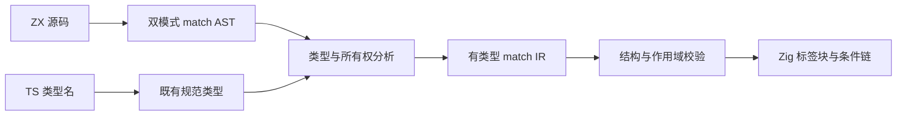
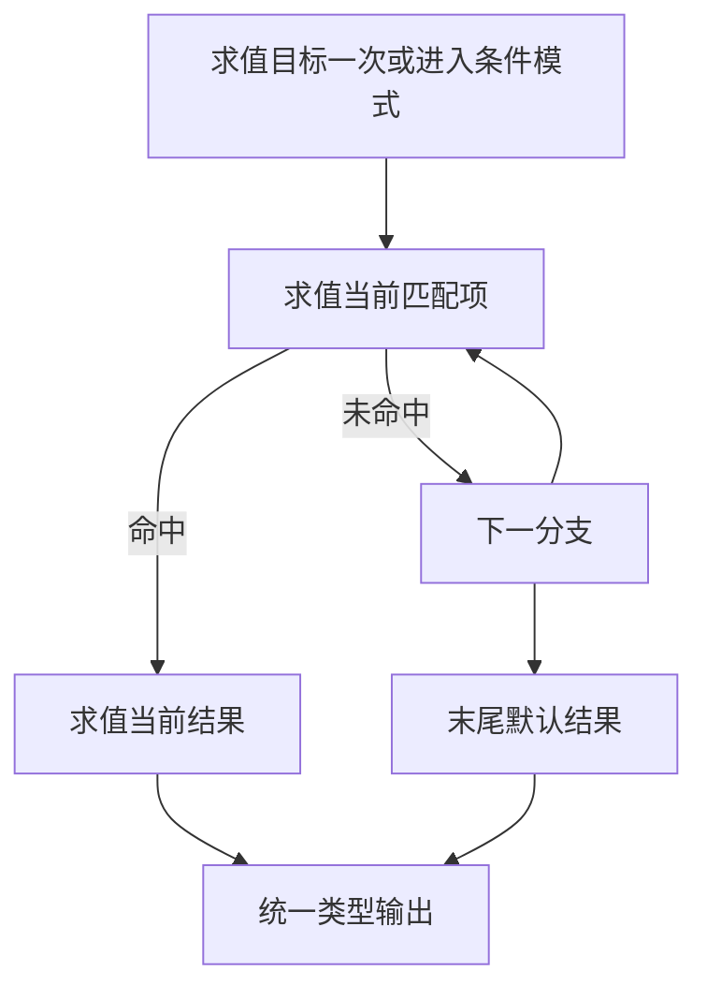

# 匹配表达式与标准类型实施

## Intent：最终目标

将双模式 `match` 接入 ZX 编译器，并让常用 TS 类型名有明确的 ZX 默认映射。

## Data：可用证据

用户提供双模式设计，随后明确要求编译器实现；逻辑连接符已确认沿用 `&&`。现有编译器拥有条件表达式、定宽标量、列表与所有权分析，尚无 match。[TS 官方类型说明](https://www.typescriptlang.org/docs/handbook/2/everyday-types.html)将 number 用于普通整数和浮点数。

## Edges：边界与限制

条件模式按布尔条件选择；值模式限定非 void 标量和枚举。首个匹配生效，目标只求值一次，结果惰性求值，必须有末尾 `_`。不实现区间、解构、链式比较。保留原有数值推断与显式定宽类型。

`number` 映射 `f64`，`boolean` 映射 `bool`，`string` 与 `void` 保持既有含义；`Array<T>` 复用 `T[]`。不把 `bigint` 错映射为 i64，不引入 any、unknown、symbol 或动态 object。映射不产生隐式初始值。其他线程已有修改必须保留。

## Answer：交付与成功标准

1. 扩展语法树、解析、类型分析和有类型 IR。
2. 补全 IR 校验、作用域遍历、所有权合流、Zig 生成与格式化检查。
3. 接入标准类型别名并同步设计及官网文档。
4. 构建与运行已有回归；不新增测试文件，不进行浏览器 UI 检查。
5. 代码快照保存在 `docs/2026-10-03/zx_match与标准类型/`，本记录补充实际验证结果及自我复核。

## 执行记录

- 已完成 AST、解析、类型分析、IR 结构与作用域校验、所有权合流、Zig 生成、命名检查遍历。
- `=>` 同时用于回调和 match 分支：匹配项根表达式禁用回调识别，参数与括号内部仍按既有表达式语法解析，避免把 `flag => result` 误当回调。
- 目标保存一次，结果留在条件分支内部；所有权按前面条件已经求值但未命中的路径逐步合流。
- `number` / `boolean` / `Array<T>` 直接规范化为已有类型；本地与导入类型不能覆盖这些名称。
- 同步主设计文档、match 专题、IR 契约、编译器说明及官网四种语言的类型和 match 文档。官网运费例已按实际格式器的语句分组修正空行。

## 实际验证

- 根目录 `zig build`：通过。
- `packages/compiler` 内 `zig build test`：通过，涵盖现有前端、IR、生成代码执行和分配失败回归；未新增测试用例文件。
- 根目录 `zig build test`：34,458 项测试通过，但整体命令失败。失败项为另一个并行工作范围中的 `packages/test/src/audit_matrix.ts` 注册审计，提示注册重复、缺失或引用不存在目录；没有改动该测试体系。
- 官网实际 `quote.zx` 经格式化后成功编译。草稿中的 `grade.zx` 演示 number、boolean、Array<number>、条件匹配和字符串/整数值匹配；两份生成模块通过 Zig 实际执行，输出 `grade=B, ready=true, score=85.5; shipping=0, payable=11000`。
- 官网 `tsc --noEmit`：通过；四语本次文档的代码块逐字一致。
- 未调用浏览器进行 UI 检查。

## 自我复核

源码修改限于语言功能所需环节，未改写数值运算、已有测试或其他线程代码。只读审查确认求值顺序、目标缓存恢复和所有权分支合流路径，无已知阻塞问题。现有回归与示例执行不能替代新增语义的系统性专用回归；按用户规则本次未新增测试用例。`number` 是 f64 的别名，不承诺完整 JS/TS 数值兼容；bigint 不映射为定宽整数。

代码快照位于 `docs/2026-10-03/zx_match与标准类型/packages/`；可运行示例位于该目录的 `示例/`，包含 ZX、生成 Zig 与调用入口。

## 首页展示补漏

用户刷新后发现首页未展示默认类型映射。HTTP 核对确认 match 已在首页示例中，但默认类型映射只出现在文档页。已将 number→f64、boolean→bool、Array<T>→T[] 直接补到首页 ZX 介绍下，并同步四种语言的标签。此处修正的是首页信息展示遗漏。

## 首页示例缓存修正

用户明确反馈首页仍显示旧的 items/map/reduce 版本。进一步提取 HTTP 返回的实际 `<pre>` 代码块后确认，开发服务仍持有旧的 `?raw` 示例模块；先前仅搜索页面中出现 match 或字段名的验证不足以确认可见示例更新。重启英文开发服务后，实际代码块与 `content/examples/quote.zx` 逐字一致：从原先 30 行缩短为 19 行，去掉汇总 items 的段落，使用已计算的 subtotal 输入，并用 match 表达运费分支。验证直接比对可见代码块与源码，未调用浏览器。
