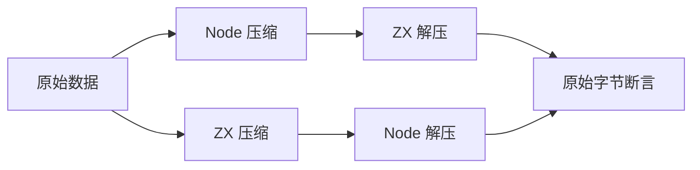
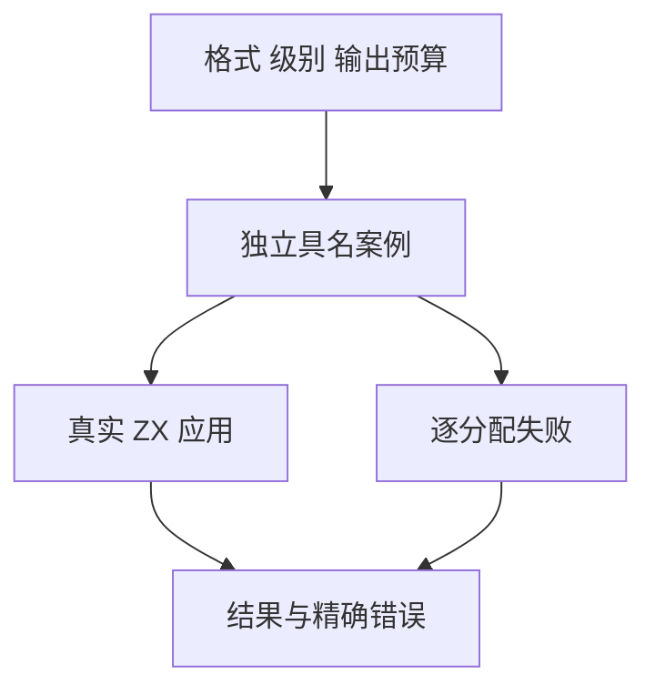

# 压缩接口独立对照与资源测试

## Intent：最终目标

为 std:zlib 的三种默认压缩、三种指定级别压缩和三种有界解压补齐独立对照、拒绝边界及资源失败测试。每个格式、级别、边界保持具名 ID，不用压缩字节必须相同或同源往返代替正确性。

## Data：可用证据

正式声明和实现位于 compiler/standard/interfaces/zlib.d.zx 与 standard/src/zlib。参考 [Node 官方 zlib 文档](https://nodejs.org/api/zlib.html)；Node 产生合法压缩输入，ZX 解压后与原始数据比较；ZX 产生压缩输出，由 Node 独立解压核对。

## Edges：边界与限制

- 压缩流可以有多种合法编码，不要求 ZX 与 Node 压缩字节相同，不以固定压缩率作为正确性断言。
- 格式区分 gzip、zlib、raw DEFLATE；级别区分默认、0 和 1–9。覆盖空数据、Unicode 字节、全部单字节值、窗口和 stored block 长度边界。
- ZX 解压有显式输出上限，检查零、恰好、超出一字节；gzip 连续成员按总输出预算判断。
- 精确拒绝边界包括非法级别、格式头、字典、截断、校验和、长度、尾随数据。Node 宽松接受但 ZX 明确拒绝的尾随数据不强行视为兼容。
- 原生分配失败直接使用 testing allocator；成功结果释放，错误传播，不靠 arena 一次释放掩盖泄漏。
- 流式接口、Brotli、Zstd 与字典不属于当前九个接口已经实现的能力，仍保留全特性缺口。

## Answer：交付与成功标准

解压案例放入按格式分组的 JSONL/ZX 并注册默认 runtime；压缩输出在既有正式安装与应用构建链路中由 Node 验证；资源用例纳入标准库资源步骤。执行生成一致性、类型与目录审计、专项和默认根回归，记录原始日志。

## 执行与自我批判

待执行。任何失败先区分输入规范、测试 oracle 和实现缺陷；不根据实际输出倒写预期。外部互操作场景与 Zig 测试、JSONL 分别计数。
