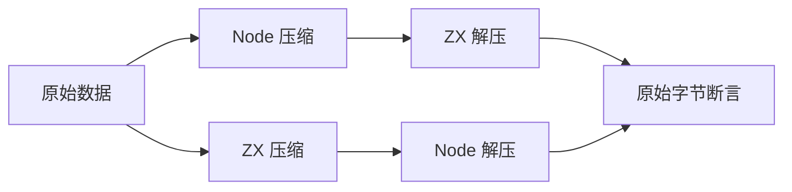
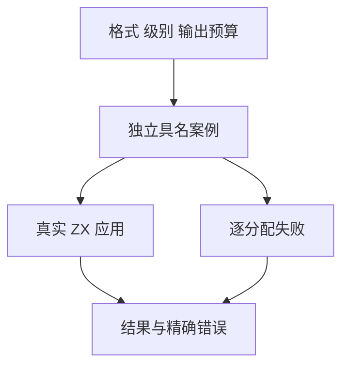

# 压缩接口独立对照与资源测试

## Intent：最终目标

为 std:zlib 的三种默认压缩、三种指定级别压缩和三种有界解压补齐独立对照、拒绝边界及资源失败测试。每个格式、级别、边界保持具名 ID，不用压缩字节必须相同或同源往返代替正确性。

## Data：可用证据

正式声明和实现位于 compiler/standard/interfaces/zlib.d.zx 与 standard/src/zlib。参考 [Node 官方 zlib 文档](https://nodejs.org/api/zlib.html)；Node 产生合法压缩输入，ZX 解压后与原始数据比较；ZX 产生压缩输出，由 Node 独立解压核对。

## Edges：边界与限制

- 压缩流可以有多种合法编码，不要求 ZX 与 Node 压缩字节相同，不以固定压缩率作为正确性断言。
- 格式区分 gzip、zlib、raw DEFLATE；级别区分默认、0 和 1–9。覆盖空数据、Unicode 字节、全部单字节值、窗口和 stored block 长度边界。
- ZX 解压有显式输出上限，检查零、恰好、超出一字节；gzip 连续成员按总输出预算判断。
- 精确拒绝边界包括非法级别、格式头、字典、截断、校验和、长度、尾随数据。Node 宽松接受但 ZX 明确拒绝的尾随数据不强行视为兼容。
- 原生分配失败直接使用 testing allocator；成功结果释放，错误传播，不靠 arena 一次释放掩盖泄漏。
- 流式接口、Brotli、Zstd 与字典不属于当前九个接口已经实现的能力，仍保留全特性缺口。

## Answer：交付与成功标准

解压案例放入按格式分组的 JSONL/ZX 并注册默认 runtime；压缩输出在既有正式安装与应用构建链路中由 Node 验证；资源用例纳入标准库资源步骤。执行生成一致性、类型与目录审计、专项和默认根回归，记录原始日志。

## 执行与自我批判

已完成下述专项和根级验证。任何失败先区分输入规范、测试 oracle 和实现缺陷；不根据实际输出倒写预期。外部互操作场景与 Zig 测试、JSONL 分别计数。

## 首轮失败与最小修复

231 条解压案例通过。分配失败测试复现三种 0 级压缩扩容时返回 WriteFailed，而非 OutOfMemory。Zig flate.Compress 源文件声明 WriteFailed 始终来自底层 writer；此处底层固定为内存 Allocating writer，其唯一写入失败来自分配。将 stored 写入、压缩初始化、输入写入和 finish 的 writer 错误映射为 OutOfMemory，其他分配与校验错误保持。

资源输入改用固定种子的 6000 字节伪随机数据，覆盖默认压缩和高级别下输出容量超过初始缓冲区的分配路径；生成输入不使用被注入失败的 allocator。没有修改压缩算法、级别、输入或预期来避开失败。

独立应用测试发现 CLI 当前直接使用 Zig JSON 编码器：有效 UTF-8 的 u8[] 为字符串，否则为数值数组。这是字节传输表示，不是压缩流内容变化。测试严格接收这两种已有表示并恢复字节，由 Node 解压比较原文；不声称当前 CLI 的字节列表始终是 JSON 数组。若未来需要稳定的类型驱动 JSON 表示，应独立设计并验证，不在压缩修复中广泛更改字符串 ABI。

## 当前专项结果

- 解压：15/15 步骤、231/231 具名案例通过，gunzip 83、inflate 76、inflateRaw 72。日志 `/tmp/zxc-test262-zlib-execution.log`。
- 标准库资源：14/14 步骤、37/37 测试通过，其中本轮新增压缩 12、解压 10。日志 `/tmp/zxc-test262-zlib-resources-final.log`。非法级别在分配器从第一次分配就失败的环境下仍报告 InvalidCompressionLevel，且分配计数为零。
- TypeScript、生成一致性、目录审计、格式与 diff 检查通过。目录新增 231，为 52,750；runtime 为 38,660。上游审查与关联不变。

按更新后的 AGENTS 规则，本阶段草稿与配套资源已统一迁移到 `docs/2026-10-03/压缩测试草稿/`，保留生产修复前版本和最终版本。历史其他阶段归档不在本次迁移范围。

压缩互操作最终通过：六个压缩接口的 264 次真实应用调用，其中 252 次由 Node 独立解码核对、12 次非法级别拒绝且无标准输出。既有安装、搬迁和原生调用也通过，test-build-modes 为 2/2 步骤。日志 `/tmp/zxc-test262-zlib-interop-final.log`。这些调用不重复计入 JSONL 数量。

用户新增要求后，已将上述 WriteFailed/OutOfMemory 复现、四行现有修复、资源和互操作日志，以及 CLI 字节 JSON 表示边界发送至实现会话 `01a1017f-f09f-7001-95ef-8e966ebd6aee`，请其审阅完善。四行修复发生在新通知要求之前；后续缺陷先保留复现并向该会话传递，不对并行实现擅自扩展修改范围。

## 根级最终证据与自我批判

根 `zig build test --summary all` 为 887/887 步骤、52,746/52,746 条 Zig 测试通过，日志 `/tmp/zxc-test262-zlib-root.log`。相比阶段 60 增加 231 条运行测试与 22 条资源测试，外部 264 次应用调用单独留证。目录总数为 52,750，不能与 Zig 汇总数混为一个指标。

生产差异仅 compress.zig 四处 writer 错误映射，修复以实际失败和底层 writer 契约为依据。测试未要求压缩字节或压缩率与 Node 相等，未通过降低输出上限要求来跳过错误。可选 gzip 头组合、更多畸形动态 Huffman 流、raw 尾随字节及未来流式接口仍需继续；当前通过不证明任意恶意输入或所有资源规模安全。

本次根通过基于运行时工作区；实现会话后续修改仍需重新核验。测试缺陷通知流程已写入总计划，后续发现实现问题将发送该会话完善。
