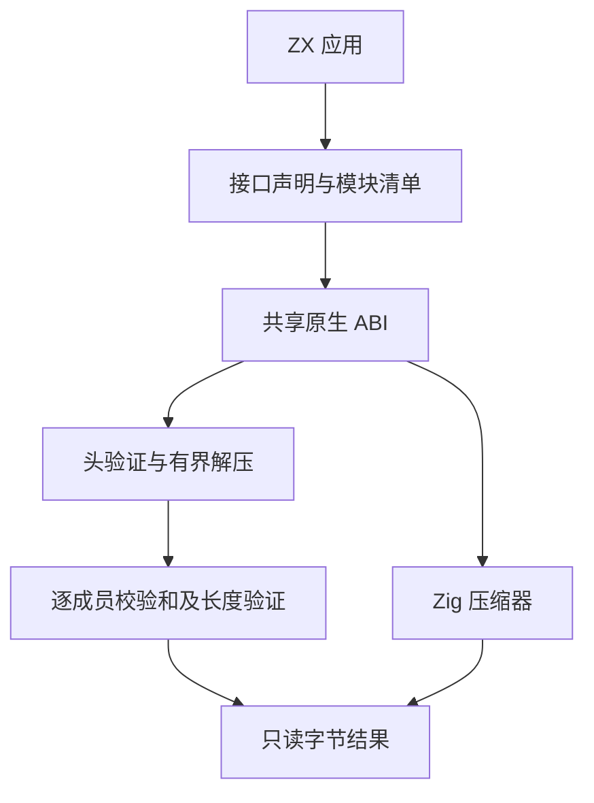
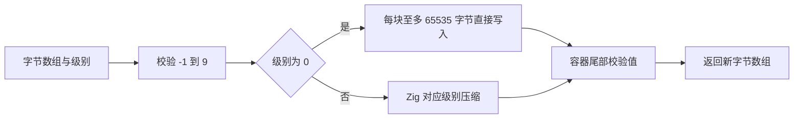

# 压缩标准库实施

## Intent：最终目标

通过 `std:zlib` 提供基于 Zig 的 gzip、zlib 与 raw DEFLATE 字节压缩和解压，为完整标准库补齐实际可调用的压缩能力。

## Data：可用证据

- [Node.js 压缩接口](https://github.com/nodejs/node/blob/main/doc/api/zlib.md)提供 gzip、deflate、raw DEFLATE 及输出长度限制。
- 当前 Zig 0.16 的 `std.compress.flate` 提供压缩器和解压器；解压器读取尾部校验值但没有比较，gzip 头校验与 zlib 头完整性也需要调用方补充。
- 现有标准模块通过 `modules.json`、`.d.zx` 声明和共享 ABI 接入。沿用 encoding 的字节数组契约，不引入 runtime。

## Edges：边界与限制

- 本轮覆盖内存中的完整数据转换与压缩级别；流式接口、Brotli、Zstd、字典及其余压缩参数仍未实现，不以已交付接口代表整个压缩功能组完成。
- 解压输入显式携带 `max_output_length`，不设置隐藏的业务大小限制。返回值为新分配的只读字节数组。
- gzip 接受连续成员并逐成员验证 CRC32 和长度；zlib 验证 Adler32。拒绝尾随垃圾、截断和不支持的预设字典。
- 不新增测试文件或测试用例；通过真实 ZX 示例构建和外部 Node.js 互操作运行核对行为。

## Answer：交付与执行顺序

1. 声明六个公开函数，注册 `std:zlib`。
2. 分离压缩、解压、容器头校验，各文件只承载一个职责。
3. 构建真实 ZX 示例，验证双向互操作与边界错误。
4. 记录实际执行结果与自我复核，不提前标记完成。

## 实施与实际验证

已新增 `standard/interfaces/zlib.d.zx` 和 `standard/src/zlib/` 下的入口、压缩、解压、头校验实现，并通过标准模块清单注册。调用方式见同目录《压缩标准库示例》。

- 根目录 `zig build` 成功；随后使用更新后的安装资源构建 `zig-out/bin/zxc build docs/2026-10-03/压缩标准库示例/main.zx --out .zxc/examples/compression`，成功。
- Node.js 与生成应用双向转换三种格式：0、1300、20000、80000 字节均逐字节相同。80000 字节运行覆盖跨历史窗口处理。压缩字节不要求与 Node.js 相同，只要求格式互通和还原一致。
- 连续 gzip 成员（包含尾部空成员）正确拼接；输出上限为实际长度时成功，小一个字节时返回 `OutputTooLarge`。
- 三种格式截断均被拒绝；尾随垃圾均被拒绝。损坏 gzip CRC32、zlib Adler32、gzip 长度、gzip 保留标志、zlib 头校验均被拒绝。
- 带 FHCRC 的 gzip 头可正确读取；损坏 FHCRC 返回 `InvalidHeaderChecksum`。
- 既有 `test-native-declarations` 通过：8/8 构建步骤、10/10 测试。这些既有测试不覆盖新压缩算法，不能替代上面的实际运行证据。
- 既有 `test-standard-resources` 通过：8/8 构建步骤、6/6 测试，覆盖既有标准库资源检查；新压缩模块的分配失败路径仍只有源码复核证据。
- `git diff --check` 通过。未新增测试文件或用例，未调用浏览器 UI。

## 自我复核

首次运行暴露了读取 API 的精确上限语义：`appendRemaining` 达到上限时会返回 `StreamTooLong`，不直接说明还有额外数据。实现现在检查下一个字节是否存在，且在 EOF 前完成尾部读取和校验。不能用增大上限掩盖这个错误。

CLI 读取安装目录中的标准库资源，源码修改后须先执行根构建更新安装副本，再构建应用；本文成功结果来自刷新后的实现。

输出上限约束解压结果字节数，不等同于总内存上限；实现仍使用 DEFLATE 历史缓冲和可增长的结果分配。新模块尚未执行逐分配故障注入，也未证明所有合法 DEFLATE 编码组合或跨平台行为。本轮没有引入专用 runtime、动态加载、后台任务或 JavaScript 依赖；Node.js 仅用于外部互操作核对。整个标准库和整体任务仍未完成。

## 后续：压缩级别

Intent：让调用方控制压缩成本与压缩率，保留现有无配置调用。

Data：Zig `Compress.Options` 公开 1–9 级参数；`Compress.Raw.finish` 为私有，不能直接调用。DEFLATE 的 stored block 格式由 [RFC 1951 第 3.2.4 节](https://www.rfc-editor.org/rfc/rfc1951#section-3.2.4)定义。

Edges：新增配置仅控制 level，接受 -1（默认）、0（不压缩）、1–9；压缩级别不是压缩率保证，不要求输出与 Node.js 逐字节相同。其余参数不伪装支持。

Answer：增加 `CompressOptions` 和 `gzipWith`、`deflateWith`、`deflateRawWith`。1–9 使用 Zig 原有参数；0 按标准分块写入原始字节和容器校验尾部。构建后实际运行各级别及跨块边界，再记录证据。

### 压缩级别执行结果

- 根构建成功，安装资源刷新后，`main.zx` 与 `levels.zx` 两个示例均构建成功。
- -1、0、1–9 各级别的三种格式均用空数据和重复 UTF-8 文本运行，Node.js 解压结果逐字节相同。
- 0 级用 65534、65535、65536、80000 字节运行，三种格式均能由 Node.js 正确解压；raw DEFLATE 大小符合每个 stored block 5 字节开销，跨块边界没有多写或丢失数据。
- -2 和 10 返回 `InvalidCompressionLevel`，没有静默夹取参数。
- 原有默认接口与显式 -1 的压缩字节相同；ZX 解压接口可还原 Node.js 0 级输出。
- 既有 `test-native-declarations` 再次通过 8/8 步骤、10/10 测试；格式化与 diff 空白检查通过。没有新增测试文件或用例。

自我复核：级别映射使用 Zig 原生参数，不保证与 Node.js 的 CPU 耗时或压缩率完全一致。0 级只实现标准的 stored block 写入，不重复实现 LZ77/Huffman。它仍分配输出字节数组，但不分配压缩历史窗口。级别支持不代表其余压缩参数、字典、流式处理或其他算法已完成。
