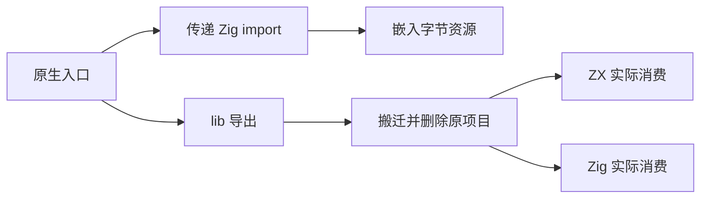
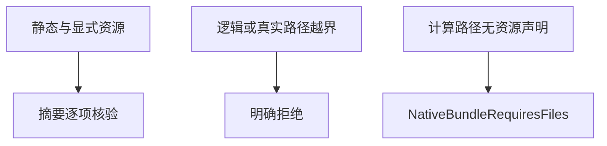

# 原生依赖搬迁回归测试

## Intent：最终目标

将原生 Zig 依赖打包的实际搬迁能力纳入自动回归，验证传递 import、嵌入资源、摘要与资源边界。

## Data：可用证据

当前 library 导出保留原生目录布局，扫描 import/embedFile，清单记录文件种类和 SHA-256；显式 bundle_files 中先作为资源发现的 Zig 文件应在传递 import 时升级解析。

## Edges：边界与限制

仅针对当前已实现的原生 Zig 静态闭包，不把 C 搜索路径或动态插件外部依赖说成已打包。测试使用临时目录，实际删除原项目后再构建消费方。符号链接拒绝测试以当前主机实际行为为证据。

## Answer：交付与成功标准

扩展现有 test-build-modes，增加 native_bundle_test.ts。正常用例检查三份文件的内容摘要和 Zig/资源分类，并在搬迁后执行真实 ZX 与 Zig 消费。负例检查逻辑越界、绝对资源路径、符号链接越界及未声明计算资源路径的具体错误。

## 执行与自我复核

最终 test-build-modes 2/2 步骤通过，包含原有 app/lib 消费与新增原生场景，日志 `/tmp/zxc-test262-native-bundle-final.log`。

新增证据：

- lib 搬至带空格的新目录后实际删除原项目；ZX 输入 9 返回 13，直接 Zig 测试同样返回 13。
- 入口、传递 Zig 源码和嵌入资源三份文件的内容、SHA-256、唯一性与 kind 全部核对。传递源码先由 bundle_files 作为 asset 入队，再由 import 升级解析，仍能发现其嵌入文件。
- 普通独立 Zig 项目通过 b.dependency(...).module("library") 消费，显式传 target/optimize，Debug 和 ReleaseSafe 都执行真实测试。配置沿用已验证的本地原生消费示例组织。
- 逻辑父目录越界、绝对资源路径、符号链接指向模块外，以及计算资源未显式声明分别返回具体错误。
- 计算 embedFile 路径补充 bundle_files 声明后成功导出；再次搬迁并删除该原项目，ZX 输入 3 返回 7。

TypeScript 与 diff 空白检查通过，无生产代码修改。新增流程接入默认根已有 build-modes 步骤；本轮运行完整相关步骤，没有重复无关根测试。最近完整根结果见阶段 46。

自我批判：输入案例用于证明包内代码和资源在原目录消失后可用，不证明任意第三方原生代码正确。没有用空的 zig build 步骤代替执行。C、动态插件的外部依赖、跨平台链接与所有计算资源路径仍未完成覆盖，显式资源声明不等于静态闭包证明。目录和 Test262 审查计数不增加。
