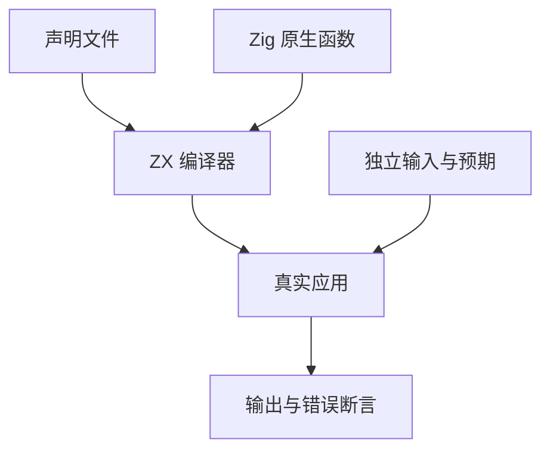

# 原生声明聚合转换回归

## Intent：最终目标

给并行实现的新 native_interfaces 声明入口增加自动回归，验证 ZX 与 Zig 的同形异名类型转换、可选枚举及失败传播。

## Data：可用证据

已读取 modules/native.zig、backends/zig/native_conversion.zig 和原生声明示例。转换以字段和枚举成员为基础；聚合数组需要分配和逐项复制。测试沿用 build_modes 的真实 CLI 构建入口，不直接调用内部转换函数。

## Edges：边界与限制

本轮独立 fixture 包含同形的 Item/Snapshot，两个不同元素类型的数组，可选枚举 Add/Keep/null 和原生 throws。36 个输入组合使用 Node 整数运算构建预期，包括空数组、单项、多项和负值；另有分配后原生错误，要求非零退出及无 stdout。预期不读取编译器生成代码。

不将数组转换称为零复制；不增加 Test262 上游关联数。生成库额外运行成功和原生错误两组分配失败遍历，由调用方 arena 管理整个调用周期。它验证 arena 销毁后的释放，不要求原生 fixture 在 arena 内逐项释放。

## Answer：交付格式与成功标准

在 test-build-modes 注册自动测试。成功标准为真实构建、36 个输出逐字段相等、原生错误准确传播及两组分配失败遍历；相关 TypeScript 与格式检查通过。

## 执行结果与自我批判

首轮 test-build-modes 2/2 步骤通过，36 个输入与原生错误检查通过，日志 `/tmp/zxc-test262-native-declaration.log`。随后加入两组生成库 allocator 故障遍历，最终专项 2/2 步骤通过，36 个输入、原生错误与两组 allocator 故障遍历均通过。日志 `/tmp/zxc-test262-native-declaration-final.log`；TypeScript、Zig 格式及 diff 空白检查通过。

自我批判：CLI 进程退出本身不能证明内存释放正确；资源测试必须完整执行生成库调用周期，并将 OutOfMemory 交回故障遍历框架，不能把基础设施或分配失败当成预期业务错误。
