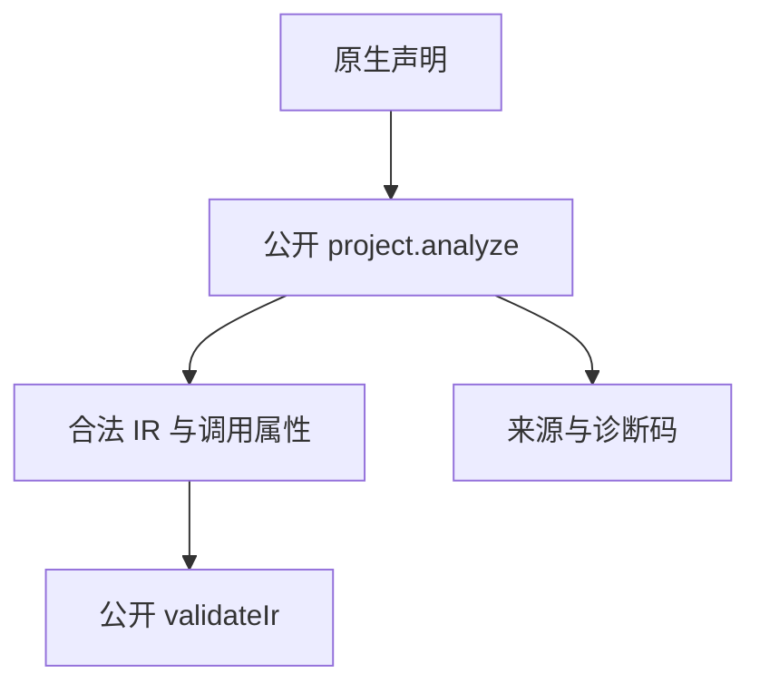

# 原生声明诊断与资源回归

## Intent：最终目标

补足原生声明入口的非法输入与分析阶段资源失败测试，作为 zxc 全特性测试的一部分。

## Data：可用证据

已读取 modules/declarations.zig、modules/native.zig、modules/project.zig。使用公开 compiler.project.analyze 和 validateIr，不调用私有声明解析器。沿用已有资源测试的 checkAllAllocationFailures 模式。

## Edges：边界与限制

十二种非法声明覆盖空接口、函数与参数命名、重复参数和函数、类型声明顺序、类型命名、void 参数、未声明输入/输出类型及缺失分号和 allocator 分隔符。预期依据当前显式规则固定为 contract/naming/name/type_mismatch/syntax；验证入口文件 source_index 和诊断消息中的原生声明路径，不只检查失败。

成功路径还检查外部函数的 allocator、throws、单参数非元组展开与成员名。成功及构造部分类型后失败两条路径遍历每次分配失败并检查释放。

另有四种零参数/双参数、allocator/throws 组合，逐项检查 nested.api.apply 路径、元组展开和调用属性；均经公开 validateIr 核验。

本轮不依赖正在改造的 app/lib runtime 打包。不会把分析成功当成原生机器码链接成功，后者已有阶段 51 的独立专项。

## Answer：交付格式与成功标准

新增 test-native-declarations，并纳入默认 test。四组测试必须实际通过；预期诊断不从被测输出生成。失败时先确认契约和执行阶段，不能弱化为“任意错误”。

## 执行与自我批判

初轮 4/4 步骤、3/3 测试通过；补充调用属性后最终 4/4 步骤、4/4 测试通过，日志 `/tmp/zxc-test262-native-diagnostics-final.log`。Zig 格式与 diff 空白检查通过。没有修改生产实现。十二行输入归入一个具名诊断组，不增加十二个 JSONL 案例；计数与已有登记案例分开。资源失败检查覆盖分析周期，不推断链接或宿主生命周期。
