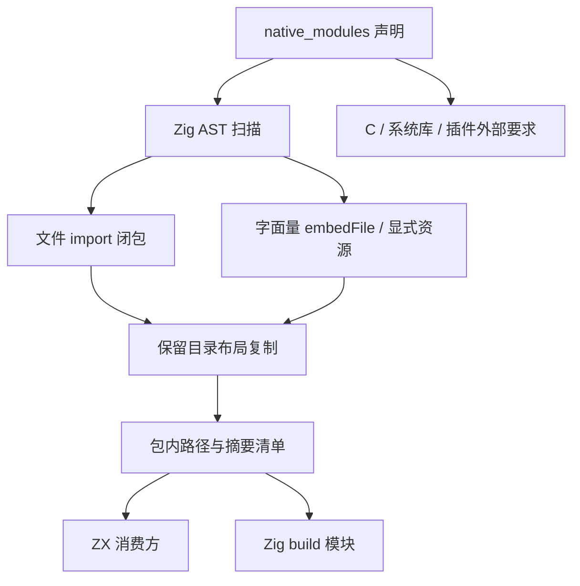
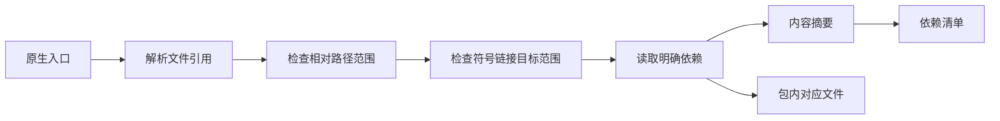

# 原生库依赖打包实施

## Intent：最终目标

使 lib 导出的原生 Zig 依赖与其资源能随库包移动，支持原项目不可访问时在新目录构建。完整目标还包括 C 与插件依赖，不将源码复制等同于所有原生依赖都已封装。

## Data：可用证据

当前 library.zig 将 native.path/native.library 和 include_paths/library_paths 改成绝对路径，library_build.zig 使用 cwd_relative。实际导出库因此仍指向原项目。Zig 0.16 的 Ast 提供 builtinCallParams，@import 必须为普通字符串字面量，@embedFile 可以使用计算路径。

## Edges：边界与限制

- 使用 Zig AST 收集普通字符串字面量的文件 import 和嵌入资源，保持模块内目录布局，复制明确引用的文件，不复制整个源目录。
- named import 通过已有 native.dependencies 连接，所有声明的 native.path 模块分别打包；std/builtin 等保留工具链身份。
- 字符串转义由 Zig string_literal 解码。逻辑路径和符号链接实际路径均必须位于原生模块根目录，拒绝绝对引用和越界资源。
- 计算得到的 embedFile 路径需要 native_modules.bundle_files 显式列出资源；这些文件按模块根目录相对路径保存，表达式仍由 Zig 求值。清单标记存在计算路径，不把声明的资源集合当作已证明完整的静态闭包。计算路径仍须在包内，绝对路径表达式不能自动重定位。
- 扫描整个 AST，包含 test 和非活动平台分支，是保守语法闭包；不能静默忽略缺失引用。
- C 搜索目录、系统库与动态插件仍按外部依赖记录，尚未完成预处理依赖、动态装载基准和共享库传递依赖封装。
- 不新增测试用例；执行真实导出、搬迁、双语言消费和已有回归。

## Answer：交付格式与成功标准

交付原生引用扫描器、源文件闭包打包器、包内构建路径、文件摘要与外部依赖清单。原生 Zig 示例移至新目录、隐藏原项目后，ZX 和 Zig 消费均应成功；清单不掩盖外部依赖。

## 自我复核

核查嵌入文件按字节复制、import 环去重、不同模块同名资源隔离、工作目录独立性，以及动态资源未获静态闭包证明的边界。不得通过保留可访问原目录获得虚假的搬迁成功。

## 当前实际搬迁结果

将示例项目复制至 `.zxc/examples/native_bundle_d7oa1ls6/original`，由真实 zxc 导出 lib；将产物移至 `relocated library`，再将原项目目录重命名，使原先绝对地址不可访问。

导出的 native.path 分别为 `native/calibration/source/root.zig` 和 `native/units/source/root.zig`。清单包含两份入口、一份传递 Zig 源文件和其 factor.txt 嵌入资源，各有 SHA-256 摘要。

从与库包不同的工作目录构建 ZX 消费方和 Zig 消费方，两者输入 80 均返回 122。库包自身 `zig build` 也通过。Zig 消费方实际用模块依赖参数绑定包内文件执行，不把仅执行无默认编译步骤的 `zig build` 当作代码已被编译的证明。

该结果覆盖静态引用的 Zig 文件、命名模块依赖和字面量嵌入资源，未证明计算资源路径、C 搜索路径或动态插件已实现自包含搬迁。

最终与 IR v4 一并完成根回归：611/611 步骤、52100/52100 测试通过，日志 `/tmp/zxc-native-ir-final-regression.log`。本轮未增加测试用例。搬迁验证没有覆盖 C 与插件传递依赖，因此整体打包能力继续保留未完成边界。

## 普通 Zig dependency 接入修正

继续用实际消费项目调用 `b.dependency("calibration", .{ .target = target, .optimize = optimize }).module("library")` 时，发现生成的 build.zig 使用 preferred_optimize_mode，会把公开选项改成 release，而不接收调用方传入的 optimize。Zig 0.16 的 Build.standardOptimizeOption 源码证实了这一行为。模板现改为标准无 preferred 形式，让目标和优化级别由消费方传入。该问题与是否存在包 manifest 不同，不通过添加无关元数据掩盖它。
