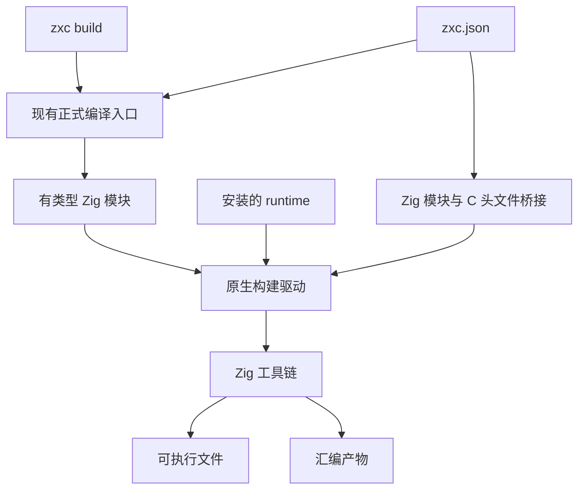
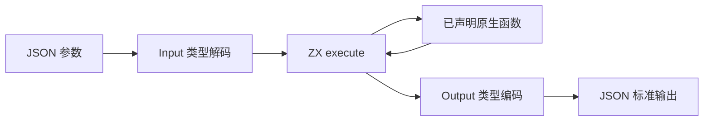

# 原生构建与汇编输出实施

## Intent：最终目标

从正式 zxc CLI 生成并链接可执行文件，支持 Zig/C 模块声明以及目标架构、CPU 与优化配置，并保留可追踪汇编产物。它是软件后端能力，不替代 FPGA 电路生成或形式化证明。

## Data：实现与证据

- CLI 新增 build 模式，保留原来的 Zig 源码输出和 fmt 行为。
- 构建沿用正式 compileProject，包含源码风格、名称、类型、所有权及导入图检查。
- root/package 两种 zig build 安装方式均附带 share/zxc/runtime 源码。
- 构建驱动使用参数数组启动 Zig，无 shell 字符串执行。生成源码、通用 JSON runner、C 头文件桥接及 command.json 存入已忽略的 .zxc/build 目录；目录键包含源码、runner 和构建配置，文件采用原子替换写入。
- --asm 通过实际 Zig -femit-asm 输出汇编；--target、--cpu 和 --optimize 分别传给所有模块。默认 ReleaseSafe，不因目标为优化构建而移除 ZX 已规定的安全语义。

## Edges：边界与限制

- Zig 命令从 PATH 查找，当前验证使用本地 Zig 0.16.0。必须同时安装 zxc 可执行文件和配套 share 目录；单独拷贝二进制不包含源码 runtime。
- 原生外部函数仍需明确注册类型和实现。C 头文件桥接使用 @cImport，导出 c 命名空间；ZX 不因此获得任意指针、变参或任意副作用能力。
- 当前生成的命令行应用接受一个 JSON 参数，按 Input 解码，按 Output 输出 JSON；void Input 不接受参数。复杂类型的 JSON 表示沿用 Zig JSON 类型规则，不声称 Node.js 序列化兼容。
- 动态插件、受控 I/O、RX 应用调度仍未实现。Zig 静态模块或 C 头文件链接不能冒充动态插件懒加载。
- 汇编输出证明目标代码已生成，不证明指令全局最优；没有完成独立的语义保持证明，也未验证任意交叉编译目标。

## Answer：用法与成功标准

### 构建与执行

```sh
zig build

zig-out/bin/zxc build docs/2026-10-03/标准库示例/compose.zx \
  --project docs/2026-10-03/标准库示例/zxc.json \
  --out .zxc/examples/compose \
  --asm .zxc/examples/compose.s \
  --optimize ReleaseSafe

.zxc/examples/compose '{"text":"hello","number":81}'
```

实际输出为 hello 的 SHA-256 摘要与 root=9。汇编中存在实际平方根指令；编译产物包含 JSON 宿主与标准库代码，不能把整个文件大小当作业务内核体积。

### 项目配置

```json
{
	"externals": [
		{
			"specifier": "c:math",
			"export_name": "sqrt",
			"signature": "export type Input = f64; export type Output = f64;",
			"implementation": { "module": "native_math", "member": "c.sqrt" }
		}
	],
	"native_modules": [{ "name": "native_math", "header": "math.h" }],
	"libraries": [],
	"include_paths": [],
	"library_paths": []
}
```

native_modules 的 path 与 header 必须且只能选一个。path 用于 Zig 模块源码，header 用于 C 头文件；路径配置相对于 zxc.json 所在目录。dependencies 声明 Zig 模块之间的导入名称。libraries 为系统链接库名称，include_paths/library_paths 为搜索目录。出现 C header 时构建接入 libc。

### 架构图



### 数据流图



### 执行记录与自我复核

已实际构建并运行标准库组合示例和原生构建示例。后者同时使用用户 Zig 模块 calibration.scale 与 C math.h 的 sqrt；所有输入由命令行传入，未硬编码预期结果或特殊业务用例。

当前最有价值的进展是声明→类型检查→代码生成→原生链接→执行/汇编已经连接。剩余的证明、受控 effect 和 FPGA 后端仍是独立工作，不能因这条链路可运行而提前宣称整体完成。
