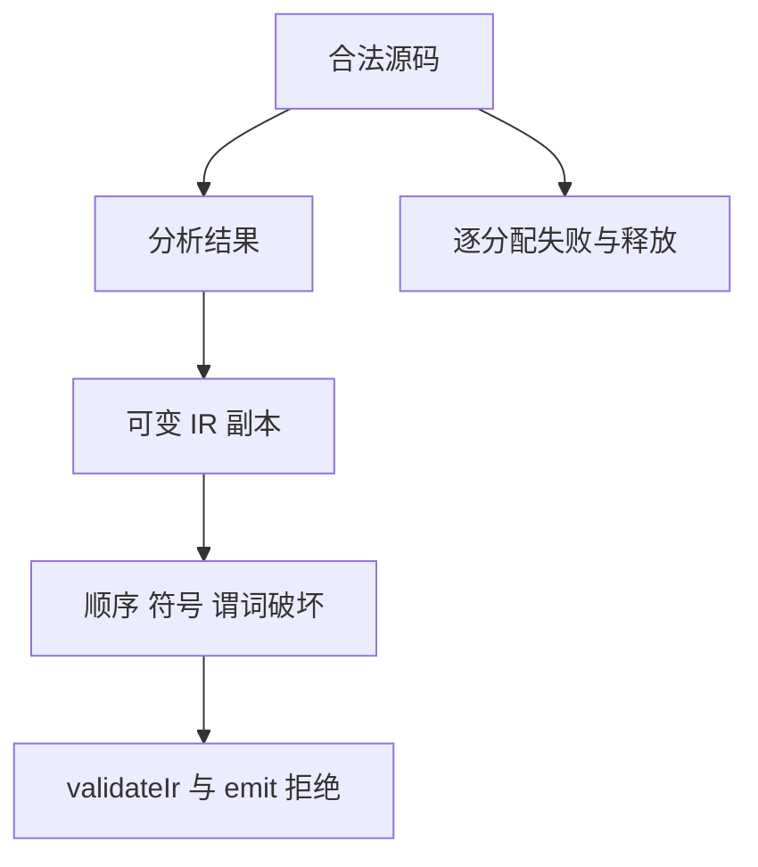

# 契约 IR 与生成门禁测试记录

## Intent：最终目标

为并行新增的 requires/ensures 解析、分析、IR 不变量和未验证契约生成门禁补测试。

## Data：可用证据

公开 parse/analyze/validateIr/zig.emit 与 compileProject 已接入契约。requires 只能访问 in，ensures 可访问 in/out；谓词必须 bool；requires 必须先于 ensures。当前后端拒绝尚未形式验证的契约。

## Edges：边界与限制

本轮不实现形式证明，也不把契约语法正确等同于契约成立。测试修改 IR 副本以验证内部不变量，保留生产实现与并行工作。独立 Zig 测试不计入 JSONL 或 Test262 上游对齐数。

## Answer：交付与成功标准

合法 IR、用户语法与分析错误、IR 破坏、分配失败、单模块及项目生成门禁分别验证。草案位于 `docs/2026-10-03/contract_tests/`。

## 执行记录与自我批判

6 个 Zig 测试已通过 Debug（5/5 构建步骤）。覆盖 6 类解析/分析错误、8 种 IR 破坏、真实公共编译及导入模块门禁，逐分配失败通过。本次根 ReleaseSafe 失败：434/452 步骤成功、5 个编译步骤失败，已执行 39,482/39,482 Zig 测试通过。并行新增 verification/conditions.zig 的 contract 捕获遮蔽同名声明导致编译错误；进程已退出 1。日志 `/tmp/zxc-test262-contracts-root.log`。保留专项通过证据，但不宣称当前全仓通过；待实现侧文件稳定后重跑。形式验证后放行协议尚未实现，不为测试添加绕过门禁开关。

## 后续根回归恢复

最终根 ReleaseSafe 454/454 构建步骤、39,528/39,528 Zig 测试通过，13 个真实求解器 CLI、11 个 RX CLI 场景与隔离安全执行步骤通过。日志 `/tmp/zxc-test262-verification-root-final.log`。此前并行编译失败已解除；形式验证 CLI 的实际测试见《形式验证求解器回归记录》。
