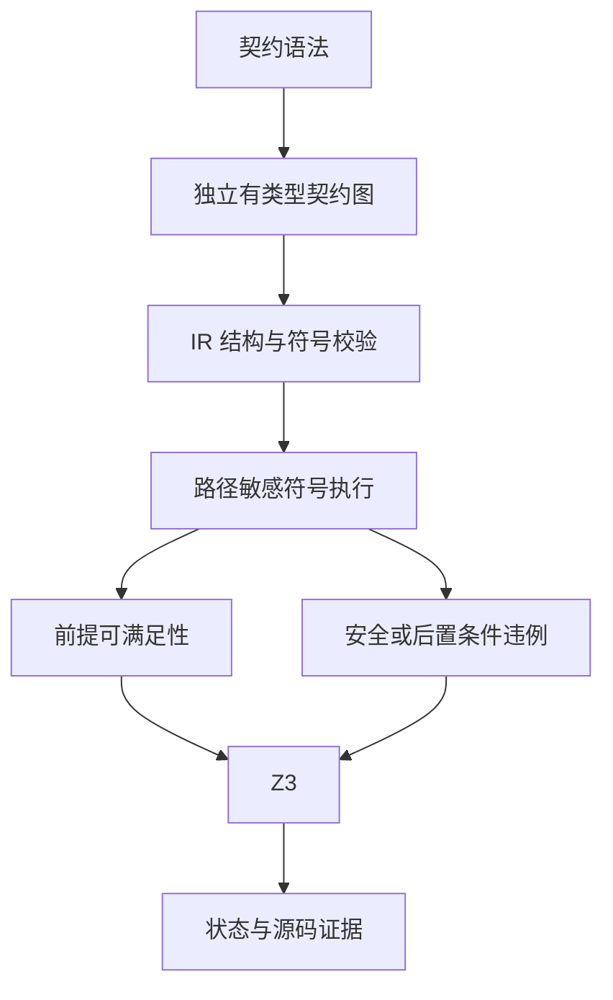
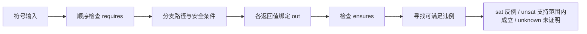

# 契约验证实现与证据

## Intent：最终目标

使用户能够为 ZX 函数声明前置条件和后置条件，并验证支持子集内的所有输入是否满足运行安全与声明契约。区分生成查询、求解成功与完整工具链可信性，后续将证明连接到代码生成和程序合成。

## Data：可用证据

正式入口为 `zxc verify source.zx --solver /path/to/z3 --out query.smt2`。本轮使用项目隔离环境 `.zxc/tools/verification/bin/z3`，版本 5.1.0。没有安装系统全局工具。

语法、语义分析和 IR 均保存 requires/ensures。契约单独持有表达式与虚拟符号，requires 只允许 in，ensures 允许 in/out，不借用执行体局部变量。契约谓词必须是 bool，requires 必须先于 ensures；风格校验覆盖谓词。

```zx
export type Input = { raw_price: u32; discount: u32; };

export type Output = { final_price: u32; };

export default function (in: Input): Output
requires (in.discount <= in.raw_price)
ensures (out.final_price == in.raw_price - in.discount)
{
  return { final_price: in.raw_price - in.discount };
}
```

实际例子以 [discount.zx](契约验证示例/discount.zx) 为准。证据文件保存在同目录：SMT-LIB 查询、前提查询、源码和类型映射、求解器版本、求解结果、反例文件。

| 执行对象                  | 实际结果                                    | 能证明什么                                                               |
| ------------------------- | ------------------------------------------- | ------------------------------------------------------------------------ |
| discount.zx               | 前提 sat，违例 unsat，退出 0                | 当前符号语义下，满足前提的输入不会出现支持范围内的算术错误且满足后置条件 |
| 既有 runtime/cases/add.zx | 违例 sat，退出 1；in = 18446744073709551613 | u64 加 3 存在溢出，验证器没有把截断运算误当成安全运算                    |
| 根回归                    | 454/454 步骤，39528/39528 测试通过          | 当前已有回归通过；不代替普遍正确性证明                                   |

根回归使用 `ZXC_TEST_SOLVER="$PWD/.zxc/tools/verification/bin/z3" zig build test --summary all`。首次未设置求解器路径时，其他工作新增的求解器回归因 FileNotFound 失败；设置真实工具路径后通过，没有跳过该检查。本实现工作没有新增测试用例。

## Edges：边界与限制

- 支持 bool、定宽整数、静态 object/tuple、不可变绑定、if/switch/match、提前 return 与短路运算。
- 算术安全条件采用宽化位向量检测溢出；区分 signed MIN/-1 的除法错误与合法余数 0。对象中被覆盖的初始化表达式仍参与安全检查。
- 每个 return 分别替换 out。分支和短路的安全条件受执行路径约束，不检查实际上没有执行的分支。
- requires 按声明顺序验证可定义性；本条谓词不能用于抹掉本条自身的错误。另行要求前提可满足，避免空输入域被报告为有效证明。
- 暂不支持浮点、字符串、动态集合、枚举、外部调用和 Store；遇到这些能力会明确拒绝，不建立任意无约束符号。纯 ZX 导入函数已在后续 [跨模块实现](跨模块契约验证实施.md) 接通。
- 超时、unknown、格式错误、求解器错误和不可满足前提均不返回证明成功。
- 无 I/O 的 Zig 后端入口仍拒绝含契约的程序。后续已新增同一 IR 的实际求解与生成入口，见 [证明后生成代码实施](证明后生成代码实施.md)；不凭结果文件跳过门禁。
- 源码与类型证据是可追踪记录，尚不是独立检查的证明证书。解析器、IR 验证器、符号执行器与 Z3 仍属于信任基础，不能宣称已验证整个编译器。

## Answer：交付格式与成功标准

交付源码、正式 CLI、可读 SMT-LIB、输入字段映射和实际求解记录。未覆盖的程序合成、优化等价性与硬件时序继续保留为未完成项。





## 自我批判

真实正例与反例已执行，独立静态审查未发现可确认的错误证明路径，但这些证据不保证符号执行器没有漏洞。尤其不能把目前的有限子集扩写成“所有 ZX 程序可验证”。下一步需要证明与代码生成共享同一已验证 IR，并保留校验边界；不得通过删除契约来放行后端。
