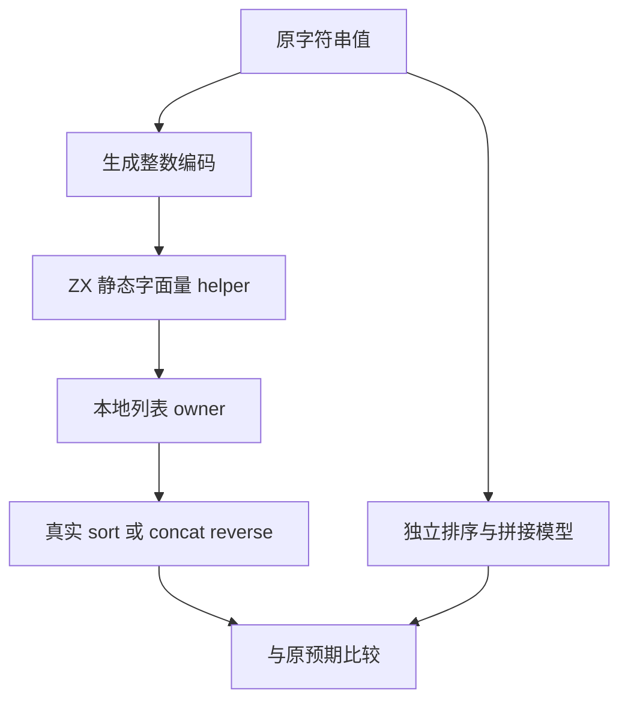
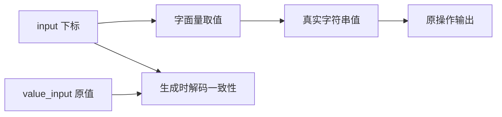

# 字符串消费测试使用静态字面量所有者

## Intent：最终目标

恢复 428 条字符串 sort 与 concat_reverse 案例，保持原字符串值、ID 和独立预期，不借隐式深复制获得 owned。

## Data：可用证据

当前借用字符串视为引用值，不能将输入字符串引用放进新外层列表后直接声称独占。测试目标是 UTF-8 字节排序和拼接后反转，原输入为有限字符串集合，包括 NUL、组合字符、非 BMP 字符与长逆序数组。

## Edges：边界与限制

- fixture 将原字符串值编码为静态字面量表的整数下标。ZX helper 从自身字面量表返回值，主程序据此构造本地列表；字符串字节不从借用输入复制。
- JSONL 的 input 明确保存实际下标输入，value_input 保留原字符串输入；expected 与 ID 不变。不能声称输入表示没有变化。
- 字面量表只编码输入值，不存储排序结果或拼接结果。两种被测操作和原参考模型保持。
- 按两个列表的长度分组，主程序从实际下标输入调用 helper。生成时解码核对 value_input，迁移后对照旧档案核验全部值和预期。
- 这证明对新建拥有者的消费行为，不证明任意借用字符串容器可消费。借用拒绝由所有权矩阵独立测试。
- helper 源文件登记为构建输入，变化必须使对应编译步骤失效重建。

## Answer：交付格式与成功标准

428 条全部恢复执行，原字符串值、ID 与预期无损；完整字符串专项和完整 runtime 通过。登记案例总数保持，测试 fixture 的输入编码不计为额外测试。

## 执行与自我批判

字符串专项 `zig build test-strings --summary all`：87/87 步骤、1,712/1,712 测试通过。完整运行专项 `zig build test-runtime --summary all`：675/675 步骤、37,889/37,889 测试通过。日志分别为 `/tmp/zxc-test262-string-owned-final.log` 和 `/tmp/zxc-test262-runtime-complete.log`。

逐 ID 对照归档，428 条原字符串值与 expected 完全一致；生成器还检查下标解码一致性。TypeScript、字符串生成一致性与矩阵审计通过，目录仍为 51,979，上游审查仍为 220。

首次执行发现 JSON 的 Unicode 转义不属于当前 ZX 引号字符串语法。fixture 对 NUL 等控制字符使用静态模板原始字节，不扩展生产词法规则，也不删除边界数据。生成的 helper 因此包含 NUL 字节，文本工具可能将其识别为二进制；JSONL 中 value_input 保留可读的转义表示。

自我批判：此编码仅用于测试数据准备，输入表示确实改变。字面量表只从输入导出，既不存预期输出，也不按案例 ID 返回结果。它不能证明借用输入可消费，不能代替嵌套元素别名测试。根级测试仍需独立验证。
