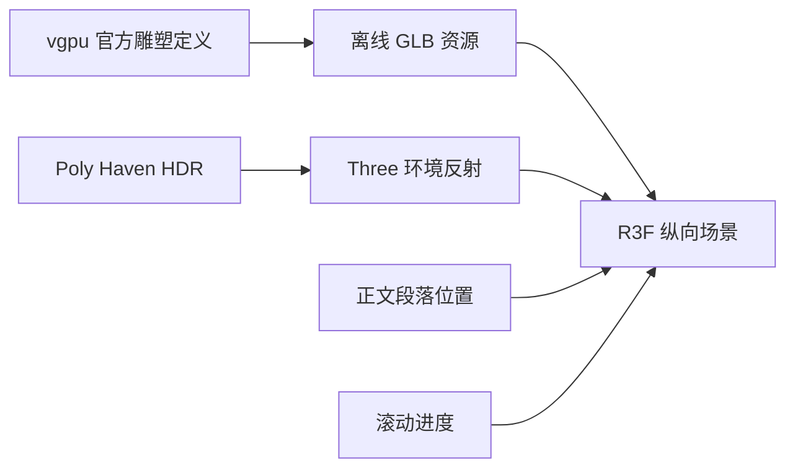
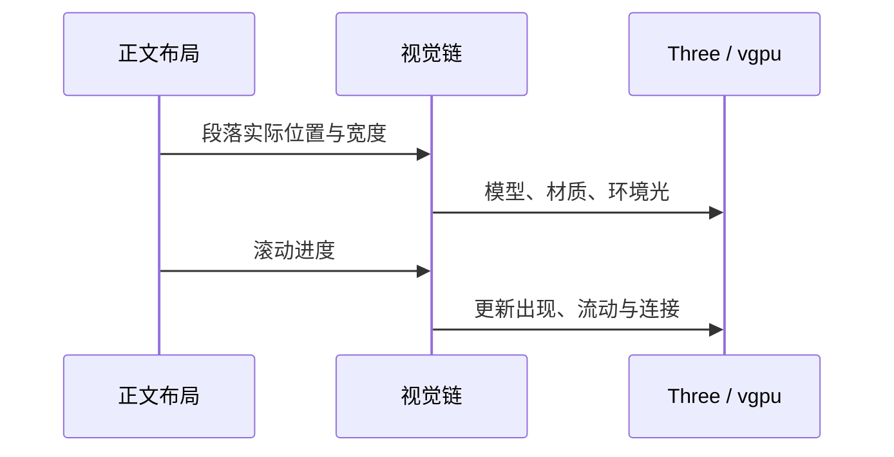

# 官网三维视觉改进

后续曲面质量、默认自动播放和首页内容调整见[首页内容与曲面质量改进](./首页内容与曲面质量改进.md)，该记录覆盖下文的旧暂停行为与模型精度。

## Intent：最终目标

对齐 code.storage 的左文右图结构，视觉列在可用右侧区域中靠左。采用暗浅金色、摄影棚金属反射、上下非等分的对象与分流结构，替换自行拼凑的立方体、检查环和八面体。

## Data：可用证据

- code.storage 完整参考截图：顶部大实体、容器、分支节点、纵向粒子流、尾部雕塑；短标签错位贴近对象，而不是五个同尺寸对象和统一居中图注。
- vgpu 官方 Glass Sculpture 示例，revision `6fa27bb458ffc3f498727090f09dce3fe5faabb43689fd669d633a2a23dc36bb`，MIT，Vercel Inc.。复用其平滑团块与扭转 ribbon 造型定义，离线转换成 GLB，运行时只加载资源。
- Poly Haven / Greg Zaal 的 Studio Small 03，CC0，1K HDR，提供真实环境反射。

## Edges：边界与限制

- 保留英文内容和已有正文样式，只调整首页视觉相关代码、资源和布局。
- 不直接复制参考站没有明确许可的模型。不使用已发现的非商业许可雕塑。
- 不生成测试，不做本地浏览器 UI 验收；资源来源检查、类型、构建、着色器与 HTTP 检查分别报告。
- Three / R3F / vgpu 技术栈继续保留，不新增运行时建模库。离线资源处理代码存放在 docs。

## Answer：交付与成功标准

交付可追溯来源的 GLB 与 HDR 资源、暗浅金属材质、左靠的右侧视觉列、与正文段落关联的纵向位置、分支连接与滚动数据流。参考方向由实际资源与引用支持，不把任意基础几何体当作完成的视觉设计。

## 实施结果

- 右侧视觉栏最大 440px，靠左放置；正文与视觉栏间距 48px，不将剩余屏幕宽度平均分给画布。
- 使用正文的 intro、capabilities、two-files、contract、get-started 区段测量位置，加上对象实际高度和最小间距约束；删除五等分网格。
- 原立方体阵列、检查环、八面体被资源雕塑、容器、五路图节点和下落粒子束替换。标签分左右，并把容器标签放在上方，避开下方分支端口。
- 暗浅金色覆盖雕塑、节点、粒子、连接线与标签。正文链接蓝色保持原有阅读样式。
- 240 个粒子通过一个实例网格绘制；连线采用虚线；滚动推进数据点，首尾雕塑有轻微鼠标视差。
- 保留 demand 帧循环、暂停、减少动态效果和小屏不加载装饰列。

### 资源来源与体积

| 资源     | 来源                              | 本地文件               | 大小        |
| -------- | --------------------------------- | ---------------------- | ----------- |
| 平滑团块 | vgpu Glass Sculpture 平滑并集造型 | source_sculpture.glb   | 660,456 B   |
| 扭转雕塑 | vgpu Glass Sculpture ribbon 造型  | output_sculpture.glb   | 786,328 B   |
| 棚拍反射 | Poly Haven / Greg Zaal，CC0       | studio_small_03_1k.hdr | 1,686,299 B |

原始 vgpu 示例由官方 CLI 拉取，带 revision 和聚合 SHA256 校验。离线使用 MIT isosurface 将原有造型定义转换为 GLB；没有把原创建模包装成下载的成品模型。转换脚本和离线预览在 `docs/2026-10-03/官网三维资源/`。公开资源目录保留 `credits.txt` 和 vgpu MIT 许可。

### 验证

- TypeScript 类型检查通过。
- 官网生产构建通过。
- vgpu WGSL 模块强制校验通过，无诊断。
- 两个 GLB 头、长度、mesh 和 buffer 结构通过检查；HTTP 返回字节与本地资源完全一致。
- 首页、文档、HDR 和 credits HTTP 200。
- 使用本机原生 WebGPU、Three、GLTFLoader 和 HDR 环境完成两张离线资源图的真实渲染，检查模型加载、材质与反射；这不是浏览器截图，也不是整页 UI 验收。

## 自我批判

1. 本轮通过资源来源、真实环境反射和视觉结构修正前一版仅靠基础几何体的不足，但美感仍需用户审阅，不能用类型或构建结果证明。
2. 参考页的信息结构已转为容器、分流、粒子与尾部雕塑；内容主题和资源不同，不声称像素级复刻。
3. 没有进行本地浏览器 UI 验收，因此整页的最终排版与交互观感仍未得到浏览器证据。离线资源图只证明单独对象可正常渲染。
4. GLB 来源是官方示例定义的离线转换，不是第三方艺术家发布的现成模型；资源说明明确保留这一差别。
