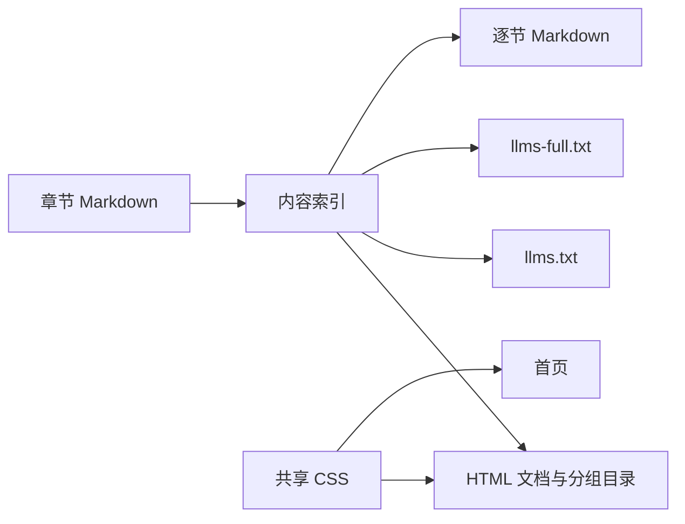
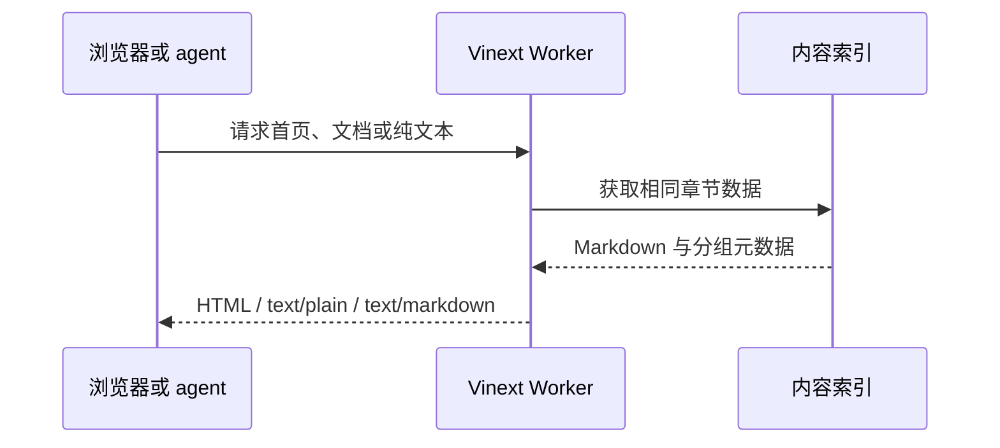

# 官网与文档实现

## Intent：最终目标

新增 packages/website，面向 agent 提供 zxc 首页、文档和无需 JavaScript 的纯文本入口。首页与文档共用浅灰背景、Geist Mono、紧凑标题、方括号导航和朴素分隔线，参考 code.storage 首页。文档目录借鉴 Trees 的概览、agent 指引、任务指南与参考资料分组。

## Data：证据与实现

- Polywise website 提供 Vinext App Router 配置参考。
- 已读取 code.storage 首页、Trees 首页与文档目录的实际页面。
- 语言内容依据根 README、compiler README、ZX 契约说明和现有应用 skills。
- 通过 npm registry 查询最新版本；直接依赖固定版本，锁文件记录解析结果。
- Vinext 1.0.1、Vite 8.3.2、React 19.3.0、TypeScript 7.0.2。
- cf 1.0.0-beta.12、Cloudflare Vite plugin 2.0.0-beta.sha-52b0dc0e9、官方 Vinext Cloudflare adapter 1.0.1。

### 文件职责

| 位置                 | 职责                                |
| -------------------- | ----------------------------------- |
| app/page.tsx         | 极简首页、语言分工和阅读入口        |
| app/docs/page.tsx    | 同视觉体系的文档页面                |
| content/docs/*.md    | 文档唯一内容源                      |
| content/docs.ts      | 章节顺序、分组与纯文本聚合          |
| components           | 页眉、目录、Markdown 渲染和提示复制 |
| styles/site.css      | 共享排版及窄屏布局                  |
| app/llms.txt         | agent 资料索引                      |
| app/llms-full.txt    | 完整资料                            |
| app/docs/raw/[slug]  | 分章节 Markdown 与缺失文档 404      |
| cloudflare.config.ts | Worker 配置、静态资源绑定           |
| vite.config.ts       | Vinext 与 Cloudflare RSC/SSR 集成   |





### cf 替代 Wrangler

官方文档明确 cf 可通过 Cloudflare Vite 插件 2.0 进行开发、构建和部署，此插件不依赖 Wrangler：

- https://developers.cloudflare.com/cf/projects/
- https://developers.cloudflare.com/cf/projects/cloudflare-config/
- https://github.com/cloudflare/vinext

本包没有 Wrangler 依赖或 wrangler 配置。dev 使用 `cf dev`，build 使用 `cf build`；部署入口使用官方 Vinext adapter，识别 typed config 后调用 cf。没有执行登录或线上部署。

cf 当前不能把 host/port 参数转发给检测到的 Vite 命令，所以端口与 host 配置在 vite.config.ts 中。开发端口为 4320，绑定 127.0.0.1。

## Edges：边界与自我复核

- RX 调度 Runtime、完整 XML 加载器和数据库未实现，页面未将其描述为可用能力。
- 样例展示语言契约，没有声称本次执行了 RX 应用。
- 未新增测试文件，未使用浏览器验证本地 UI；因此没有宣称像素级视觉确认或剪贴板交互实测。
- 没有修改编译器、zray 或应用 skills；zray 仍停止。
- 当前文档默认英文，无搜索框、主题开关或其他不必要的交互。
- cf 与插件 2.0 是 beta。构建有框架分块提示、未启动 Docker 的探测提示和 workspace lockfile 提示，均未阻止构建及本地 Worker HTTP 访问。项目不使用 Container。
- 开发 Worker 提示 React 的 eval 调试功能受限；生产预览正常。
- 自我复核：避免把设计目标写成现有功能，避免两份 HTML/纯文本内容漂移，修正 GitHub 文档链接至实际 master 分支。

## Answer：交付与验证

```sh
pnpm dev:website
pnpm build:website
pnpm start:website
pnpm --filter @zxc/website typecheck
pnpm --filter @zxc/website check
```

显式上线时使用 `pnpm deploy:website`。本次不执行此命令。

已完成：

- TypeScript 检查通过。
- Vinext compatibility check：6 项支持、0 项问题。
- cf build 完成 RSC、客户端与 SSR 构建。
- 开发环境首页、文档、9 个 raw Markdown、llms.txt、llms-full.txt、字体返回 200。
- 缺失页面及缺失 raw 文档返回 404。
- 文档锚点检查没有缺失目标。
- 生产 Worker 预览：首页、文档、纯文本、Markdown 返回 200，引用的 CSS 与 JS 资源返回 200。

开发地址：http://127.0.0.1:4320。

### 文档多页迭代

按用户要求将单页全文改为 `/docs/[slug]` 独立章节，`/docs` 跳转 Overview。每页仅渲染当前章节，目录使用独立链接与 aria-current 标记，首页及正文交叉链接同步更新。`llms-full.txt` 和逐节 Markdown 保持原契约。类型检查与生产构建通过，HTTP 验证覆盖全部章节、索引跳转及 404。
