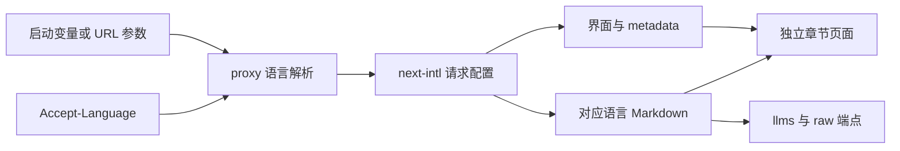
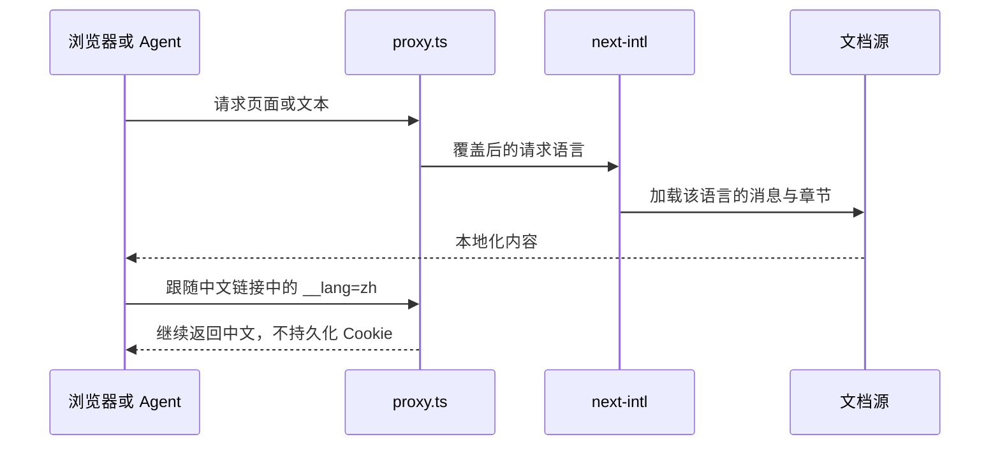

# 官网国际化实现

## Intent：最终目标

在现有 Vinext 官网中接入与 Polywise website 相同的 next-intl，支持英语、简体中文、日语、韩语，保持独立章节文档，不提供语言切换器。

## Data：证据与实现

Polywise 使用 next-intl 的 getRequestConfig，而不是 i18next；用户已明确确认沿用 next-intl 和以下语言策略。安装版本为 npm 当前 latest 的 next-intl 4.14.9。

### 语言策略

1. `ZXC_WEBSITE_LOCALE=zh` 启动开发服务时优先使用中文。
2. URL 包含 `?__lang=zh` 时使用中文。
3. 其余情况按 Accept-Language 权重选择 en、ja、ko，支持 en-US、ja-JP、ko-KR 等地区标签。
4. 不匹配的语言回退英语，zh-CN、zh-TW 等中文偏好不自动开启中文。
5. 不写语言 cookie，不增加语言菜单。站内中文链接保留查询参数。

```sh
pnpm dev:website

ZXC_WEBSITE_LOCALE=zh pnpm dev:website
```

中文 URL：

```text
http://127.0.0.1:4320/?__lang=zh
http://127.0.0.1:4320/docs/overview?__lang=zh
http://127.0.0.1:4320/llms-full.txt?__lang=zh
```

### 文件职责

| 文件或目录                      | 职责                                                                         |
| ------------------------------- | ---------------------------------------------------------------------------- |
| proxy.ts                        | 在服务端决定请求语言，覆盖内部语言头，设置 Content-Language、Vary 和缓存策略 |
| i18n/locale.ts                  | 语言类型、偏好匹配和中文链接参数                                             |
| i18n/request.ts                 | next-intl 请求配置                                                           |
| i18n/messages.ts                | 按语言加载界面消息                                                           |
| i18n/types.d.ts                 | next-intl 类型扩展                                                           |
| locales/{en,zh,ja,ko}.json      | 页面、导航、metadata、复制反馈和 agent 索引的翻译                            |
| content/docs/{en,zh,ja,ko}/*.md | 每种语言的九个章节，HTML 与纯文本共用                                        |
| content/docs.ts                 | 文档索引、章节按需加载、全文聚合                                             |
| components/agent_prompt.tsx     | 服务端生成已翻译的复制提示                                                   |
| components/copy_prompt.tsx      | 客户端剪贴板行为与反馈状态                                                   |
| cloudflare.config.ts            | 将启动配置传入 Worker 文本绑定                                               |

Vinext 自动识别 i18n/request.ts 并注册 next-intl/config 别名，因此无需复制 Polywise 的整个 Next.js 配置或安装额外的国际化路由系统。

```typescript
export default getRequestConfig(async () => {
	const value = (await headers()).get('x-zxc-locale') ?? 'en'
	const locale = isLocale(value) ? value : 'en'

	return { locale, messages: await loadMessages(locale) }
})
```





## Edges：边界与自我复核

- 继续使用 Vinext，不改成 next build，不加入切换器和语言前缀路由。
- 代码标识符、实际命令、文件路径与语言能力版本不翻译。
- 简体中文是唯一中文译文，不自动按浏览器中文偏好启用。
- 每个请求独立解析语言，不用共享可变单例存储当前语言。
- 根布局动态渲染；响应包含 Accept-Language 的 Vary 和 private, no-store，避免共享缓存串用语言。
- 生产 Worker 的默认语言绑定由构建配置保存。如需生产默认中文，使用 `ZXC_WEBSITE_LOCALE=zh pnpm build:website` 后再预览或部署。单独给已构建产物的 preview 进程添加环境变量不会改写产物中的绑定。查询参数无需重新构建。
- 没有生成测试文件，没有调用浏览器进行本地 UI 确认；复制按钮交互未人工实测。
- 翻译保留了编译器、RX Runtime、数据库、所有权与提交行为的边界，没有把未实现能力写为可用。
- 自我复核：四种语言的消息键一致，可执行代码块与英文源一致；正文译文尚未经过人工母语审校。

## Answer：交付与验证

完成范围包括首页、共享导航、页脚、章节标题、全部九章文档、metadata、HTML lang、404、复制提示、llms.txt、llms-full.txt 和逐章 Markdown。

验证结果：

- TypeScript 检查通过。
- cf build 生产构建通过。
- 四语言 × 九章，共 36 个独立章节 HTTP 验证通过。
- 四语言的索引跳转、纯文本端点和 404 验证通过。
- 中文查询参数、区域语言匹配、q 权重、中文默认回退、伪造内部语言头覆盖检查通过。
- 启动变量设置为 zh 后，无查询参数且 Accept-Language=en 的请求仍返回中文。
- 生产 Worker 中并发请求英、日、韩、中文，HTML 与 Content-Language 一致；首页、章节、索引、全文及 raw 文档检查通过。
- 按用户后续要求，开发服务使用 ZXC_WEBSITE_LOCALE=zh 启动，端口 4320。

### 链接行为

根布局通过 `<base target="_blank" />` 统一让页面导航和 Markdown 链接在新标签页打开；仅用于键盘无障碍的跳至正文锚点保留当前页行为。已检查服务端输出的 base 属性，并确认无查询参数、英文请求头仍返回中文。
