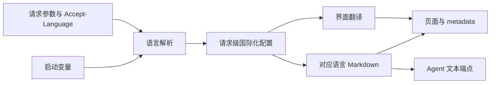
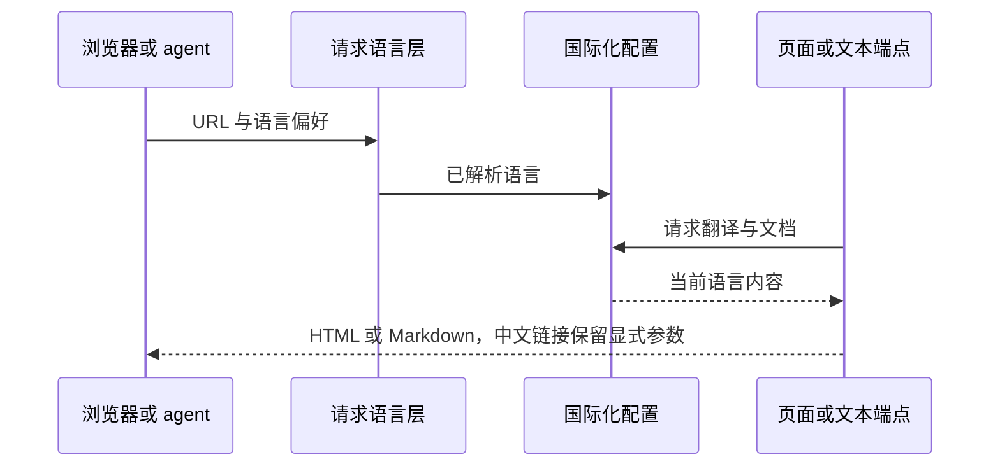

# 官网国际化计划

## Intent：最终目标

官网首页、分章节文档及 agent 文本入口支持英语、简体中文、日语和韩语，不提供语言切换界面。中文只能通过启动环境变量或专用查询参数开启。

## Data：可用证据

Polywise website 使用 next-intl 的请求配置与服务端语言读取，并非 i18next；用户已确认沿用 next-intl。现有 website 是 Vinext App Router，包含单独章节页面、共享 Markdown 与服务端纯文本接口。

## Edges：边界与限制

- 自动匹配浏览器英语、日语、韩语；其他语言回退英语，中文不自动匹配。
- 已确认中文入口：ZXC_WEBSITE_LOCALE=zh 或 ?__lang=zh。
- 不使用永久语言 cookie，中文预览在站内链接中显式保留参数。
- 不改变 URL 的章节 slug，不增加切换器，不翻译代码标识符或命令。
- 翻译同一份能力契约，不扩展语言实际能力；保持 raw 文档与 HTML 内容一致。
- 不新增测试用例，不进行浏览器 UI 验证；通过构建和不同请求头/查询参数的 HTTP 结果检查。

## Answer：实现与成功标准

请求语言解析独立于内容索引，页面使用请求级翻译，不允许跨请求共享可变语言状态。四语言的文档、导航、页面标题、HTML lang 和复制反馈必须一致；中文不能被 Accept-Language 或伪造内部请求头单独开启。

