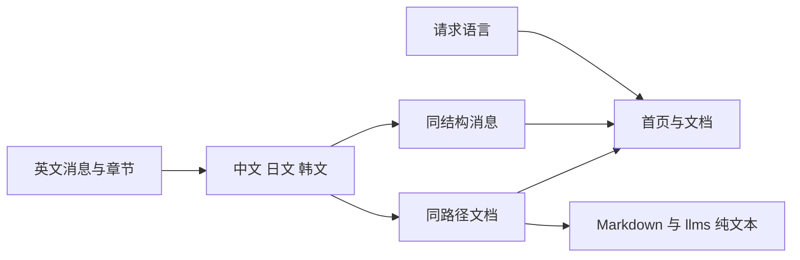

# 官网多语言内容同步

## Intent：最终目标

将已完善的英文首页与全部 20 章文档同步为中文、日文和韩文。页面、目录、抽屉、章节跳转、三维标注与纯文本入口读取同一当前语言。

## Data：可用证据

英文消息位于 `packages/website/locales/en.json`，文档位于 `packages/website/content/docs/en/`。其他语言仍只有 9 章旧文档，首页部分组件显式读取英文。用户已要求中文启动，并进一步授权翻译其他语言。

## Edges：边界与限制

保留英文原文、代码块、命令、语法符号、路径与链接目标。翻译说明文字，不增加实现能力承诺。保留中文显式开启及其他语言浏览器协商的既有规则。开发服务最终继续使用中文。资源署名与许可证保留原文。不新增测试文件，不调用浏览器进行 UI 验证。

## Answer：交付与成功标准

三种译文与英文消息键一致，每种语言均有 20 章。移除首页固定英文读取，补齐新交互的无障碍标签和三维标注。通过类型检查、构建与 HTTP 检查，并比较各语言代码块及链接目标，确认翻译没有改动技术契约。

## 执行与复核

已完成中文、日文、韩文首页与各 20 章文档的同步。每种语言补充 11 个原先缺少的章节，并更新 6 个已有章节；3 个与当前英文内容一致的旧章节保留。首页介绍、功能说明、三维图形标注、目录抽屉及章节导航均使用当前语言。

技术复核：

- 四种语言的消息键集合完全一致。
- 三种译文逐章比对，执行代码块与链接目标均与英文一致。
- `pnpm --filter @zxc/website typecheck` 通过。
- `pnpm --filter @zxc/website build` 通过；构建过程仍报告框架动态导入与本机 Docker 不可用提示，未阻断构建。
- 生产预览 HTTP 检查通过：4 个首页、80 个章节页面、80 个原始 Markdown 入口，以及各语言的索引和完整正文；原始正文与对应语言源文件匹配。
- ZX 参考表中的逻辑或符号正确渲染为 `||`，没有破坏表格列结构。
- `git diff --check -- packages/website` 通过。
- 中文开发服务继续运行于 `http://127.0.0.1:4320/`，响应语言与 HTML 语言均为 `zh`。

## 自我批判与边界复核

翻译没有把 RX 结构校验夸大为运行时能力，也没有改变代码、命令与协议标识。验证覆盖内容完整性、语言选择和服务端输出；遵照要求未进行浏览器 UI 检查，未新增测试文件。日文和韩文已经逐章对照技术含义，但尚未经母语编辑校对。编译器正由其他工作并行修改，本次文档只同步现有英文基线，不扩展为编译器新能力审计。
