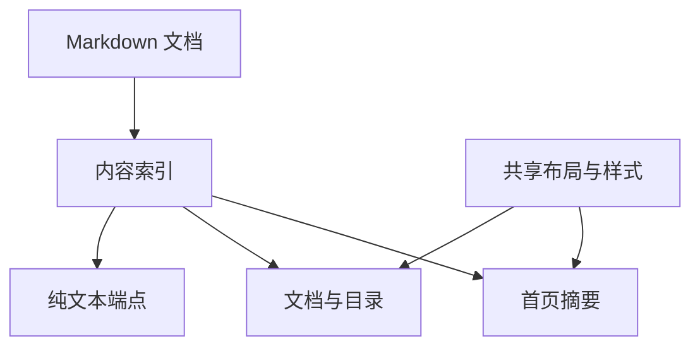
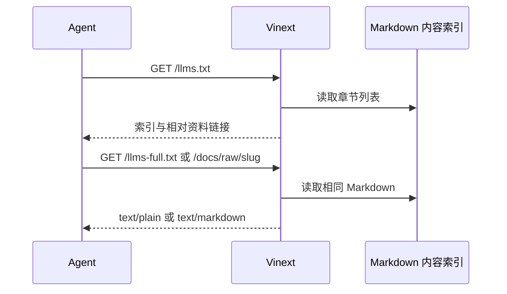

# zxc 官网执行计划

## Intent：最终目标

在 packages/website 新增 Vinext 官网。首页和文档共用 code.storage 首页的等宽、浅灰、纯文本视觉语言。为 agent 提供清晰能力边界、可链接文档和无需 JavaScript 的纯文本资料。

## Data：可用证据

- Polywise website 的 Vinext App Router、React、TypeScript 配置。
- https://code.storage/：紧凑等宽文字、宽留白、方括号导航、朴素表格。
- https://trees.software/ 与 /docs：agent 入口、纯文本引用、按任务分组的分层目录。
- README.md、packages/compiler/README.md、packages/skills/rx/*.md、build.zig.zon。
- npm latest：新增直接依赖使用当前最新稳定版本并固定版本号。

## Edges：边界与限制

- 不修改编译器、zray 或现有 skills，不启动已停止的 zray 服务。
- 不复刻参考品牌素材，不加入装饰性营销卡片。
- 语言能力以当前实现为准；RX 调度 Runtime、数据库不宣称可用。
- 官网内容默认英文。Markdown 是网站文档与 agent 纯文本的同一数据源。
- 不生成测试用例，不调用浏览器进行本地 UI 确认；使用类型、构建和 HTTP 检查。
- 不部署线上服务。按用户补充要求采用 cf 和 Cloudflare 插件 2.0 beta，提供部署配置与命令，不登录或配置账户。

## Answer：交付与成功标准

- 独立 packages/website 包及根 dev:website、build:website、start:website 命令。
- 首页、分组文档、llms.txt、llms-full.txt、逐节原始 Markdown 端点。
- 文档目录、复制 agent 提示、原始文本链接可用；样式具备窄屏布局。
- 完成类型检查、生产构建、HTTP 端点验证，记录实际结果及限制。

