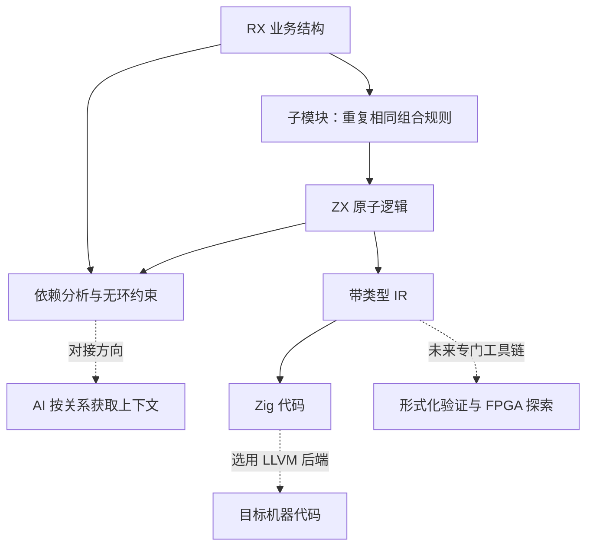

# 官网核心定位与性能愿景

## Intent：最终目标

用 RX 业务结构、ZX 原子逻辑、分形组合这一条主线重新表达官网。让读者理解清晰的数据流与数据架构如何服务于持续扩展、AI 协作和长期性能优化，而非只强调“生成后还能读懂”。用户所述“分型”按分形组织理解：不同层级重复同一套显式边界与组合规则，不是运行时递归调用。

## Data：可用证据

- 用户本轮明确定位与长期愿景。
- `packages/rx/src/module_graph.zig`：校验服务调用与导入的路径、存在性和无环关系。
- `packages/compiler/src/modules/project.zig`：分析 ZX 导入，连接函数类型，拒绝导入环。
- `packages/compiler/README.md`：ZX → 带类型 IR → Zig；提供分析 API，IR 尚无稳定序列化 ABI；部分集合操作仍有分配。
- [Zig 文档](https://ziglang.org/documentation/master/)：编译期执行与内联机制。
- [LLVM 代码生成](https://llvm.org/docs/CodeGenerator.html)：优化后的表示到目标指令与汇编等输出。
- [LLVM 高层综合研究](https://llvm.org/devmtg/2010-11/Rotem-CToVerilog.pdf)：硬件综合需要专门的变换、调度和后端。

## Edges：边界与限制

只修改官网内容及必要的展示组件，同步中英日韩。保留实际运行教程、命令与代码示例。当前的依赖分析不表述为已经发布稳定的 AI 图谱接口；图谱对接 AI 是设计方向。让非 SOTA 与 SOTA 模型达到同一质量标准是目标，不虚构测评结论。零成本抽象是编译优化目标，不承诺全部代码无开销。形式化证明需要规格和证明工具；FPGA 需要综合工具和专用后端，均不能由 LLVM 支持自动推出。

## Answer：交付格式与成功标准

首页明确呈现结构、原子、分形、AI 图谱与性能路径。文档概览解释因果关系，Agent 指南、模块组合、ZX 逻辑及能力边界与之对齐。新增展示源码同时存入 `docs/2026-10-03/官网核心定位/`。完成消息键与内容检查、类型检查和 HTTP 验证，不新增测试用例，不进行浏览器 UI 检查。

## 架构图

## 数据流图

## 执行与自我复核

已完成中英日韩首页与概览、Agent 指南、模块组合、ZX 逻辑、能力边界的同步。首页围绕业务结构、分形扩展、图谱驱动 AI、局部修改和原子级优化组织，标题按用户要求缩短。

根据后续反馈，删去首页与概览中关于 AI 图谱接口和评测建设进度的说明。首页不再展示示例介绍、结果与边界三段文字，对应翻译键也已删除。

## 结算示例

原先的原样返回例子已替换为订单结算：RX 连接 `carts/load`、`quote` 和 `orders/create`；ZX 汇总商品小计、限制折扣上限、依据折后金额判断免邮并计算应付金额。页面从真实的 `.rx` 和 `.zx` 源文件读取展示文本，避免另维护一份代码字符串。

`carts/load` 在这个组合契约中提供匹配 Input 的商品和计价规则，宿主负责数值范围、非空购物车和服务绑定。RX 是结构示例，不宣称已端到端执行订单服务。金额使用最小货币单位。两件单价 3000 的商品、折扣 1000、运费 500、免邮门槛 6000，按源码推导应付 5500；此处是推导结果，不是运行观测。局部修改示例相应改为将免邮依据从原价小计调整为折后金额。

## 实际验证

- `zxc fmt packages/website/content/examples/quote.zx --check` 通过。
- 当前本地编译器将报价示例编译为 `/tmp/zxc-home-quote.zig`，退出码 0。没有为此修改编译器，也没有新增测试用例。
- 官网 TypeScript 检查和生产构建通过。
- 四种语言的首页和每种语言 5 个更新章节的 HTML、原始 Markdown 入口均返回 200，语言头正确。
- 首页包含新的短标题与结算代码，不再包含用户要求删除的三个消息键。
- 四种语言消息键对齐，各章可执行代码块和链接保持一致。
- `git diff --check -- packages/website` 通过。中文开发服务保持运行。

## 自我批判

原子化并不能凭文件拆分自动解决耦合，文档明确把业务责任与契约作为边界依据。对非 SOTA 与 SOTA 的表述保留为质量目标，未伪造模型评测结果。LLVM 不是形式化证明和 FPGA 的自动实现，主页将它们表达为需接入专门工具的未来探索，详细技术边界留在能力章节。报价示例只有编译证据，没有完整订单服务运行证据。遵照用户要求，未调用浏览器做 UI 验证。

## 补充：语法选择

Intent：解释 RX 选择 XML、ZX 选择类 TypeScript 的设计理由。

Data：RX 的 XML AST 与标签校验实现、ZX 语言设计的有限语法与静态编译路径，以及现有首页示例。

Edges：不把 XML 本身说成省 token 或自动无环，不把类 TypeScript 说成 TypeScript 兼容，不将熟悉语法视为已证明的模型性能提升。

Answer：首页 RX/ZX 说明直接讲清语法选择；模块组合与 ZX 逻辑章节补充表达机制、收益与取舍，四种语言同步。

## 补充：双模式 match

依据作者提供的设计对话，将双模式 match 写入 `docs/zx_match设计.md` 并从 ZX 主设计文档链接，使用 IDEA 框架区分确定设计、实现建议和待定边界。官网四种语言的 ZX 指南与参考同步补充两种形式。首页报价示例由 30 行缩为 20 行，商品汇总移到上游，保留折扣上限与 match 运费判断；局部改动示例同步调整。新示例是设计语法，当前编译器尚未实现 match，前文旧报价示例的编译通过记录不适用于这个版本。本次不扩展编译器实现。
