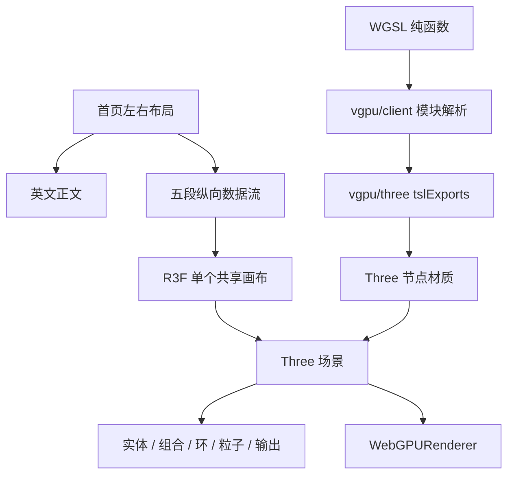
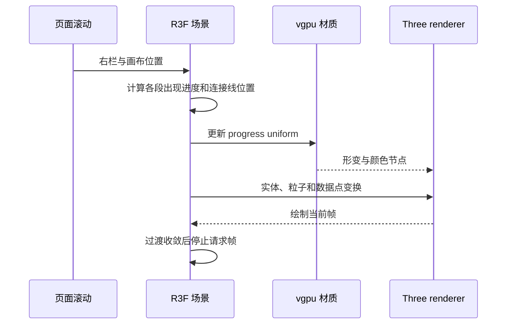

# 官网英文内容完善实现

三维视觉部分已继续改进，当前资源、布局与验证结果以[官网三维视觉改进](./官网三维视觉改进.md)为准；下文保留本轮首次英文内容实现记录。

## Intent：最终目标

完善英文首页与文档。首页右侧参考 code.storage，以纵向多个对象和滚动动画表达从输入到输出的数据流；技术采用用户指定的 Three.js、React Three Fiber 与 vgpu。英文审阅后再翻译其他语言。

## Data：可用证据

- [Code Storage](https://code.storage/) 的完整页面截图：右侧对象、连接线和短说明沿页面纵向分布，而非固定单一装饰物。
- [Trees 文档](https://trees.software/docs) 的任务指南与 API 参考组织。
- compiler README、ZX 契约、CLI、真实示例、RX 标签定义和两个只读分析任务的结果。
- [R3F Canvas](https://r3f.docs.pmnd.rs/api/canvas) 的异步 renderer factory 与 demand frameloop。
- vgpu 0.5.0 随包文档 `guides/threejs.docs.md`：`tslExports` 将 WGSL 纯函数转换为 Three TSL 节点，不接管 renderer、scene 或 render loop。

## Edges：边界与限制

- 修改范围为 website、相应依赖锁文件、pnpm 构建脚本许可条目和执行文档。工作区同时出现的 compiler / test / build 文件变动不属于本任务，未处理。
- 开发服务固定 `ZXC_WEBSITE_LOCALE=en`。新首页内容显式使用英文；原有其他语言文档保留，新英文章节不加入缺少译文的语言目录。
- 未生成测试文件，未使用浏览器检查本地 UI。只查看了用户指定参考站的截图。
- 未部署。cf 构建成功，仍输出 Docker 未运行及 Vinext 自身的动态导入、路由静态分类提示。
- RX AST / 依赖校验、ZX 编译、宿主执行、事务和业务验证分别描述，不宣称 RX XML 运行时或数据库已经实现。

## Answer：交付内容与成功标准

### 首页内容

新增能力表、编译路径、RX / ZX 示例、功能契约、源码构建步骤、重点阅读入口和项目介绍。首页阅读列表保留四个重点入口，完整二十章目录在文档中。

### 纵向对象与数据流

五段视觉分别为：

1. SOURCE：带有表面形变和材质变化的实体，表达输入。
2. COMPOSE：多个组合单元，表达显式连接。
3. CHECK：分层环与核心对象，表达约束检查。
4. LOWER：72 个实例粒子组成的数据束。
5. OUTPUT：收束后的实体与环，表达输出。

各段之间由曲线与数据点连接。对象的屏幕位置由右侧栏实际尺寸和滚动位置计算；滚动触发出现、缩放、旋转、表面变化和粒子移动。一个共享的 viewport 画布渲染完整场景，对象在页面中的位置随滚动推进，并非固定同一个对象覆盖所有段落。

画布使用按需帧循环，滚动或布局变化时更新，过渡收敛后停止绘制。提供暂停，尊重减少动态效果；移动端隐藏装饰列且不加载 3D 场景。DPR 限制为 1–1.5。Three 自动回退到 WebGL2 时使用普通物理材质，不向 GLSL 后端传入 WGSL；渲染初始化失败由局部错误边界保留品牌图形。

### 技术分工

| 层                   | 职责                                       |
| -------------------- | ------------------------------------------ |
| React                | 纵向说明、可用空间、偏好和暂停状态         |
| React Three Fiber    | Canvas、场景对象、按需帧循环、资源生命周期 |
| Three WebGPURenderer | GPU 设备、渲染管线、绑定、场景绘制         |
| vgpu/client          | WGSL 模块解析、反射、构建压缩              |
| vgpu/three           | 将公开 WGSL 函数转换为可调用的 TSL 节点    |

没有手写 GPUBuffer、GPURenderPipeline、绑定布局或命令编码器。WGSL 文件仅包含返回值的纯材质函数，没有 GPU 资源绑定和 shader entry point。

```typescript
import { wgslVitePlugin } from 'vgpu/client'

const plugins = [wgslVitePlugin({ minify: true })]
```

```typescript
const { flowPosition, flowColor } = tslExports<{
	flowPosition: SurfaceInputs
	flowColor: SurfaceInputs
}>(surface)('flowPosition', 'flowColor')

material.positionNode = flowPosition({ position: positionLocal, progress })
material.colorNode = flowColor({ position: positionLocal, progress })
```

### 文件职责

实现集中在 `packages/website/features/home/data_flow/`。

- `index.tsx`：右侧栏、分段说明、桌面懒加载与动效偏好。
- `canvas.tsx`：R3F Canvas 与异步 Three WebGPU 初始化。
- `scene.tsx`：滚动位置映射、出现过渡、连接线与数据点。
- `objects.tsx`：各阶段的几何形态。
- `particles.tsx`：单个 instancedMesh 中的 72 个粒子。
- `source_object.tsx`、`source_material.ts`、`surface.wgsl`：输入对象及 vgpu 材质。
- `scene_boundary.tsx`：局部渲染失败边界。
- `stages.ts`：五段英文说明。





### 英文文档

从 9 章扩展到 20 章，全文约 4 万字符。新增集成选择、路径导入、分支任务、类型、集合所有权、状态、Gateway / Store、诊断、ZX 参考、CLI 和 Zig 宿主集成。原有概览、入门、依赖、RX 参考和验证等章节增加示例与边界表。

章节新增上一章 / 下一章导航。HTML 页面、目录、raw Markdown、`llms.txt` 与 `llms-full.txt` 共用同一内容索引；尚无译文的新章节不进入其他语言目录。

### 验证与实际边界

- TypeScript 类型检查通过。
- 官网生产构建通过。
- `vgpu check features/home/data_flow/surface.wgsl --require-validation` 通过：`validation.ok = true`，无诊断。
- 20 个文档页面及 raw 端点可访问；各章 raw 正文存在于全文入口。
- 正文 18 个不同内部链接可访问。
- 开发服务固定英语，浏览器语言与中文查询参数不会改变本轮英文预览。
- 依赖变化曾触发开发服务重启期间短暂 500，重启完成后首页恢复 200。

vgpu 的 Node adapter 安装脚本不是浏览器入口的依赖，已在 pnpm `allowBuilds` 中明确设为 `false`，替换安装工具生成的待决占位值；没有为浏览器功能放宽构建脚本许可。实际 vgpu shader validation 与官网构建正常完成。

### 自我批判

1. 对象表达 zxc 的概念数据流，不代表 RX 调度、GPU 编译或真实运行指标；没有将装饰对象描述为实时数据。
2. shader 模块校验不等于整个浏览器 GPU 渲染验证。没有声称视觉效果、滚动手感或特定浏览器驱动已经验收。
3. 参考站截图用于修正纵向布局理解。本轮使用用户指定的 Three / R3F / vgpu 实现程序化对象，不复制对方资产，不引入截图替代交互。
4. 文档预期结果来自源码推导；未执行的示例不标为实测。网站检查不构成 RX 运行时验证。
5. 重新开放多语言之前，仍需补齐翻译并恢复首页随 locale 选择，避免英文正文与其他语言框架混排。
