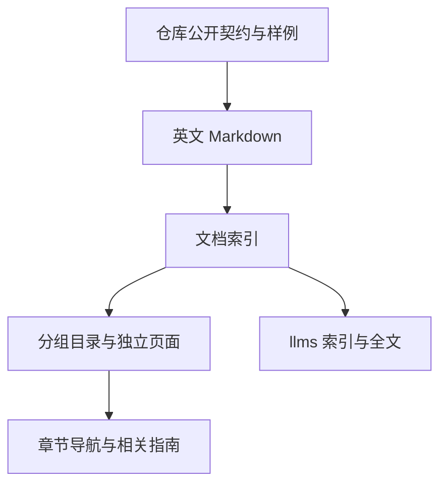
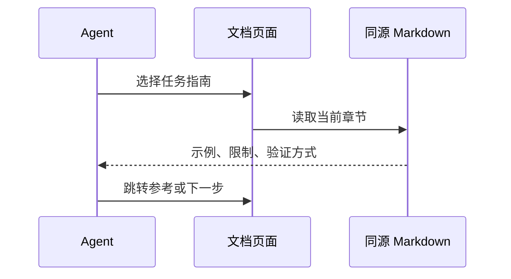

# 官网英文内容完善计划

## Intent：最终目标

先完善英文首页和文档，待用户确认后再翻译。首页参考 code.storage 的段落、规格表、代码和列表节奏；文档参考 Trees 的任务指南、共享概念和参考资料组织，保持独立章节页面。

## Data：可用证据

- https://code.storage/ 的能力表、工作原理、代码示例与功能列表。
- https://trees.software/docs 的 guide-first 顺序、具体任务步骤、共享概念、参数表、常见陷阱与下一步链接。
- README、packages/compiler、packages/zx、packages/rx 的当前文档、CLI 源码、标签定义和已有示例。
- 两个只读分析子任务分别核对 ZX 与 RX 的公开契约，不编辑源代码、不执行测试。

## Edges：边界与限制

- 本轮只完善英文，保留已有翻译资料，不生成新的中日韩译文。
- 开发环境固定英文，等待用户审阅；不更改浏览器 UI，不生成测试文件。
- 不编造安装包、命令、RX 运行时、数据库、客户案例或性能数字。
- 语法结构校验、生成 Zig、宿主执行、业务验证分别标明，不能互相替代。
- 文档内容、目录与 agent 文本共用索引，原始 Markdown 保留。

## Answer：交付与成功标准

首页加入能力表、编译流程、功能列表、源码构建命令与阅读入口。文档补齐集成选择、文件路径、类型、集合与所有权、控制流、Store 与宿主、Gateway 声明、CLI、诊断与参考；页面之间建立明确关联。

完成后检查类型、构建、内部链接、章节与 raw 端点的一致性。没有运行的编译示例、宿主行为或 UI 交互不声称验证通过。

## 补充需求：首页纵向数据流

用户进一步明确两项约束：使用 Three.js 与 React Three Fiber，不裸写 WebGPU；使用 vgpu.sh 简化着色器开发。视觉采用 code.storage 的纵向多个对象与滚动叙事，不采用单个 sticky 旋转阵列。

实现采用 `vgpu/three` 官方适配层：vgpu 解析和检查 WGSL 纯函数模块，Three WebGPURenderer 管理 GPU 管线和绑定，React Three Fiber 管理场景。右侧五个对象沿长页面依次分布，用曲线路径和数据点连接；滚动驱动出现、形变、旋转与粒子传递。

桌面保留左侧约 500px 正文，右侧使用一个共享画布渲染五个纵向对象。暂停或减少动态效果时保留静态形态；小屏不加载 3D 场景，保留正文可读性。使用按需绘制，不进行持续空转。

依据：

- https://r3f.docs.pmnd.rs/api/canvas
- https://threejs.org/docs/pages/WebGPURenderer.html
- vgpu 0.5.0 本地版本文档：`vgpu docs cat guides/threejs.docs.md`
- https://github.com/vercel-labs/vgpu

只读取参考站布局截图；遵守用户约束，不调用浏览器检查本地 UI。通过类型、构建、vgpu shader 检查和 HTTP 验证交付边界。
