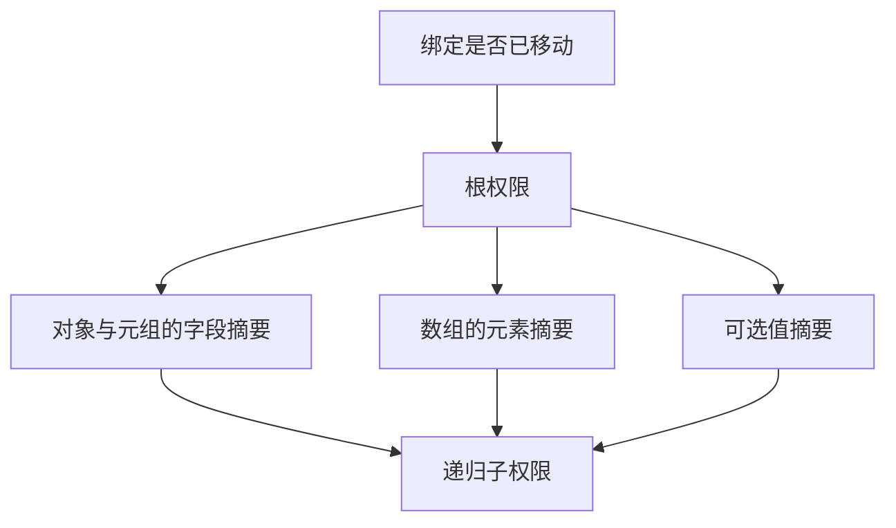
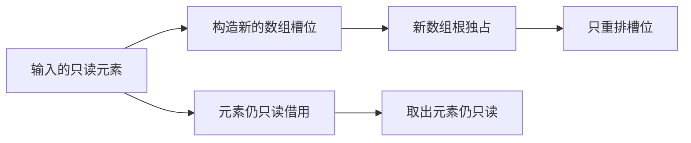

# 容器与元素所有权分离方案

## Intent：最终目标

在不引入 ZX 指针语法、不深拷贝数据的前提下，准确区分容器自身的独占存储与其元素的只读借用。是否开放共享元素的新数组排序已向用户询问；确认前不修改该语言规则。

## Data：可用证据

当前 ownership/check.zig 用一个状态表示整个值。字段、索引继承父值状态，tuple 解构将父状态复制给每个分量，函数返回摘要也只有一个状态。现有做法保守地拒绝包含借用元素的新容器消费，但不能简单新增一个可消费的枚举值，否则借用子数组可能继承可变权限。

标准库共享 ABI 3174 个用例、现有运行时 37461 个已运行用例通过。两个旧字符串入口仍使用已禁止的 clone，因此完整运行时构建失败。这些数字不能证明待设计的新权限规则。

## Edges：边界与限制

- ZX 作者只使用普通类型与 const 绑定。所有权信息只存在于编译期，不进入运行时对象。
- 外层数组排序只能改变外层槽位，绝不能授予元素的新修改权限。
- 借用父值的投影必须保持只读，即使底层子值原本独占。
- 首版可以消费整个父绑定，不立即支持部分字段移动或精确借用结束。
- 任意返回子路径包含借用时，调用点必须保护输入来源。
- 原生返回缺少所有权契约时保持只读，不猜测 allocator 参数代表返回独占。
- 借用来源和区域存活期是独立问题；递归权限摘要不能替代 Store 生命周期约束。

## Answer：表示、实施边界与成功标准

建议表示为绑定可用性与不可变权限摘要两部分：

```text
Binding = { moved, summary }
Summary = { root: copy | owned | borrowed, children }
```

摘要由 IR 类型驱动：对象与元组逐字段，list 使用一个保守合并的元素摘要，optional 使用 payload 摘要。没有运行时元素级跟踪，也不按下标建立特殊规则。





列表操作需分别生成每个返回分量的摘要。sort/reverse 保留元素权限；push/concat 合并元素权限；pop 的可选结果保留原元素权限；splice 的保留与移除列表都保留各自元素权限。不得将返回 tuple 的根拥有权广播给全部分量。

map 的新数组根与 callback 返回元素分别推导。filter 产生新外层数组，但引用元素仍只读。reduce 合并零次迭代的 initial 和 callback 结果；首版聚合 accumulator 仍只读，避免未经证明就允许后续迭代消费。

函数输出、分支合并、match 与 IR 验证都必须处理完整摘要。IR 验证重新推导并逐路径拒绝过度声明权限，不能只对比根枚举。

成功标准包括允许的外层操作、禁止的借用子数组修改、tuple 各分量的权限、跨函数返回、空 reduce、分支路径以及伪造 IR 拒绝。不得通过弱化现有断言或按用例特判达成。

## 自我批判

这是一份待确认的语义方案，不是已经完成的实现。单独增加 owned_borrowing 枚举过于粗糙；递归摘要更准确，但其内存管理、合并终止性和借用来源保护需要一起落实。需要在实施前确认表示不会变成无必要的通用框架，也不能用引用共享规则掩盖输入区域过早释放的问题。
