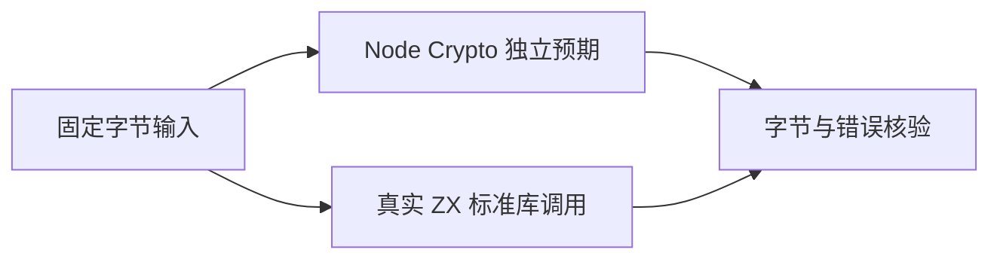
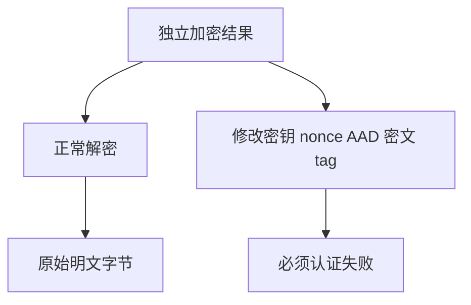

# 密码学接口独立对照测试

## Intent：最终目标

为新增 HMAC、HKDF、PBKDF2 和 AEAD 接口建立真实 ZX 与独立密码学实现的结果对照，验证认证失败不会返回成功结果。

## Data：可用证据

生产实现调用 Zig 标准库；测试预期使用本机 Node Crypto（OpenSSL）计算。接口来源为当前标准库注册表。参考 [Node Crypto 官方文档](https://nodejs.org/download/release/latest-v25.x/docs/api/crypto.html)，AEAD 使用 12 字节 nonce 和 16 字节 tag，对应当前 ZX 契约。

## Edges：边界与限制

固定数据用于可重复测试，不是应用密钥或 nonce 管理方案。测试验证接口结果与错误，不证明侧信道安全或密码算法本身。KDF 迭代次数用于快速边界测试，不是生产参数建议。非法长度和错误名称按 ZX 明确契约断言。

## Answer：交付与成功标准

分层目录 tests/standard/crypto 下按算法、加密/解密与派生用途登记。Node 生成正确结果并确认每个被篡改的认证输入确实被拒绝；真实 ZX 逐个比较密文、tag、派生字节及精确错误。草案在 `docs/2026-10-03/crypto_tests/`。

## 执行与自我复核

新增 980 个目录案例：HMAC/校验 tag 104、HKDF 148、PBKDF2 218、三种 AEAD 加密 81/解密 405、字节相等 24。AEAD 中 315 个案例逐项修改密钥、nonce、密文、tag 或 AAD，Node 先确认认证拒绝，ZX 再精确检查 AuthenticationFailed。另验证密钥/nonce/tag 长度错误、HKDF 输出上限、PBKDF2 零迭代与比较长度不符。

本机 Node/OpenSSL 对零长度 HKDF/PBKDF2 报 Deriving bits failed，而当前 ZX 实现允许返回空字节数组。对应 60 个案例明确使用 ZX 空输出行为作为预期，不声称 Node 一致；其余非空派生、HMAC 与加密成功值由 Node 独立计算。timingSafeEqual 只检查字节相等及长度错误，不能据此证明常数时间行为。

Debug runtime 458/458 步骤、38,100/38,100 测试通过；目录累计 52,174，上游审查仍 208。新增两组直接资源测试对三种 AEAD（含认证失败路径）、两种 HMAC/HKDF/PBKDF2 遍历全部分配失败，确认返回错误和释放分配；standard-resources 共 6/6 测试通过。首次资源测试的泛型回调不符合 Zig 故障遍历工具反射约定，已改为固定签名的测试回调，不计产品缺陷。

日志 `/tmp/zxc-test262-crypto-debug-final.log`、`/tmp/zxc-test262-crypto-resources-final.log`。TypeScript、两生成器一致性和目录审计通过。最终根 ReleaseSafe 617/617 步骤、52,126/52,126 根 Zig 测试通过，额外插件及 CLI/隔离步骤通过，退出码 0；日志 `/tmp/zxc-test262-crypto-root.log`。无生产代码修改。

自我批判：这些证据验证所选输入的字节结果、认证错误传播与分配清理；不独立证明算法、侧信道、所有内存清零时刻或应用密钥/nonce 生命周期安全。认证失败精确返回错误证明不交付成功结果，但分配器回收测试本身不检查释放前每个字节是否被清零。
