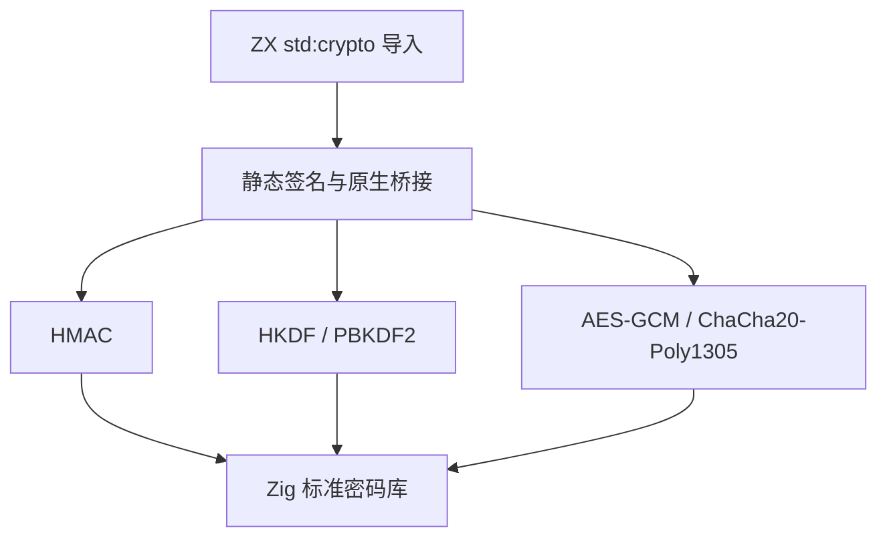
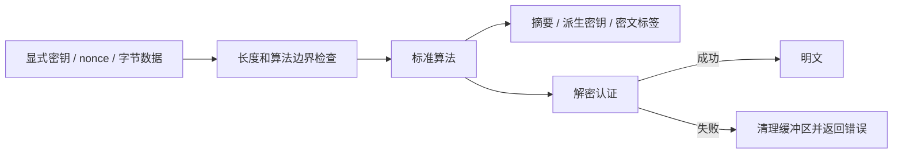

# 密码学标准库实施

## Intent：最终目标

将仅有 SHA 摘要的 std:crypto 扩展为可用于完整消息认证、密钥派生及认证加密流程的纯计算模块，使用 Zig 标准库实现，不自行发明密码算法。

## Data：可用证据

参考 Node.js Crypto 文档：https://nodejs.org/download/release/v26.7.0/docs/api/crypto.html 。现有标准库注册器支持对象输入输出、分配器和错误传播；现有 path 对象接口是本轮类型桥接样例。本地 Zig 0.16 提供 HMAC、HKDF、PBKDF2、AES-GCM 与 ChaCha20-Poly1305。

## Edges：边界与限制

- 全部输入为显式字节列表；字符串编码由 std:encoding 完成。
- 不在纯函数内部生成随机数；nonce 必须由调用方为同一密钥保证唯一，密码盐与密钥材料同样由调用方提供。随机源将由受控 I/O 能力接入。
- AEAD 固定 12 字节 nonce、16 字节认证标签，AES 密钥为 16/32 字节，ChaCha 为 32 字节。认证失败不返回任何明文。
- HKDF 遵守 255 倍摘要长度的输出上限；PBKDF2 iterations 必须大于零，不代替调用者选择密码成本策略。
- 当前不提供非对称密钥管理、证书、TLS、随机源或流式加密，不宣称 Node Crypto 全部兼容。
- 不添加测试用例；通过现有回归和实际应用调用确认接入路径。

## Answer：交付格式与成功标准

交付按职责分组的 Zig 实现、静态注册签名、可运行 ZX 应用示例、使用文档和实际结果。验证输入长度错误与认证失败传播，执行现有回归。

## 自我复核

必须区分算法可用、静态接口接通与应用实际运行。尤其检查不同算法的长度约束、分配失败清理、标签和密文的所有权；不把往返解密相同当作独立算法正确性证明。

## 公共接口

下表中的 bytes 均表示 u8[]。成员通过 `import crypto from "std:crypto"` 使用。

| 成员                                                          | 输入                                                                       | 输出                                 |
| ------------------------------------------------------------- | -------------------------------------------------------------------------- | ------------------------------------ |
| sha256 / sha512                                               | bytes                                                                      | bytes                                |
| hmacSha256 / hmacSha512                                       | `{ key: bytes; data: bytes; }`                                             | bytes                                |
| verifyHmacSha256 / verifyHmacSha512                           | `{ key: bytes; data: bytes; tag: bytes; }`                                 | bool                                 |
| hkdfSha256 / hkdfSha512                                       | `{ key: bytes; salt: bytes; info: bytes; length: u32; }`                   | bytes                                |
| pbkdf2Sha256 / pbkdf2Sha512                                   | `{ password: bytes; salt: bytes; iterations: u32; length: u32; }`          | bytes                                |
| encryptAes128Gcm / encryptAes256Gcm / encryptChaCha20Poly1305 | `{ key: bytes; nonce: bytes; data: bytes; aad: bytes; }`                   | `{ ciphertext: bytes; tag: bytes; }` |
| decryptAes128Gcm / decryptAes256Gcm / decryptChaCha20Poly1305 | `{ key: bytes; nonce: bytes; ciphertext: bytes; tag: bytes; aad: bytes; }` | bytes                                |
| timingSafeEqual                                               | `{ left: bytes; right: bytes; }`                                           | bool                                 |

HMAC 校验要求完整 32/64 字节标签，格式正确但不匹配返回 false，长度错误返回 InvalidTagLength。timingSafeEqual 要求两个输入等长，否则 LengthMismatch。比较操作使用 Zig 标准时序安全接口；输入处理、异常和外层业务逻辑不属于该时序性质的保证范围。

HKDF 输出长度上限为 SHA-256 的 8160 字节、SHA-512 的 16320 字节。允许零长密钥材料、盐、info 和输出；info 按底层 HKDF 接受字节串，没有复制 Node 的 1024 字节接口限制。PBKDF2 接受零长输出，iterations 为零时返回 InvalidIterations。接口没有隐式成本默认值，也不限制为示例中的成本。

AES-GCM 消息上限为 2^36−32 字节；ChaCha20-Poly1305 为 2^38−64 字节。所有 AEAD 接口的 aad 长度不超过 floor((2^64−1)/8)，实际可用大小还取决于宿主地址空间与分配器。固定 12 字节 nonce 与 16 字节 tag 是本接口契约，不接受 Node 中的其他 GCM nonce/tag 长度配置。

## 实现与所有权

crypto/root.zig 只汇总入口，hash.zig 保留已有摘要，kdf.zig 承载 HMAC/派生密钥，aead.zig 承载认证加密，compare.zig 承载字节比较。各算法直接调用 Zig 0.16 标准库。

成功输出由调用分配器持有；native Zig 调用者分别释放 ciphertext 和 tag，ZX 执行通过现有 arena 生命周期管理。加密第二次分配失败会释放第一次分配；解密失败会先清零输出再释放；HKDF 中间 PRK 与 HMAC 校验的临时 tag 用完清零。调用方输入以及成功返回值的销毁仍由宿主管理，不宣称整个应用内存自动安全清除。

## 实际执行证据

已构建 [派生示例](密码学标准库示例/derive.zx)、[加密示例](密码学标准库示例/encrypt.zx) 和 [解密示例](密码学标准库示例/decrypt.zx)。加解密示例使用 Algorithm 枚举，未知算法不会回退到默认算法。

- 同一组参数下，两个 HMAC、两个 HKDF、两个 PBKDF2 的全部结果与 Node.js node:crypto 实际计算一致。
- 三种 AEAD 以 Node 生成的临时密钥和 nonce 调用 ZX 应用，密文和标签与 Node 一致；解密恢复 `ZX 标准库消息 🌱`。
- 分别篡改三种算法的标签，均得到 AuthenticationFailed，退出码 1，stdout 为空。
- 空 AES-256 密钥返回 InvalidKeyLength；零次 PBKDF2 返回 InvalidIterations；8161 字节 HKDF-SHA256 返回 OutputTooLong。零长度派生输出正常返回空数组。
- 加密示例已导出 `.zxc/examples/crypto_library`，库包包含本轮标准库实现；该导出记录不替代所有目标平台的消费验证。
- 独立只读复核确认本地 Zig API、参数顺序、算法长度上限、分配失败清理与接口注册一致，未发现确定性接入问题。

这些是实际应用调用与实现审查证据，未新增仓库测试用例，也不等同于算法或编译器的形式化安全证明。

## 回归结果

执行 `ZXC_TEST_SOLVER="$PWD/.zxc/tools/verification/bin/z3" zig build test --summary all`，最终 561/561 个构建步骤、51144/51144 个测试通过，退出码 0。日志位于 `/tmp/zxc-crypto-regression.log`。编译器构建、本轮 Zig 格式检查及 diff 空白检查均通过。

本轮没有新增测试用例；回归数量来自执行时当前仓库。整个标准库仍有随机源、系统 I/O、网络、流、非对称密码与其他功能组待实现，不能将本轮密码学扩展称为全部完成。
