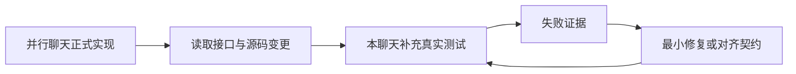
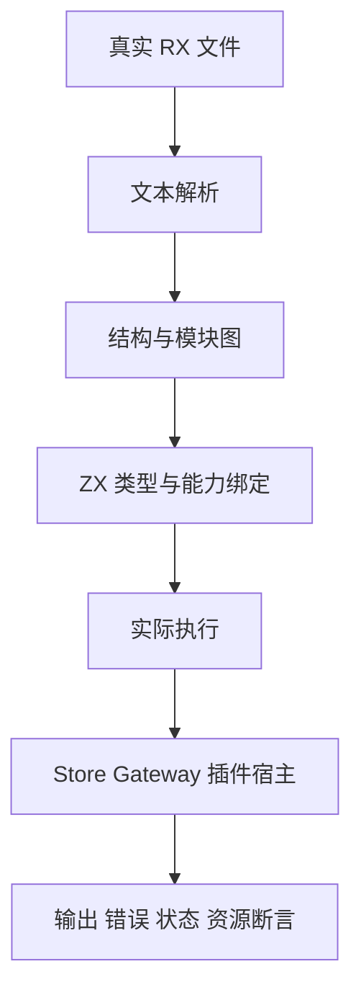

# 并行实现测试对齐计划

## Intent：最终目标

按用户更新后的目标，将本聊天的测试工作与 [检查 RX 实现与设计整合](codex://threads/01a1017f-f09f-7001-95ef-8e966ebd6aee) 中的正式实现对齐。保留 Test262 对齐总目标，优先为正在落地的功能提供实际回归。

## Data：可用证据

已读取该聊天与《系统完整实现计划》：范围包括 RX 文本与项目装载、RX/ZX 类型联结、模块命名空间、纯计算与受控 I/O 标准库、原生插件、编译期风格门禁及应用 Runtime。当前优先推进真实 RX XML 输入。另一个聊天负责生产实现，本聊天负责补充测试。

当前可复用证据包括：模块图与路径测试、Store 手工上下文的真实执行测试、编译器前端与生成执行支持。它们不能替代真实 RX 文本与授权联结的端到端验证。

## Edges：边界与限制

- 两个聊天共享工作区，先读取新接口与 diff，再接入测试，不覆盖实现中的修改。
- 实现计划中的“不新增测试”是对方聊天的工作分工；用户在本聊天已明确要求为对应实现添加测试。
- 接口尚未落地时记录测试清单，不伪造 API 或把占位测试登记为通过。
- 继续只用 TypeScript 编写数据生成和审计脚本；测试源码在 packages/test/tests 分层存放。
- 未获直接授权向另一个聊天发送消息，当前通过读取进展和共享文件对齐，不额外发送提示。

## Answer：交付与成功标准

| 优先级 | 对应实现             | 测试证据                                                                              | 当前状态                                                                              |
| ------ | -------------------- | ------------------------------------------------------------------------------------- | ------------------------------------------------------------------------------------- |
| P0     | RX XML 文本入口      | 正常标签、属性和实体；不闭合/错配/重复属性；字节位置；文本到 validate/validateModules | 已接入 9 个文本入口测试，Debug 通过                                                   |
| P0     | RX 模块装载          | 真实多文件依赖、缺失目标、规范化身份、未使用 Import 的环、嵌套 service 边             | 已有 AST 图基线、9 个文本入口测试及 11 个真实 CLI 文件场景；类型联结与运行待实现      |
| P0     | RX 与 ZX 联结        | Call.fn/service 实际调用，输入输出类型、ctx 定义顺序、分支返回、属性错误位置          | 待接口落地                                                                            |
| P0     | Store 授权与 Runtime | 权限从真实 RX 推导；暂存可见；执行失败不提交；冲突与恢复                              | 本轮先完成双槽手工上下文基线，授权/持久化待实现                                       |
| P1     | 模块分类和解析       | zig:/c:/std:/无前缀；非法 scheme；签名与实际链接；无环                                | 待读取最终接口后逐项接入                                                              |
| P1     | 标准库               | 清单内能力逐项调用；边界与错误；纯计算/受控 I/O 隔离                                  | 已验证 8 个编码/哈希接口、362 个执行案例及 4 个直接资源测试；更多标准库能力随接口补齐 |
| P1     | 插件与懒加载         | ABI 不匹配、缺失符号、首次加载、重复调用、释放、失败传播                              | 待 ABI 固定                                                                           |
| P1     | 新语法风格门禁       | 命名角色、嵌套表达式空行、外部协议字段豁免                                            | 随实际新语法补齐                                                                      |

## 继续顺序

先收集当前 Store 构建结果并记录；随后核对并行聊天的 RX 文本解析文件与公开入口，直接为落地实现添加案例。每次报告区分 AST 基线、文本解析、联结和运行，不把一个层级的通过扩张为整个链路完成。

## 新增契约接口

并行实现已落地 requires/ensures 解析、谓词类型与作用域分析、契约 IR 不变量和未验证契约的后端拦截。本聊天新增 6 个契约专项测试；形式证明和 app/lib 构建的完整产物链路仍需按实际接口继续接入。详见《契约IR与生成门禁测试记录》。

形式验证 generate/verify CLI 已接入 13 个真实 Z3 场景，证明/反例/不可满足/浮点拒绝及证据文件已核验。完整回归现在需要 Z3 或 ZXC_TEST_SOLVER。

app/lib 已验证正式安装、应用运行、删除原始源码后搬迁纯 ZX 库，并由 Zig/ZX 消费者实际执行。外部原生依赖不计入可搬迁范围。详见《应用与库产物消费测试记录》。

路径标准库的 POSIX/Windows 八个基础接口已用 88 个真实 ZX 案例与 Node 对照，Debug 与根 ReleaseSafe 通过。resolve/relative 已确认正式接口，下一步接入显式 cwd 与跨盘符边界。
