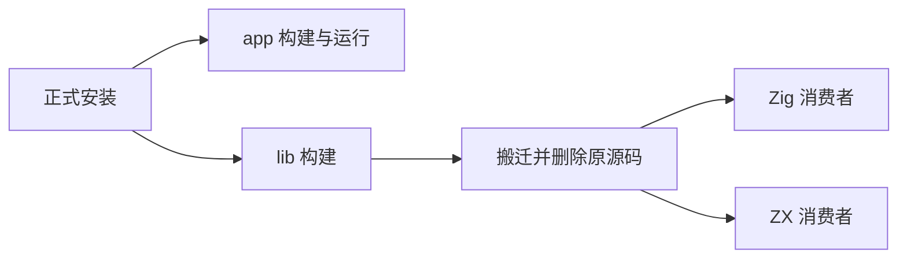
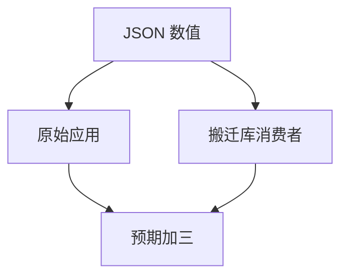

# 应用与库产物消费测试记录

## Intent：最终目标

验证正式安装后的 zxc 构建 app/lib，并实际消费搬迁后的纯 ZX 库。

## Data：可用证据

构建命令依赖安装目录的 share/zxc/runtime；app 接收一个 JSON 命令行参数并输出 JSON。lib 输出 root.zig、runtime、重写路径的 ZX 源码和 zxc.json。

## Edges：边界与限制

测试使用 compiler 包自身的正式 install 步骤安装到临时目录，不把缓存可执行文件伪装成完整安装。只覆盖纯 ZX 依赖，native_sources_bundled=false 的外部原生依赖不能据此宣称可搬迁。

## Answer：交付与成功标准

编译并运行 app；生成 lib 后搬迁并删除原始源码；分别通过 Zig 模块导入和 ZX 包导入编译运行，核对实际值。草案位于 `docs/2026-10-03/build_modes/`。

## 执行记录与自我批判

专项 2/2 构建步骤通过，44 秒完成正式安装、app 构建运行、lib 搬迁及 Zig/ZX 双消费者执行。app 输入 7 得到 10；搬迁后 Zig 测试得到 10，ZX 消费者输入 9 得到 12，原 app 在源码删除后输入 0 得到 3。TypeScript 严格检查通过。最终根 ReleaseSafe 459/459 构建步骤、39,531/39,531 根 Zig 测试通过；正式安装与 app/lib 消费、13 个验证 CLI、11 个 RX CLI 及隔离安全执行步骤通过。子进程中的 Zig 消费测试单独执行，不重复计入根报告数量。日志 `/tmp/zxc-test262-build-modes-root.log`。构建成功和文件存在不能代替实际消费者执行。
