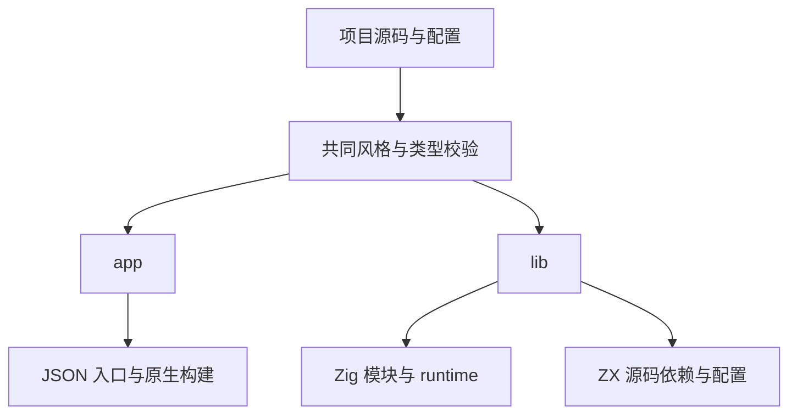
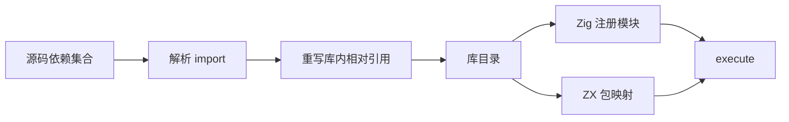

# 应用与库构建实施

> 历史实施记录：下文的单 ZX 入口、旧配置名和 runtime 产物不作为当前设计规范。最新 lib 设计以模块的公共接口为边界，RX 与 ZX 分别承担模块内部的编排与逻辑，见 [统一库设计](../2026-10-05/统一库设计.md)。本页保留当时执行证据，不代表统一机制已经实现。

## Intent：最终目标

将应用入口和可复用计算库明确区分。app 生成可执行程序；lib 交付可供 Zig 注册为模块、可供其他 ZX 程序导入的库。

## Data：实际交付

```sh
zig-out/bin/zxc build docs/2026-10-03/标准库示例/compose.zx \
  --project docs/2026-10-03/标准库示例/zxc.json \
  --mode lib --out .zxc/examples/compose_library
```

| 产物               | 用途                                               |
| ------------------ | -------------------------------------------------- |
| root.zig           | 有类型 Zig 模块，导出 Input、Output、execute       |
| build.zig          | 注册 library 模块并连接 runtime 和原生依赖         |
| runtime/           | 本次编译器配套运行支持源码                         |
| source/module_N.zx | 收集后的 ZX 依赖；普通文件与包导入改为库内相对引用 |
| zxc.json           | library 包入口与原生接口/链接配置                  |
| library.json       | 产物格式、IR 版本、入口与原生源码打包状态          |

使用解析后的 import 结构重写声明，不通过全文件字符串替换修改路径。保留外部 zig:/c:/std: 导入；包入口指向 source/module_0.zx。库目录可以由用户指定，默认导出名称 library 可以在使用方的包映射中改名。

ZX 消费示例 [consumer.zx](库构建示例/consumer.zx)：

```sh
zig-out/bin/zxc build docs/2026-10-03/库构建示例/consumer.zx \
  --project .zxc/examples/compose_library/zxc.json \
  --out .zxc/examples/library_consumer

.zxc/examples/library_consumer '{"text":"hello","number":81}'
```

实际输出 encoded 为 hello 的 SHA-256，root 为 9。传递依赖中的 std:encoding、std:crypto 和显式 zig:math 接口均进入真实执行链。

Zig 消费示例 [main.zig](库构建示例/main.zig)：

```sh
zig build-exe --dep library \
  -Mroot=docs/2026-10-03/库构建示例/main.zig \
  --dep zx_runtime -Mlibrary=.zxc/examples/compose_library/root.zig \
  -Mzx_runtime=.zxc/examples/compose_library/runtime/root.zig \
  -femit-bin=.zxc/examples/zig_library_consumer

.zxc/examples/zig_library_consumer hello 81
```

实际得到相同 SHA-256 和 root=9。库目录中的 `zig build` 也已成功执行，确认生成的模块注册脚本有效。Zig Build 项目可将库目录声明为本地依赖并获取 `dependency.module("library")`；上述实际验证使用直接模块注册方式。

## Edges：边界与限制

- app 默认生成接收 JSON Input、输出 JSON Output 的命令行应用；lib 保持调用级 Arena 与 execute 接口，不带命令行入口。
- lib 交付可编译的源码模块，不是具有稳定 C ABI 的静态/动态机器码库。
- 库的目标平台、CPU 和优化由消费方选择；lib 模式拒绝 --asm、--target、--cpu、--optimize，避免参数被默默忽略。
- 用户原生 Zig 文件、C 头文件搜索目录和链接库仍由显式配置提供，不递归复制任意外部文件。绝对路径依赖不支持直接跨机器迁移；library.json 明确标记 native_sources_bundled=false。
- 目前没有包管理器、版本冲突解析或自动合并多个库的原生配置。多个库由消费方配置明确映射。
- ZX 仍保持“类型导入必须来自纯类型文件”的既有规则。消费示例显式定义输入输出结构，不绕过该规则；已有纯类型依赖会随源码闭包一起交付。
- 带形式化契约的库通过同一 IR 的实际求解后才能生成，可用 --solver 指定工具；当前验证子集不支持的库仍拒绝。

## Answer：成功标准与自我复核

app/lib 参数与产物分离已完成，两个真实消费路径均构建执行。跨机器原生依赖打包、稳定二进制 ABI 和包管理仍是未完成能力，不能据此宣称所有库发布场景已经覆盖。




